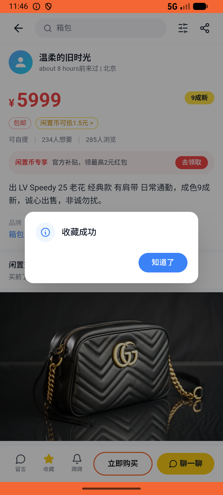

# order/v032_order_validator  ❌

- **Brand**: `xianzhiershouwang`
- **Class**: `XianzhiershouwangOrderV032OrderValidatorTask`
- **Pass@3**: **0/3**  (score = 0.00)
- **Elapsed**: 529s (~8.8 min)
- **Model**: `doubao-seed-2-0-lite-260428`
- **Raw log**: [./raw_logs/XianzhiershouwangOrderV032OrderValidatorTask.log](./raw_logs/XianzhiershouwangOrderV032OrderValidatorTask.log)
- **Generated**: 2026-06-08T09:57:05+08:00

## Task Goal

> 我做设计要存大量素材，想买台容量最大的iPad Pro 11，帮我挑在卖的里面存储最大那台微信下单，然后关注卖家进入主页，他家还有卖包的，选LV品牌收藏，方便比价

## System Prompt

<details>
<summary>展开查看完整 System Prompt</summary>


> You are provided with a task description, a history of previous actions, and corresponding screenshots. Your goal is to perform the next action to complete the task. Please note that if performing the same action multiple times results in a static screen with no changes, you should attempt a modified or alternative action.
> 
> ---
> 
> ## Function Definition
> 
> - `clarify` — Ask the user for more information to complete the task.
> - `click` — Mouse left single click action.
> - `double_click` — Mouse left double click action.
> - `drag` — Perform a drag action from the start point to the end point. Typically used for swiping or selecting elements.
> - `long_press` — Perform a long press action at the specified coordinates.
> - `open_app` — Open the specified application.
> - `press_back` — Press the back button.
> - `press_enter` — Press the enter key.
> - `press_home` — Press the home button.
> - `take_notes` — Take notes and report the result in the specified content.
> - `type` — Type the specified content. You should manually delete any text from the input box that you want to remove.
> - `wait` — Wait for a certain period of time.

</details>

## User Query

> 请在 com.xianzhiershouwang 里面完成以下任务：
> 我做设计要存大量素材，想买台容量最大的iPad Pro 11，帮我挑在卖的里面存储最大那台微信下单，然后关注卖家进入主页，他家还有卖包的，选LV品牌收藏，方便比价

## Attempts

| # | Outcome | Steps | Terminated | Reason | Start → End |
|---|---------|-------|------------|--------|-------------|
| 1 | ❌ failed | 32 | answer | 关注了卖家「筱爱百货数码店」(User id=4): 未关注卖家(User id=4) Diff: @@ -1 +1 @@ -true +false ; 收藏了卖家在卖的 LV 包(id=1358): 未收藏卖家在卖的 LV Pochette(id=1358)（卖家箱包里 ... | 2026-06-08 08:36:23 → 2026-06-08 08:40:26 |
| 2 | ❌ failed | 28 | answer | 关注了卖家「筱爱百货数码店」(User id=4): 未关注卖家(User id=4) Diff: @@ -1 +1 @@ -true +false ; 收藏了卖家在卖的 LV 包(id=1358): 未收藏卖家在卖的 LV Pochette(id=1358)（卖家箱包里 ... | 2026-06-08 08:40:26 → 2026-06-08 08:43:48 |
| 3 | ❌ failed | 10 | answer | 订单关联到容量最大(512G)的 iPad Pro 11 (id=793): 未找到对容量最大(512G)的 iPad Pro 11(id=793)的订单（可能买成了 128G/256G）; 支付方式为微信: 前置订单未生成; 关注了卖家「筱爱百货数码店」(User id=... | 2026-06-08 08:43:48 → 2026-06-08 08:45:12 |

## Failure Details

### Episode 1 — ❌ failed

- steps_used: `32`
- terminated_reason: `answer`
- reason:

  ```
  关注了卖家「筱爱百货数码店」(User id=4): 未关注卖家(User id=4)
  Diff:
  @@ -1 +1 @@
  -true
  +false
  ; 收藏了卖家在卖的 LV 包(id=1358): 未收藏卖家在卖的 LV Pochette(id=1358)（卖家箱包里 LV 唯一一件，其他是 Coach/Prada/BV）
  Diff:
  @@ -1 +1 @@
  -true
  +false
  ```
- death shot: 
  - state: [`./death_shots/XianzhiershouwangOrderV032OrderValidatorTask/episode_001/step_032.json`](./death_shots/XianzhiershouwangOrderV032OrderValidatorTask/episode_001/step_032.json)
  - digest: [`episode_digest.md`](./death_shots/XianzhiershouwangOrderV032OrderValidatorTask/episode_001/episode_digest.md)

### Episode 2 — ❌ failed

- steps_used: `28`
- terminated_reason: `answer`
- reason:

  ```
  关注了卖家「筱爱百货数码店」(User id=4): 未关注卖家(User id=4)
  Diff:
  @@ -1 +1 @@
  -true
  +false
  ; 收藏了卖家在卖的 LV 包(id=1358): 未收藏卖家在卖的 LV Pochette(id=1358)（卖家箱包里 LV 唯一一件，其他是 Coach/Prada/BV）
  Diff:
  @@ -1 +1 @@
  -true
  +false
  ```
- death shot: 
  - state: [`./death_shots/XianzhiershouwangOrderV032OrderValidatorTask/episode_002/step_028.json`](./death_shots/XianzhiershouwangOrderV032OrderValidatorTask/episode_002/step_028.json)
  - digest: [`episode_digest.md`](./death_shots/XianzhiershouwangOrderV032OrderValidatorTask/episode_002/episode_digest.md)

### Episode 3 — ❌ failed

- steps_used: `10`
- terminated_reason: `answer`
- reason:

  ```
  订单关联到容量最大(512G)的 iPad Pro 11 (id=793): 未找到对容量最大(512G)的 iPad Pro 11(id=793)的订单（可能买成了 128G/256G）; 支付方式为微信: 前置订单未生成; 关注了卖家「筱爱百货数码店」(User id=4): 未关注卖家(User id=4)
  Diff:
  @@ -1 +1 @@
  -true
  +false
  ; 收藏了卖家在卖的 LV 包(id=1358): 未收藏卖家在卖的 LV Pochette(id=1358)（卖家箱包里 LV 唯一一件，其他是 Coach/Prada/BV）
  Diff:
  @@ -1 +1 @@
  -true
  +false
  ```
- death shot: 
  - state: [`./death_shots/XianzhiershouwangOrderV032OrderValidatorTask/episode_003/step_010.json`](./death_shots/XianzhiershouwangOrderV032OrderValidatorTask/episode_003/step_010.json)
  - digest: [`episode_digest.md`](./death_shots/XianzhiershouwangOrderV032OrderValidatorTask/episode_003/episode_digest.md)

---

> 本摘要由 `sengclaw/scripts/pipeline/log_summarizer.py` 自动生成。 原始完整 log 见上方 Raw log 链接（含每 step 的 messages / tool_call / screenshot 引用）。
