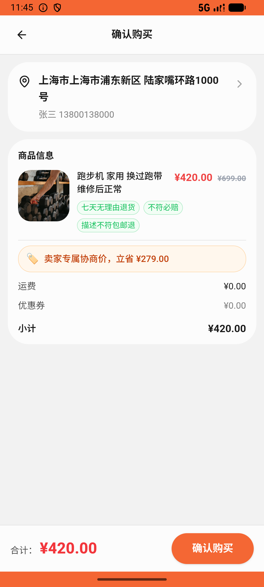
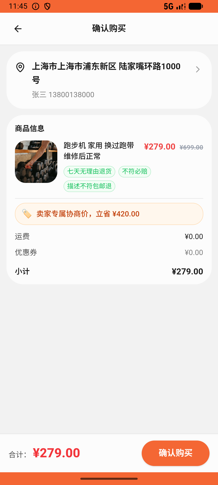

# comment/v017_comment_validator  ❌

- **Brand**: `xianzhiershouwang`
- **Class**: `XianzhiershouwangCommentV017CommentValidatorTask`
- **Pass@3**: **0/3**  (score = 0.00)
- **Elapsed**: 526s (~8.8 min)
- **Model**: `doubao-seed-2-0-lite-260428`
- **Raw log**: [./raw_logs/XianzhiershouwangCommentV017CommentValidatorTask.log](./raw_logs/XianzhiershouwangCommentV017CommentValidatorTask.log)
- **Generated**: 2026-06-09T02:08:39+08:00

## Task Goal

> 搜索iPhone 13主板维修过的标准版那台帮我留言问问维修后信号稳不稳；再帮我看看二手跑步机，带瑕疵价格明显高就砍价（幅度别低于标价的6折），卖家发优惠卡片就按那个价直接拍下来

## System Prompt

<details>
<summary>展开查看完整 System Prompt</summary>


> You are provided with a task description, a history of previous actions, and corresponding screenshots. Your goal is to perform the next action to complete the task. Please note that if performing the same action multiple times results in a static screen with no changes, you should attempt a modified or alternative action.
> 
> ---
> 
> ## Function Definition
> 
> - `clarify` — Ask the user for more information to complete the task.
> - `click` — Mouse left single click action.
> - `double_click` — Mouse left double click action.
> - `drag` — Perform a drag action from the start point to the end point. Typically used for swiping or selecting elements.
> - `long_press` — Perform a long press action at the specified coordinates.
> - `open_app` — Open the specified application.
> - `press_back` — Press the back button.
> - `press_enter` — Press the enter key.
> - `press_home` — Press the home button.
> - `take_notes` — Take notes and report the result in the specified content.
> - `type` — Type the specified content. You should manually delete any text from the input box that you want to remove.
> - `wait` — Wait for a certain period of time.

</details>

## User Query

> 请在 com.xianzhiershouwang 里面完成以下任务：
> 搜索iPhone 13主板维修过的标准版那台帮我留言问问维修后信号稳不稳；再帮我看看二手跑步机，带瑕疵价格明显高就砍价（幅度别低于标价的6折），卖家发优惠卡片就按那个价直接拍下来

## Attempts

| # | Outcome | Steps | Terminated | Reason | Start → End |
|---|---------|-------|------------|--------|-------------|
| 1 | ❌ failed | 21 | answer | 对异响舒华 1302 发起了砍价（含数字的对话消息触发优惠卡）: 未对 id=1302（异响舒华 ¥1999）发起对话砍价; 砍价金额合理：≥ 标价 6 折 且 < 标价: 前置砍价消息未生成，跳过金额检查; 砍价后接下了优惠卡片：对 1302 下了带 offer_pric... | 2026-06-08 22:39:34 → 2026-06-08 22:42:19 |
| 2 | ❌ failed | 21 | answer | 对异响舒华 1302 发起了砍价（含数字的对话消息触发优惠卡）: 未对 id=1302（异响舒华 ¥1999）发起对话砍价; 砍价金额合理：≥ 标价 6 折 且 < 标价: 前置砍价消息未生成，跳过金额检查; 砍价后接下了优惠卡片：对 1302 下了带 offer_pric... | 2026-06-08 22:42:19 → 2026-06-08 22:45:33 |
| 3 | ❌ failed | 21 | answer | 对异响舒华 1302 发起了砍价（含数字的对话消息触发优惠卡）: 未对 id=1302（异响舒华 ¥1999）发起对话砍价; 砍价金额合理：≥ 标价 6 折 且 < 标价: 前置砍价消息未生成，跳过金额检查; 砍价后接下了优惠卡片：对 1302 下了带 offer_pric... | 2026-06-08 22:45:33 → 2026-06-08 22:48:20 |

## Failure Details

### Episode 1 — ❌ failed

- steps_used: `21`
- terminated_reason: `answer`
- reason:

  ```
  对异响舒华 1302 发起了砍价（含数字的对话消息触发优惠卡）: 未对 id=1302（异响舒华 ¥1999）发起对话砍价; 砍价金额合理：≥ 标价 6 折 且 < 标价: 前置砍价消息未生成，跳过金额检查; 砍价后接下了优惠卡片：对 1302 下了带 offer_price 的订单: 未对 1302 下带 offer_price 的订单（卖家发优惠卡后应直接按卡片价拍下）; 1302 接卡下单金额 = 优惠卡 offer_price（不是 1999 标价）: 前置接卡订单未生成，跳过金额检查
  ```
- death shot: 
  - state: [`./death_shots/XianzhiershouwangCommentV017CommentValidatorTask/episode_001/step_021.json`](./death_shots/XianzhiershouwangCommentV017CommentValidatorTask/episode_001/step_021.json)
  - digest: [`episode_digest.md`](./death_shots/XianzhiershouwangCommentV017CommentValidatorTask/episode_001/episode_digest.md)

### Episode 2 — ❌ failed

- steps_used: `21`
- terminated_reason: `answer`
- reason:

  ```
  对异响舒华 1302 发起了砍价（含数字的对话消息触发优惠卡）: 未对 id=1302（异响舒华 ¥1999）发起对话砍价; 砍价金额合理：≥ 标价 6 折 且 < 标价: 前置砍价消息未生成，跳过金额检查; 砍价后接下了优惠卡片：对 1302 下了带 offer_price 的订单: 未对 1302 下带 offer_price 的订单（卖家发优惠卡后应直接按卡片价拍下）; 1302 接卡下单金额 = 优惠卡 offer_price（不是 1999 标价）: 前置接卡订单未生成，跳过金额检查
  ```
- death shot: 
  - state: [`./death_shots/XianzhiershouwangCommentV017CommentValidatorTask/episode_002/step_021.json`](./death_shots/XianzhiershouwangCommentV017CommentValidatorTask/episode_002/step_021.json)
  - digest: [`episode_digest.md`](./death_shots/XianzhiershouwangCommentV017CommentValidatorTask/episode_002/episode_digest.md)

### Episode 3 — ❌ failed

- steps_used: `21`
- terminated_reason: `answer`
- reason:

  ```
  对异响舒华 1302 发起了砍价（含数字的对话消息触发优惠卡）: 未对 id=1302（异响舒华 ¥1999）发起对话砍价; 砍价金额合理：≥ 标价 6 折 且 < 标价: 前置砍价消息未生成，跳过金额检查; 砍价后接下了优惠卡片：对 1302 下了带 offer_price 的订单: 未对 1302 下带 offer_price 的订单（卖家发优惠卡后应直接按卡片价拍下）; 1302 接卡下单金额 = 优惠卡 offer_price（不是 1999 标价）: 前置接卡订单未生成，跳过金额检查
  ```
- death shot: 
  - state: [`./death_shots/XianzhiershouwangCommentV017CommentValidatorTask/episode_003/step_021.json`](./death_shots/XianzhiershouwangCommentV017CommentValidatorTask/episode_003/step_021.json)
  - digest: [`episode_digest.md`](./death_shots/XianzhiershouwangCommentV017CommentValidatorTask/episode_003/episode_digest.md)

---

> 本摘要由 `sengclaw/scripts/pipeline/log_summarizer.py` 自动生成。 原始完整 log 见上方 Raw log 链接（含每 step 的 messages / tool_call / screenshot 引用）。
