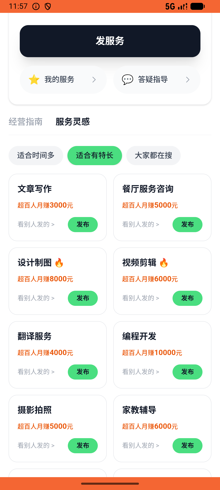
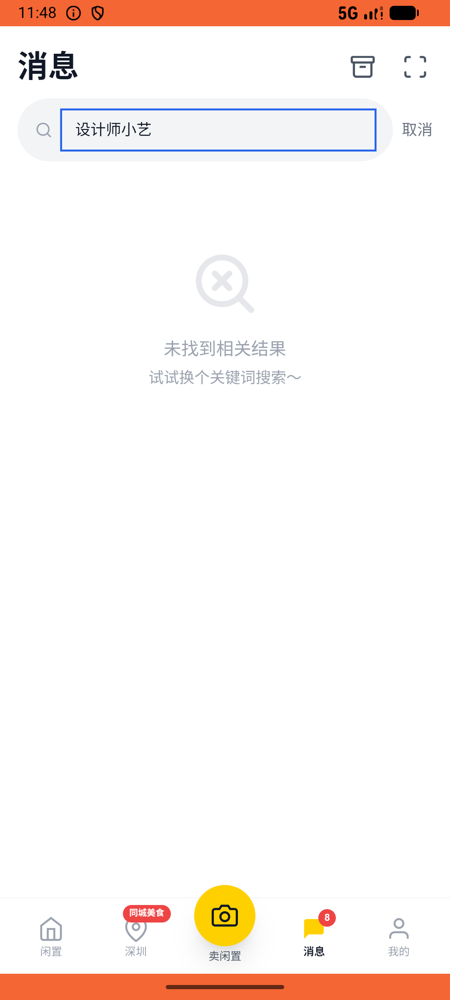

# favorite/v010_favorite_validator  ❌

- **Brand**: `xianzhiershouwang`
- **Class**: `XianzhiershouwangFavoriteV010FavoriteValidatorTask`
- **Pass@3**: **0/3**  (score = 0.00)
- **Elapsed**: 1521s (~25.4 min)
- **Model**: `doubao-seed-2-0-lite-260428`
- **Raw log**: [./raw_logs/XianzhiershouwangFavoriteV010FavoriteValidatorTask.log](./raw_logs/XianzhiershouwangFavoriteV010FavoriteValidatorTask.log)
- **Generated**: 2026-06-09T20:54:56+08:00

## Task Goal

> 想买把87键机械键盘，我只要红轴的、而且必须包邮，帮我挑出符合的收藏一下；然后去神奇副业找官方职业选设计师小艺里的海报设计帖子，再私信问关于海报问题

## System Prompt

<details>
<summary>展开查看完整 System Prompt</summary>


> You are provided with a task description, a history of previous actions, and corresponding screenshots. Your goal is to perform the next action to complete the task. Please note that if performing the same action multiple times results in a static screen with no changes, you should attempt a modified or alternative action.
> 
> ---
> 
> ## Function Definition
> 
> - `clarify` — Ask the user for more information to complete the task.
> - `click` — Mouse left single click action.
> - `double_click` — Mouse left double click action.
> - `drag` — Perform a drag action from the start point to the end point. Typically used for swiping or selecting elements.
> - `long_press` — Perform a long press action at the specified coordinates.
> - `open_app` — Open the specified application.
> - `press_back` — Press the back button.
> - `press_enter` — Press the enter key.
> - `press_home` — Press the home button.
> - `take_notes` — Take notes and report the result in the specified content.
> - `type` — Type the specified content. You should manually delete any text from the input box that you want to remove.
> - `wait` — Wait for a certain period of time.

</details>

## User Query

> 请在 com.xianzhiershouwang 里面完成以下任务：
> 想买把87键机械键盘，我只要红轴的、而且必须包邮，帮我挑出符合的收藏一下；然后去神奇副业找官方职业选设计师小艺里的海报设计帖子，再私信问关于海报问题

## Attempts

| # | Outcome | Steps | Terminated | Reason | Start → End |
|---|---------|-------|------------|--------|-------------|
| 1 | ⏰ timeout | 80 | max_steps | 给设计师小艺发起了关于海报设计的私信会话: 未找到张三给设计师小艺关于「海报设计/宣传物料」的私信消息（应进 service post 的 conversation 由 zhangsan 发出至少一条消息） | 2026-06-09 19:23:33 → 2026-06-09 19:38:12 |
| 2 | ❌ failed | 45 | answer | 给设计师小艺发起了关于海报设计的私信会话: 未找到张三给设计师小艺关于「海报设计/宣传物料」的私信消息（应进 service post 的 conversation 由 zhangsan 发出至少一条消息） | 2026-06-09 19:38:12 → 2026-06-09 19:44:43 |
| 3 | ❌ failed | 31 | answer | 给设计师小艺发起了关于海报设计的私信会话: 未找到张三给设计师小艺关于「海报设计/宣传物料」的私信消息（应进 service post 的 conversation 由 zhangsan 发出至少一条消息） | 2026-06-09 19:44:43 → 2026-06-09 19:48:53 |

## Failure Details

### Episode 1 — ⏰ timeout

- steps_used: `80`
- terminated_reason: `max_steps`
- reason:

  ```
  给设计师小艺发起了关于海报设计的私信会话: 未找到张三给设计师小艺关于「海报设计/宣传物料」的私信消息（应进 service post 的 conversation 由 zhangsan 发出至少一条消息）
  ```
- death shot: 
  - state: [`./death_shots/XianzhiershouwangFavoriteV010FavoriteValidatorTask/episode_001/step_080.json`](./death_shots/XianzhiershouwangFavoriteV010FavoriteValidatorTask/episode_001/step_080.json)
  - digest: [`episode_digest.md`](./death_shots/XianzhiershouwangFavoriteV010FavoriteValidatorTask/episode_001/episode_digest.md)

### Episode 2 — ❌ failed

- steps_used: `45`
- terminated_reason: `answer`
- reason:

  ```
  给设计师小艺发起了关于海报设计的私信会话: 未找到张三给设计师小艺关于「海报设计/宣传物料」的私信消息（应进 service post 的 conversation 由 zhangsan 发出至少一条消息）
  ```
- death shot: 
  - state: [`./death_shots/XianzhiershouwangFavoriteV010FavoriteValidatorTask/episode_002/step_045.json`](./death_shots/XianzhiershouwangFavoriteV010FavoriteValidatorTask/episode_002/step_045.json)
  - digest: [`episode_digest.md`](./death_shots/XianzhiershouwangFavoriteV010FavoriteValidatorTask/episode_002/episode_digest.md)

### Episode 3 — ❌ failed

- steps_used: `31`
- terminated_reason: `answer`
- reason:

  ```
  给设计师小艺发起了关于海报设计的私信会话: 未找到张三给设计师小艺关于「海报设计/宣传物料」的私信消息（应进 service post 的 conversation 由 zhangsan 发出至少一条消息）
  ```
- death shot: 
  - state: [`./death_shots/XianzhiershouwangFavoriteV010FavoriteValidatorTask/episode_003/step_031.json`](./death_shots/XianzhiershouwangFavoriteV010FavoriteValidatorTask/episode_003/step_031.json)
  - digest: [`episode_digest.md`](./death_shots/XianzhiershouwangFavoriteV010FavoriteValidatorTask/episode_003/episode_digest.md)

---

> 本摘要由 `sengclaw/scripts/pipeline/log_summarizer.py` 自动生成。 原始完整 log 见上方 Raw log 链接（含每 step 的 messages / tool_call / screenshot 引用）。
