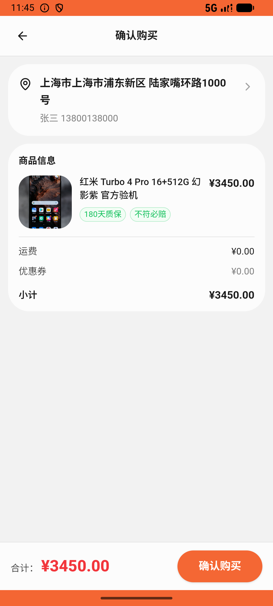

# order/v030_order_validator  ❌

- **Brand**: `xianzhiershouwang`
- **Class**: `XianzhiershouwangOrderV030OrderValidatorTask`
- **Pass@3**: **0/3**  (score = 0.00)
- **Elapsed**: 525s (~8.8 min)
- **Model**: `doubao-seed-2-0-lite-260428`
- **Raw log**: [./raw_logs/XianzhiershouwangOrderV030OrderValidatorTask.log](./raw_logs/XianzhiershouwangOrderV030OrderValidatorTask.log)
- **Generated**: 2026-06-09T20:54:56+08:00

## Task Goal

> 帮我搜个红米Turbo 4 Pro，我只敢买已验证卖家、要支持质保的，这里面挑最便宜那个支付宝支付买了

## System Prompt

<details>
<summary>展开查看完整 System Prompt</summary>


> You are provided with a task description, a history of previous actions, and corresponding screenshots. Your goal is to perform the next action to complete the task. Please note that if performing the same action multiple times results in a static screen with no changes, you should attempt a modified or alternative action.
> 
> ---
> 
> ## Function Definition
> 
> - `clarify` — Ask the user for more information to complete the task.
> - `click` — Mouse left single click action.
> - `double_click` — Mouse left double click action.
> - `drag` — Perform a drag action from the start point to the end point. Typically used for swiping or selecting elements.
> - `long_press` — Perform a long press action at the specified coordinates.
> - `open_app` — Open the specified application.
> - `press_back` — Press the back button.
> - `press_enter` — Press the enter key.
> - `press_home` — Press the home button.
> - `take_notes` — Take notes and report the result in the specified content.
> - `type` — Type the specified content. You should manually delete any text from the input box that you want to remove.
> - `wait` — Wait for a certain period of time.

</details>

## User Query

> 请在 com.xianzhiershouwang 里面完成以下任务：
> 帮我搜个红米Turbo 4 Pro，我只敢买已验证卖家、要支持质保的，这里面挑最便宜那个支付宝支付买了

## Attempts

| # | Outcome | Steps | Terminated | Reason | Start → End |
|---|---------|-------|------------|--------|-------------|
| 1 | ❌ failed | 19 | answer | 订单关联到正解帖子（已验证+有质保中最便宜，¥3450）: 未找到对正解帖子(¥3450.0，已验证+180天质保)的订单。合格集为 ¥3450 与 ¥3800，应选最便宜的 ¥3450；最低价 ¥2999.0 未验证是陷阱。 | 2026-06-09 20:28:00 → 2026-06-09 20:30:39 |
| 2 | ❌ failed | 20 | answer | 订单关联到正解帖子（已验证+有质保中最便宜，¥3450）: 未找到对正解帖子(¥3450.0，已验证+180天质保)的订单。合格集为 ¥3450 与 ¥3800，应选最便宜的 ¥3450；最低价 ¥2999.0 未验证是陷阱。 | 2026-06-09 20:30:39 → 2026-06-09 20:33:28 |
| 3 | ❌ failed | 22 | answer | 订单关联到正解帖子（已验证+有质保中最便宜，¥3450）: 未找到对正解帖子(¥3450.0，已验证+180天质保)的订单。合格集为 ¥3450 与 ¥3800，应选最便宜的 ¥3450；最低价 ¥2999.0 未验证是陷阱。 | 2026-06-09 20:33:28 → 2026-06-09 20:36:45 |

## Failure Details

### Episode 1 — ❌ failed

- steps_used: `19`
- terminated_reason: `answer`
- reason:

  ```
  订单关联到正解帖子（已验证+有质保中最便宜，¥3450）: 未找到对正解帖子(¥3450.0，已验证+180天质保)的订单。合格集为 ¥3450 与 ¥3800，应选最便宜的 ¥3450；最低价 ¥2999.0 未验证是陷阱。
  ```
- death shot: 
  - state: [`./death_shots/XianzhiershouwangOrderV030OrderValidatorTask/episode_001/step_019.json`](./death_shots/XianzhiershouwangOrderV030OrderValidatorTask/episode_001/step_019.json)
  - digest: [`episode_digest.md`](./death_shots/XianzhiershouwangOrderV030OrderValidatorTask/episode_001/episode_digest.md)

### Episode 2 — ❌ failed

- steps_used: `20`
- terminated_reason: `answer`
- reason:

  ```
  订单关联到正解帖子（已验证+有质保中最便宜，¥3450）: 未找到对正解帖子(¥3450.0，已验证+180天质保)的订单。合格集为 ¥3450 与 ¥3800，应选最便宜的 ¥3450；最低价 ¥2999.0 未验证是陷阱。
  ```
- death shot: 
  - state: [`./death_shots/XianzhiershouwangOrderV030OrderValidatorTask/episode_002/step_020.json`](./death_shots/XianzhiershouwangOrderV030OrderValidatorTask/episode_002/step_020.json)
  - digest: [`episode_digest.md`](./death_shots/XianzhiershouwangOrderV030OrderValidatorTask/episode_002/episode_digest.md)

### Episode 3 — ❌ failed

- steps_used: `22`
- terminated_reason: `answer`
- reason:

  ```
  订单关联到正解帖子（已验证+有质保中最便宜，¥3450）: 未找到对正解帖子(¥3450.0，已验证+180天质保)的订单。合格集为 ¥3450 与 ¥3800，应选最便宜的 ¥3450；最低价 ¥2999.0 未验证是陷阱。
  ```
- death shot: 
  - state: [`./death_shots/XianzhiershouwangOrderV030OrderValidatorTask/episode_003/step_022.json`](./death_shots/XianzhiershouwangOrderV030OrderValidatorTask/episode_003/step_022.json)
  - digest: [`episode_digest.md`](./death_shots/XianzhiershouwangOrderV030OrderValidatorTask/episode_003/episode_digest.md)

---

> 本摘要由 `sengclaw/scripts/pipeline/log_summarizer.py` 自动生成。 原始完整 log 见上方 Raw log 链接（含每 step 的 messages / tool_call / screenshot 引用）。
