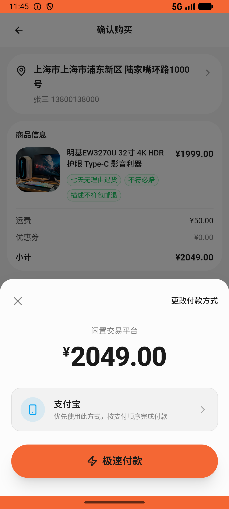
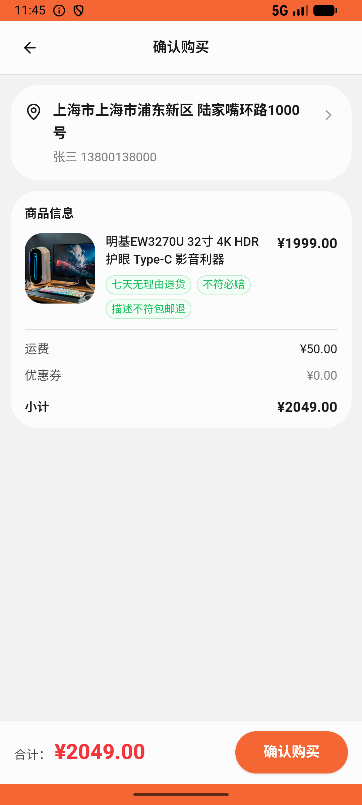

# comment/v015_comment_validator  ❌

- **Brand**: `xianzhiershouwang`
- **Class**: `XianzhiershouwangCommentV015CommentValidatorTask`
- **Pass@3**: **0/3**  (score = 0.00)
- **Elapsed**: 564s (~9.4 min)
- **Model**: `doubao-seed-2-0-lite-260428`
- **Raw log**: [./raw_logs/XianzhiershouwangCommentV015CommentValidatorTask.log](./raw_logs/XianzhiershouwangCommentV015CommentValidatorTask.log)
- **Generated**: 2026-06-09T23:19:43+08:00

## Task Goal

> 去我的关注里看「筱爱百货数码店」主页中一台蓝色iPad Air 5先收藏了；逛他家店发现还卖显示器，明基 EW3270U—帮我把他家那台32寸大屏显示器支付买，无需向我确认

## System Prompt

<details>
<summary>展开查看完整 System Prompt</summary>


> You are provided with a task description, a history of previous actions, and corresponding screenshots. Your goal is to perform the next action to complete the task. Please note that if performing the same action multiple times results in a static screen with no changes, you should attempt a modified or alternative action.
> 
> ---
> 
> ## Function Definition
> 
> - `clarify` — Ask the user for more information to complete the task.
> - `click` — Mouse left single click action.
> - `double_click` — Mouse left double click action.
> - `drag` — Perform a drag action from the start point to the end point. Typically used for swiping or selecting elements.
> - `long_press` — Perform a long press action at the specified coordinates.
> - `open_app` — Open the specified application.
> - `press_back` — Press the back button.
> - `press_enter` — Press the enter key.
> - `press_home` — Press the home button.
> - `take_notes` — Take notes and report the result in the specified content.
> - `type` — Type the specified content. You should manually delete any text from the input box that you want to remove.
> - `wait` — Wait for a certain period of time.

</details>

## User Query

> 请在 com.xianzhiershouwang 里面完成以下任务：
> 去我的关注里看「筱爱百货数码店」主页中一台蓝色iPad Air 5先收藏了；逛他家店发现还卖显示器，明基 EW3270U—帮我把他家那台32寸大屏显示器支付买，无需向我确认

## Attempts

| # | Outcome | Steps | Terminated | Reason | Start → End |
|---|---------|-------|------------|--------|-------------|
| 1 | ❌ failed | 20 | answer | 购买了卖家4那台 32 寸 4K 显示器(id=454): 未找到购买 32寸显示器(明基EW3270U, id=454)的订单——可能买错了 27寸款 | 2026-06-09 22:25:22 → 2026-06-09 22:28:07 |
| 2 | ❌ failed | 22 | answer | 购买了卖家4那台 32 寸 4K 显示器(id=454): 未找到购买 32寸显示器(明基EW3270U, id=454)的订单——可能买错了 27寸款 | 2026-06-09 22:28:07 → 2026-06-09 22:31:35 |
| 3 | 💥 error | 0 | exception | exception: HTTPConnectionPool(host='localhost', port=6800): Max retries exceeded with url: /step (Caused by NewConnectionError("HTTPConne... | 2026-06-09 22:31:35 → 2026-06-09 22:34:46 |

## Failure Details

### Episode 1 — ❌ failed

- steps_used: `20`
- terminated_reason: `answer`
- reason:

  ```
  购买了卖家4那台 32 寸 4K 显示器(id=454): 未找到购买 32寸显示器(明基EW3270U, id=454)的订单——可能买错了 27寸款
  ```
- death shot: 
  - state: [`./death_shots/XianzhiershouwangCommentV015CommentValidatorTask/episode_001/step_020.json`](./death_shots/XianzhiershouwangCommentV015CommentValidatorTask/episode_001/step_020.json)
  - digest: [`episode_digest.md`](./death_shots/XianzhiershouwangCommentV015CommentValidatorTask/episode_001/episode_digest.md)

### Episode 2 — ❌ failed

- steps_used: `22`
- terminated_reason: `answer`
- reason:

  ```
  购买了卖家4那台 32 寸 4K 显示器(id=454): 未找到购买 32寸显示器(明基EW3270U, id=454)的订单——可能买错了 27寸款
  ```
- death shot: 
  - state: [`./death_shots/XianzhiershouwangCommentV015CommentValidatorTask/episode_002/step_022.json`](./death_shots/XianzhiershouwangCommentV015CommentValidatorTask/episode_002/step_022.json)
  - digest: [`episode_digest.md`](./death_shots/XianzhiershouwangCommentV015CommentValidatorTask/episode_002/episode_digest.md)

### Episode 3 — 💥 error

- steps_used: `0`
- terminated_reason: `exception`
- reason:

  ```
  exception: HTTPConnectionPool(host='localhost', port=6800): Max retries exceeded with url: /step (Caused by NewConnectionError("HTTPConnection(host='localhost', port=6800): Failed to establish a new connection: [Errno 61] Connection refused"))
  ```
- death shot: 
  - state: [`./death_shots/XianzhiershouwangCommentV015CommentValidatorTask/episode_003/step_023.json`](./death_shots/XianzhiershouwangCommentV015CommentValidatorTask/episode_003/step_023.json)
  - digest: [`episode_digest.md`](./death_shots/XianzhiershouwangCommentV015CommentValidatorTask/episode_003/episode_digest.md)

---

> 本摘要由 `sengclaw/scripts/pipeline/log_summarizer.py` 自动生成。 原始完整 log 见上方 Raw log 链接（含每 step 的 messages / tool_call / screenshot 引用）。
