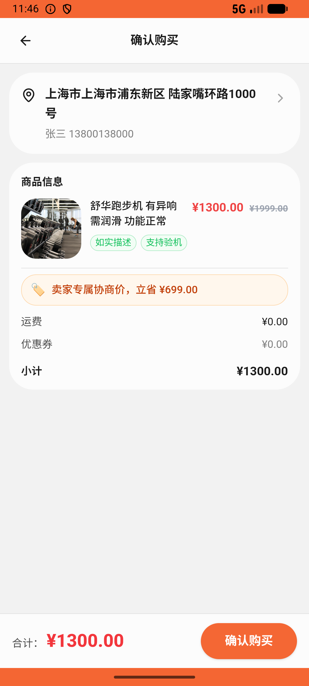
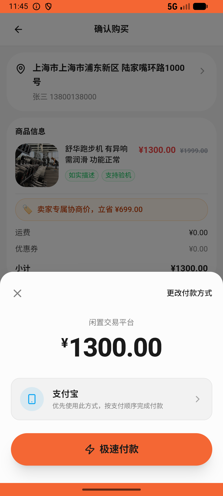

# comment/v017_comment_validator  ❌

- **Brand**: `xianzhiershouwang`
- **Class**: `XianzhiershouwangCommentV017CommentValidatorTask`
- **Pass@3**: **0/3**  (score = 0.00)
- **Elapsed**: 609s (~10.2 min)
- **Model**: `doubao-seed-2-0-lite-260428`
- **Raw log**: [./raw_logs/XianzhiershouwangCommentV017CommentValidatorTask.log](./raw_logs/XianzhiershouwangCommentV017CommentValidatorTask.log)
- **Generated**: 2026-06-10T00:52:20+08:00

## Task Goal

> 搜索iPhone 13主板维修过的标准版那台帮我留言问问维修后信号稳不稳；再帮我看看二手跑步机，带瑕疵价格明显高就私信卖家进行砍价（砍完后的价格不要低于标价的60%，比如标价1999就砍到1200以上别太低），等卖家发优惠卡片就按那个价直接拍下来支付买，无需向我确认

## System Prompt

<details>
<summary>展开查看完整 System Prompt</summary>


> You are provided with a task description, a history of previous actions, and corresponding screenshots. Your goal is to perform the next action to complete the task. Please note that if performing the same action multiple times results in a static screen with no changes, you should attempt a modified or alternative action.
> 
> ---
> 
> ## Function Definition
> 
> - `clarify` — Ask the user for more information to complete the task.
> - `click` — Mouse left single click action.
> - `double_click` — Mouse left double click action.
> - `drag` — Perform a drag action from the start point to the end point. Typically used for swiping or selecting elements.
> - `long_press` — Perform a long press action at the specified coordinates.
> - `open_app` — Open the specified application.
> - `press_back` — Press the back button.
> - `press_enter` — Press the enter key.
> - `press_home` — Press the home button.
> - `take_notes` — Take notes and report the result in the specified content.
> - `type` — Type the specified content. You should manually delete any text from the input box that you want to remove.
> - `wait` — Wait for a certain period of time.

</details>

## User Query

> 请在 com.xianzhiershouwang 里面完成以下任务：
> 搜索iPhone 13主板维修过的标准版那台帮我留言问问维修后信号稳不稳；再帮我看看二手跑步机，带瑕疵价格明显高就私信卖家进行砍价（砍完后的价格不要低于标价的60%，比如标价1999就砍到1200以上别太低），等卖家发优惠卡片就按那个价直接拍下来支付买，无需向我确认

## Attempts

| # | Outcome | Steps | Terminated | Reason | Start → End |
|---|---------|-------|------------|--------|-------------|
| 1 | ❌ failed | 24 | answer | 砍价后接下了优惠卡片：对 1302 下了带 offer_price 的订单: 未对 1302 下带 offer_price 的订单（卖家发优惠卡后应直接按卡片价拍下）; 1302 接卡下单金额 = 优惠卡 offer_price（不是 1999 标价）: 前置接卡订单未生成... | 2026-06-10 00:39:01 → 2026-06-10 00:42:06 |
| 2 | ❌ failed | 33 | answer | 在主板维修过的标准版 iPhone 13(id=989) 下留了维修风险相关留言: 未在 iPhone 13 标准版(id=989)下找到张三的留言; 砍价后接下了优惠卡片：对 1302 下了带 offer_price 的订单: 未对 1302 下带 offer_price... | 2026-06-10 00:42:06 → 2026-06-10 00:46:08 |
| 3 | ❌ failed | 23 | answer | 砍价后接下了优惠卡片：对 1302 下了带 offer_price 的订单: 未对 1302 下带 offer_price 的订单（卖家发优惠卡后应直接按卡片价拍下）; 1302 接卡下单金额 = 优惠卡 offer_price（不是 1999 标价）: 前置接卡订单未生成... | 2026-06-10 00:46:08 → 2026-06-10 00:49:10 |

## Failure Details

### Episode 1 — ❌ failed

- steps_used: `24`
- terminated_reason: `answer`
- reason:

  ```
  砍价后接下了优惠卡片：对 1302 下了带 offer_price 的订单: 未对 1302 下带 offer_price 的订单（卖家发优惠卡后应直接按卡片价拍下）; 1302 接卡下单金额 = 优惠卡 offer_price（不是 1999 标价）: 前置接卡订单未生成，跳过金额检查
  ```
- death shot: 
  - state: [`./death_shots/XianzhiershouwangCommentV017CommentValidatorTask/episode_001/step_024.json`](./death_shots/XianzhiershouwangCommentV017CommentValidatorTask/episode_001/step_024.json)
  - digest: [`episode_digest.md`](./death_shots/XianzhiershouwangCommentV017CommentValidatorTask/episode_001/episode_digest.md)

### Episode 2 — ❌ failed

- steps_used: `33`
- terminated_reason: `answer`
- reason:

  ```
  在主板维修过的标准版 iPhone 13(id=989) 下留了维修风险相关留言: 未在 iPhone 13 标准版(id=989)下找到张三的留言; 砍价后接下了优惠卡片：对 1302 下了带 offer_price 的订单: 未对 1302 下带 offer_price 的订单（卖家发优惠卡后应直接按卡片价拍下）; 1302 接卡下单金额 = 优惠卡 offer_price（不是 1999 标价）: 前置接卡订单未生成，跳过金额检查
  ```
- death shot: 
  - state: [`./death_shots/XianzhiershouwangCommentV017CommentValidatorTask/episode_002/step_033.json`](./death_shots/XianzhiershouwangCommentV017CommentValidatorTask/episode_002/step_033.json)
  - digest: [`episode_digest.md`](./death_shots/XianzhiershouwangCommentV017CommentValidatorTask/episode_002/episode_digest.md)

### Episode 3 — ❌ failed

- steps_used: `23`
- terminated_reason: `answer`
- reason:

  ```
  砍价后接下了优惠卡片：对 1302 下了带 offer_price 的订单: 未对 1302 下带 offer_price 的订单（卖家发优惠卡后应直接按卡片价拍下）; 1302 接卡下单金额 = 优惠卡 offer_price（不是 1999 标价）: 前置接卡订单未生成，跳过金额检查
  ```
- death shot: 
  - state: [`./death_shots/XianzhiershouwangCommentV017CommentValidatorTask/episode_003/step_023.json`](./death_shots/XianzhiershouwangCommentV017CommentValidatorTask/episode_003/step_023.json)
  - digest: [`episode_digest.md`](./death_shots/XianzhiershouwangCommentV017CommentValidatorTask/episode_003/episode_digest.md)

---

> 本摘要由 `sengclaw/scripts/pipeline/log_summarizer.py` 自动生成。 原始完整 log 见上方 Raw log 链接（含每 step 的 messages / tool_call / screenshot 引用）。
