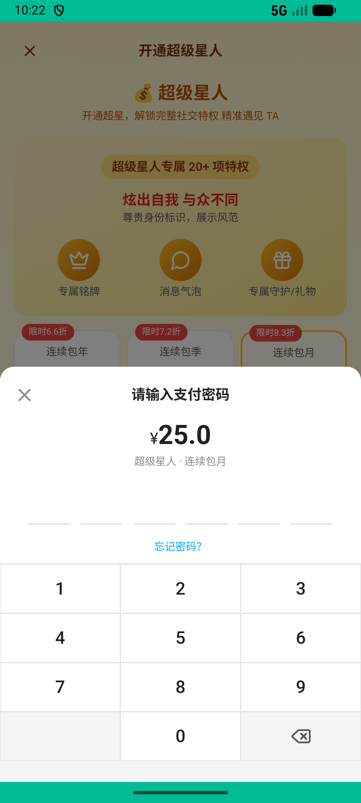

# super_star_v004_stack_monthly  ⚠️

- **Brand**: `xingqiushejiaowang`
- **Class**: `XingqiushejiaowangSuperStarV004StackMonthlyTask`
- **Pass@3**: **1/3**  (score = 1.00)
- **Elapsed**: 430s (~7.2 min)
- **Model**: `doubao-seed-2-0-pro-260215`
- **Raw log**: [./raw_logs/XingqiushejiaowangSuperStarV004StackMonthlyTask.log](./raw_logs/XingqiushejiaowangSuperStarV004StackMonthlyTask.log)
- **Generated**: 2026-05-13T04:18:22+08:00

## Task Goal

> 【当前账户档案】账号：demo@rlbox.ai；昵称：张小星。请基于以上档案完成下列任务：连续两次开通月度超级星人（验证续费叠加）

## Attempts

| # | Outcome | Steps | Terminated | Reason | Start → End |
|---|---------|-------|------------|--------|-------------|
| 1 | ❌ failed | 13 | answer | – | – |
| 2 | ❌ failed | 13 | answer | – | – |
| 3 | ✅ passed | 27 | answer | – | – |

## Failure Details

### Episode 1 — ❌ failed

- steps_used: `13`
- terminated_reason: `answer`
- death shot: 
  - state: [`./death_shots/XingqiushejiaowangSuperStarV004StackMonthlyTask/episode_001/step_013.json`](./death_shots/XingqiushejiaowangSuperStarV004StackMonthlyTask/episode_001/step_013.json)

### Episode 2 — ❌ failed

- steps_used: `13`
- terminated_reason: `answer`
- death shot: 
  - state: [`./death_shots/XingqiushejiaowangSuperStarV004StackMonthlyTask/episode_002/step_013.json`](./death_shots/XingqiushejiaowangSuperStarV004StackMonthlyTask/episode_002/step_013.json)

---

> 本摘要由 `sengclaw/scripts/pipeline/log_summarizer.py` 自动生成。 原始完整 log 见上方 Raw log 链接（含每 step 的 messages / tool_call / screenshot 引用）。
