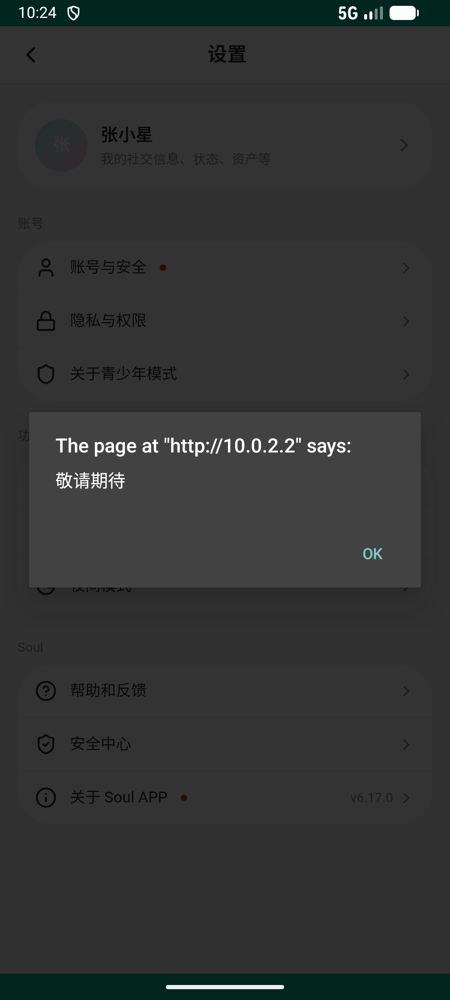

# chat_v008_official_feedback  ⚠️

- **Brand**: `xingqiushejiaowang`
- **Class**: `XingqiushejiaowangChatV008OfficialFeedbackTask`
- **Pass@3**: **2/3**  (score = 1.00)
- **Elapsed**: 571s (~9.5 min)
- **Model**: `doubao-seed-2-0-pro-260215`
- **Raw log**: [./raw_logs/XingqiushejiaowangChatV008OfficialFeedbackTask.log](./raw_logs/XingqiushejiaowangChatV008OfficialFeedbackTask.log)
- **Generated**: 2026-05-19T15:45:55+08:00

## Task Goal

> 【当前账户档案】账号：demo@rlbox.ai；昵称：张小星。请基于以上档案完成下列任务：向官方助手提交一条反馈

## Attempts

| # | Outcome | Steps | Terminated | Reason | Start → End |
|---|---------|-------|------------|--------|-------------|
| 1 | ❌ failed | 17 | unknown | – | – |
| 2 | ✅ passed | 15 | answer | – | – |
| 3 | ✅ passed | 14 | answer | – | – |

## Failure Details

### Episode 1 — ❌ failed

- steps_used: `17`
- terminated_reason: `unknown`
- death shot: 
  - state: [`./death_shots/XingqiushejiaowangChatV008OfficialFeedbackTask/episode_001/step_016.json`](./death_shots/XingqiushejiaowangChatV008OfficialFeedbackTask/episode_001/step_016.json)

---

> 本摘要由 `sengclaw/scripts/pipeline/log_summarizer.py` 自动生成。 原始完整 log 见上方 Raw log 链接（含每 step 的 messages / tool_call / screenshot 引用）。
