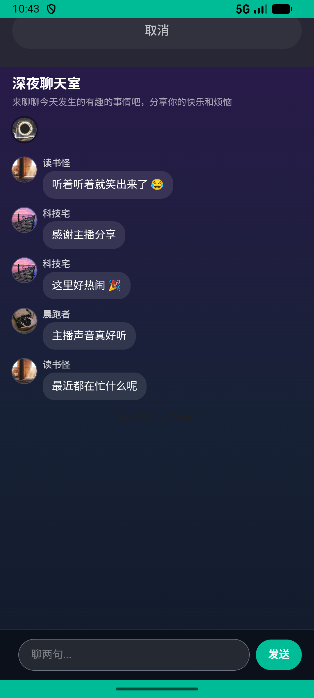

# party_v004_leave_current_party  ❌

- **Brand**: `xingqiushejiaowang`
- **Class**: `XingqiushejiaowangPartyV004LeaveCurrentPartyTask`
- **Pass@3**: **0/3**  (score = 0.00)
- **Elapsed**: 896s (~14.9 min)
- **Model**: `doubao-seed-2-0-lite-260428`
- **Raw log**: [./raw_logs/XingqiushejiaowangPartyV004LeaveCurrentPartyTask.log](./raw_logs/XingqiushejiaowangPartyV004LeaveCurrentPartyTask.log)
- **Generated**: 2026-05-22T01:25:51+08:00

## Task Goal

> 当前App：【星球社交网】。

## Attempts

| # | Outcome | Steps | Terminated | Reason | Start → End |
|---|---------|-------|------------|--------|-------------|
| 1 | ❌ failed | 9 | answer | – | 2026-05-22 01:10:55 → 2026-05-22 01:12:52 |
| 2 | ❌ failed | 7 | answer | – | 2026-05-22 01:12:52 → 2026-05-22 01:14:10 |
| 3 | ⏰ timeout | 50 | max_steps | – | 2026-05-22 01:14:10 → 2026-05-22 01:25:50 |

## Failure Details

### Episode 1 — ❌ failed

- steps_used: `9`
- terminated_reason: `answer`
- death shot: 
  - state: [`./death_shots/XingqiushejiaowangPartyV004LeaveCurrentPartyTask/episode_001/step_009.json`](./death_shots/XingqiushejiaowangPartyV004LeaveCurrentPartyTask/episode_001/step_009.json)

### Episode 2 — ❌ failed

- steps_used: `7`
- terminated_reason: `answer`
- death shot: 
  - state: [`./death_shots/XingqiushejiaowangPartyV004LeaveCurrentPartyTask/episode_002/step_007.json`](./death_shots/XingqiushejiaowangPartyV004LeaveCurrentPartyTask/episode_002/step_007.json)

### Episode 3 — ⏰ timeout

- steps_used: `50`
- terminated_reason: `max_steps`
- death shot: 
  - state: [`./death_shots/XingqiushejiaowangPartyV004LeaveCurrentPartyTask/episode_003/step_050.json`](./death_shots/XingqiushejiaowangPartyV004LeaveCurrentPartyTask/episode_003/step_050.json)

---

> 本摘要由 `sengclaw/scripts/pipeline/log_summarizer.py` 自动生成。 原始完整 log 见上方 Raw log 链接（含每 step 的 messages / tool_call / screenshot 引用）。
