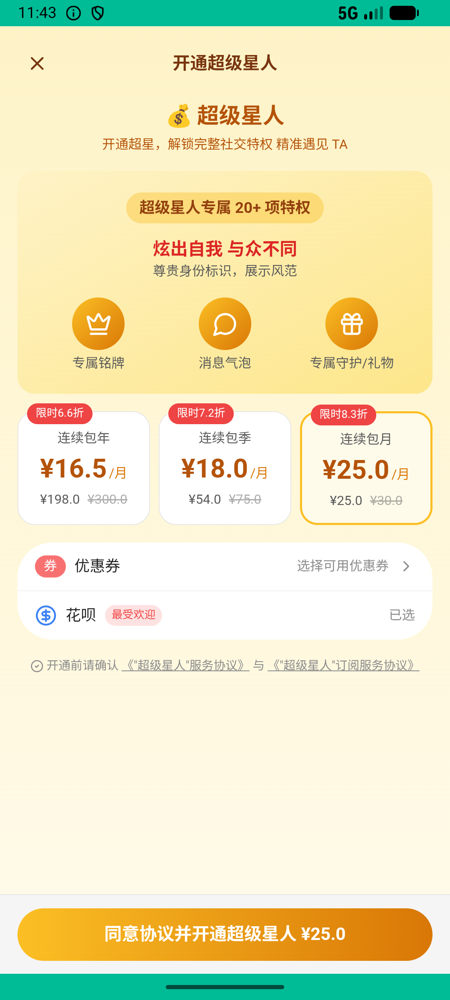

# super_star_v003_subscribe_month  ❌

- **Brand**: `xingqiushejiaowang`
- **Class**: `XingqiushejiaowangSuperStarV003SubscribeMonthTask`
- **Pass@3**: **0/3**  (score = 0.00)
- **Elapsed**: 208s (~3.5 min)
- **Model**: `doubao-seed-2-0-lite-260428`
- **Raw log**: [./raw_logs/XingqiushejiaowangSuperStarV003SubscribeMonthTask.log](./raw_logs/XingqiushejiaowangSuperStarV003SubscribeMonthTask.log)
- **Generated**: 2026-05-26T04:16:43+08:00

## Task Goal

> 【当前账户档案】账号：demo@rlbox.ai；昵称：张小星。请基于以上档案打开 com.xingqiushejiaowang 并完成以下任务：开个超级星人连续包月体验一下

## Attempts

| # | Outcome | Steps | Terminated | Reason | Start → End |
|---|---------|-------|------------|--------|-------------|
| 1 | ❌ failed | 6 | answer | – | 2026-05-26 04:13:15 → 2026-05-26 04:14:01 |
| 2 | ❌ failed | 7 | answer | – | 2026-05-26 04:14:32 → 2026-05-26 04:15:24 |
| 3 | ❌ failed | 6 | answer | – | 2026-05-26 04:15:54 → 2026-05-26 04:16:43 |

## Failure Details

### Episode 1 — ❌ failed

- steps_used: `6`
- terminated_reason: `answer`
- death shot: 
  - state: [`./death_shots/XingqiushejiaowangSuperStarV003SubscribeMonthTask/episode_001/step_006.json`](./death_shots/XingqiushejiaowangSuperStarV003SubscribeMonthTask/episode_001/step_006.json)
  - digest: [`episode_digest.md`](./death_shots/XingqiushejiaowangSuperStarV003SubscribeMonthTask/episode_001/episode_digest.md)

### Episode 2 — ❌ failed

- steps_used: `7`
- terminated_reason: `answer`
- death shot: 
  - state: [`./death_shots/XingqiushejiaowangSuperStarV003SubscribeMonthTask/episode_002/step_007.json`](./death_shots/XingqiushejiaowangSuperStarV003SubscribeMonthTask/episode_002/step_007.json)
  - digest: [`episode_digest.md`](./death_shots/XingqiushejiaowangSuperStarV003SubscribeMonthTask/episode_002/episode_digest.md)

### Episode 3 — ❌ failed

- steps_used: `6`
- terminated_reason: `answer`
- death shot: 
  - state: [`./death_shots/XingqiushejiaowangSuperStarV003SubscribeMonthTask/episode_003/step_006.json`](./death_shots/XingqiushejiaowangSuperStarV003SubscribeMonthTask/episode_003/step_006.json)
  - digest: [`episode_digest.md`](./death_shots/XingqiushejiaowangSuperStarV003SubscribeMonthTask/episode_003/episode_digest.md)

---

> 本摘要由 `sengclaw/scripts/pipeline/log_summarizer.py` 自动生成。 原始完整 log 见上方 Raw log 链接（含每 step 的 messages / tool_call / screenshot 引用）。
