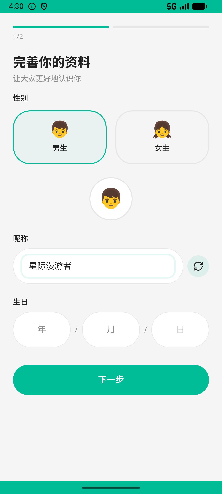

# onboarding_v005_gift_host_after_join  ⚠️

- **Brand**: `xingqiushejiaowang`
- **Class**: `XingqiushejiaowangOnboardingV005GiftHostAfterJoinTask`
- **Pass@3**: **2/3**  (score = 1.00)
- **Elapsed**: 279s (~4.7 min)
- **Model**: `doubao-seed-2-0-lite-260428`
- **Raw log**: [./raw_logs/XingqiushejiaowangOnboardingV005GiftHostAfterJoinTask.log](./raw_logs/XingqiushejiaowangOnboardingV005GiftHostAfterJoinTask.log)
- **Generated**: 2026-05-27T05:02:49+08:00

## Task Goal

> 【当前账户档案】账号：demo@rlbox.ai；昵称：张小星；支付密码：无需密码，直接完成支付。请基于以上档案打开 com.xingqiushejiaowang 并完成以下任务：我刚注册，帮我填完资料（男，昵称「星际漫游者」，生日 2000-06-15，性格测试随便选），然后进首页那个派对，给房主送个小黄鸭

## Attempts

| # | Outcome | Steps | Terminated | Reason | Start → End |
|---|---------|-------|------------|--------|-------------|
| 1 | ✅ passed | 21 | answer | – | 2026-05-27 04:27:49 → 2026-05-27 04:29:52 |
| 2 | ❌ failed | 5 | answer | – | 2026-05-27 04:29:52 → 2026-05-27 04:30:23 |
| 3 | ✅ passed | 20 | answer | – | 2026-05-27 04:30:23 → 2026-05-27 04:32:27 |

## Failure Details

### Episode 2 — ❌ failed

- steps_used: `5`
- terminated_reason: `answer`
- death shot: 
  - state: [`./death_shots/XingqiushejiaowangOnboardingV005GiftHostAfterJoinTask/episode_002/step_005.json`](./death_shots/XingqiushejiaowangOnboardingV005GiftHostAfterJoinTask/episode_002/step_005.json)
  - digest: [`episode_digest.md`](./death_shots/XingqiushejiaowangOnboardingV005GiftHostAfterJoinTask/episode_002/episode_digest.md)

---

> 本摘要由 `sengclaw/scripts/pipeline/log_summarizer.py` 自动生成。 原始完整 log 见上方 Raw log 链接（含每 step 的 messages / tool_call / screenshot 引用）。
