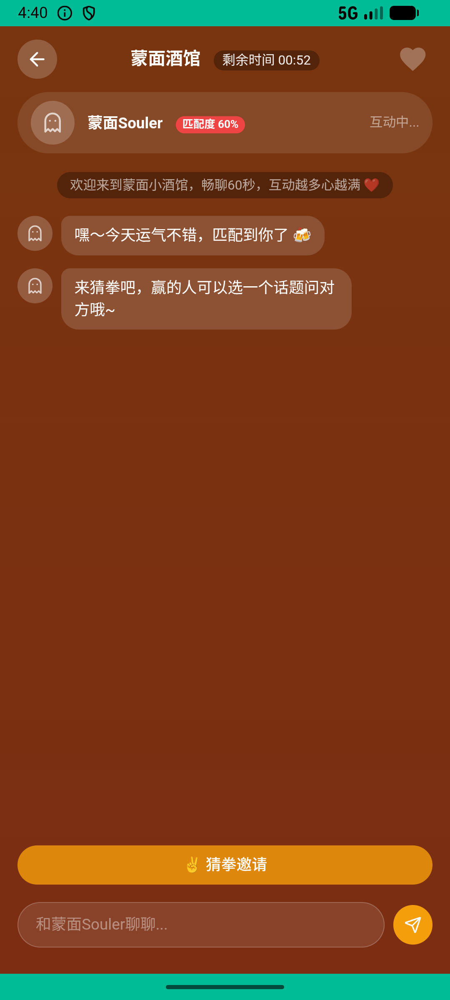

# party_v006_masked_bar_match  ❌

- **Brand**: `xingqiushejiaowang`
- **Class**: `XingqiushejiaowangPartyV006MaskedBarMatchTask`
- **Pass@3**: **0/3**  (score = 0.00)
- **Elapsed**: 188s (~3.1 min)
- **Model**: `doubao-seed-2-0-lite-260428`
- **Raw log**: [./raw_logs/XingqiushejiaowangPartyV006MaskedBarMatchTask.log](./raw_logs/XingqiushejiaowangPartyV006MaskedBarMatchTask.log)
- **Generated**: 2026-05-27T05:02:49+08:00

## Task Goal

> 【当前账户档案】账号：demo@rlbox.ai；昵称：张小星；支付密码：无需密码，直接完成支付。请基于以上档案打开 com.xingqiushejiaowang 并完成以下任务：去蒙面酒馆匹配一个酒友，边聊边玩

## Attempts

| # | Outcome | Steps | Terminated | Reason | Start → End |
|---|---------|-------|------------|--------|-------------|
| 1 | ❌ failed | 6 | answer | – | 2026-05-27 04:39:49 → 2026-05-27 04:40:29 |
| 2 | ❌ failed | 13 | answer | – | 2026-05-27 04:40:29 → 2026-05-27 04:42:03 |
| 3 | ❌ failed | 8 | answer | – | 2026-05-27 04:42:03 → 2026-05-27 04:42:56 |

## Failure Details

### Episode 1 — ❌ failed

- steps_used: `6`
- terminated_reason: `answer`
- death shot: 
  - state: [`./death_shots/XingqiushejiaowangPartyV006MaskedBarMatchTask/episode_001/step_006.json`](./death_shots/XingqiushejiaowangPartyV006MaskedBarMatchTask/episode_001/step_006.json)
  - digest: [`episode_digest.md`](./death_shots/XingqiushejiaowangPartyV006MaskedBarMatchTask/episode_001/episode_digest.md)

### Episode 2 — ❌ failed

- steps_used: `13`
- terminated_reason: `answer`
- death shot: 
  - state: [`./death_shots/XingqiushejiaowangPartyV006MaskedBarMatchTask/episode_002/step_013.json`](./death_shots/XingqiushejiaowangPartyV006MaskedBarMatchTask/episode_002/step_013.json)
  - digest: [`episode_digest.md`](./death_shots/XingqiushejiaowangPartyV006MaskedBarMatchTask/episode_002/episode_digest.md)

### Episode 3 — ❌ failed

- steps_used: `8`
- terminated_reason: `answer`
- death shot: 
  - state: [`./death_shots/XingqiushejiaowangPartyV006MaskedBarMatchTask/episode_003/step_008.json`](./death_shots/XingqiushejiaowangPartyV006MaskedBarMatchTask/episode_003/step_008.json)
  - digest: [`episode_digest.md`](./death_shots/XingqiushejiaowangPartyV006MaskedBarMatchTask/episode_003/episode_digest.md)

---

> 本摘要由 `sengclaw/scripts/pipeline/log_summarizer.py` 自动生成。 原始完整 log 见上方 Raw log 链接（含每 step 的 messages / tool_call / screenshot 引用）。
