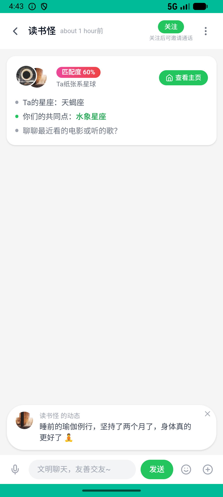
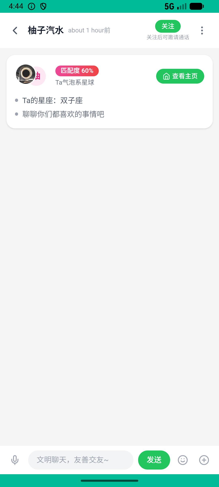
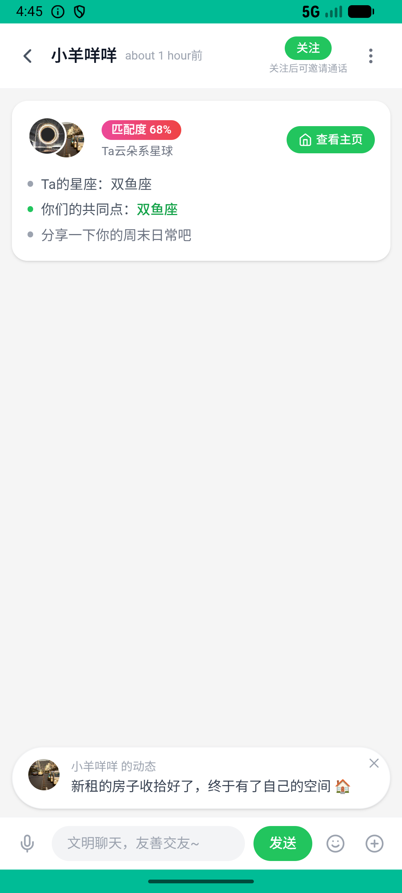

# party_v007_adventure_match  ❌

- **Brand**: `xingqiushejiaowang`
- **Class**: `XingqiushejiaowangPartyV007AdventureMatchTask`
- **Pass@3**: **0/3**  (score = 0.00)
- **Elapsed**: 104s (~1.7 min)
- **Model**: `doubao-seed-2-0-lite-260428`
- **Raw log**: [./raw_logs/XingqiushejiaowangPartyV007AdventureMatchTask.log](./raw_logs/XingqiushejiaowangPartyV007AdventureMatchTask.log)
- **Generated**: 2026-05-27T05:02:49+08:00

## Task Goal

> 【当前账户档案】账号：demo@rlbox.ai；昵称：张小星；支付密码：无需密码，直接完成支付。请基于以上档案打开 com.xingqiushejiaowang 并完成以下任务：点开奇遇铃，认识一个新朋友

## Attempts

| # | Outcome | Steps | Terminated | Reason | Start → End |
|---|---------|-------|------------|--------|-------------|
| 1 | ❌ failed | 3 | answer | – | 2026-05-27 04:43:37 → 2026-05-27 04:43:57 |
| 2 | ❌ failed | 6 | answer | – | 2026-05-27 04:43:57 → 2026-05-27 04:44:35 |
| 3 | ❌ failed | 6 | answer | – | 2026-05-27 04:44:35 → 2026-05-27 04:45:21 |

## Failure Details

### Episode 1 — ❌ failed

- steps_used: `3`
- terminated_reason: `answer`
- death shot: 
  - state: [`./death_shots/XingqiushejiaowangPartyV007AdventureMatchTask/episode_001/step_003.json`](./death_shots/XingqiushejiaowangPartyV007AdventureMatchTask/episode_001/step_003.json)
  - digest: [`episode_digest.md`](./death_shots/XingqiushejiaowangPartyV007AdventureMatchTask/episode_001/episode_digest.md)

### Episode 2 — ❌ failed

- steps_used: `6`
- terminated_reason: `answer`
- death shot: 
  - state: [`./death_shots/XingqiushejiaowangPartyV007AdventureMatchTask/episode_002/step_006.json`](./death_shots/XingqiushejiaowangPartyV007AdventureMatchTask/episode_002/step_006.json)
  - digest: [`episode_digest.md`](./death_shots/XingqiushejiaowangPartyV007AdventureMatchTask/episode_002/episode_digest.md)

### Episode 3 — ❌ failed

- steps_used: `6`
- terminated_reason: `answer`
- death shot: 
  - state: [`./death_shots/XingqiushejiaowangPartyV007AdventureMatchTask/episode_003/step_006.json`](./death_shots/XingqiushejiaowangPartyV007AdventureMatchTask/episode_003/step_006.json)
  - digest: [`episode_digest.md`](./death_shots/XingqiushejiaowangPartyV007AdventureMatchTask/episode_003/episode_digest.md)

---

> 本摘要由 `sengclaw/scripts/pipeline/log_summarizer.py` 自动生成。 原始完整 log 见上方 Raw log 链接（含每 step 的 messages / tool_call / screenshot 引用）。
