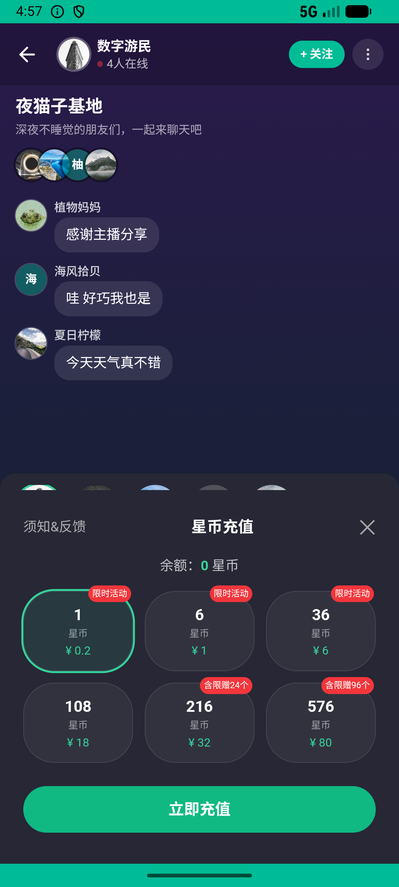
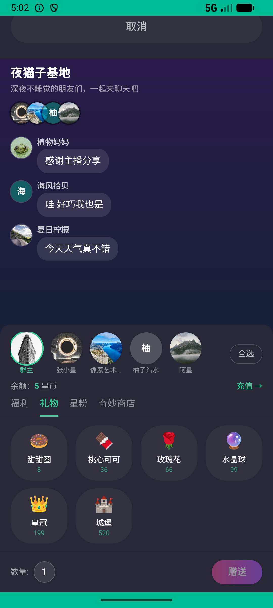

# party_v012_recharge_and_send_gift  ❌

- **Brand**: `xingqiushejiaowang`
- **Class**: `XingqiushejiaowangPartyV012RechargeAndSendGiftTask`
- **Pass@3**: **0/3**  (score = 0.00)
- **Elapsed**: 414s (~6.9 min)
- **Model**: `doubao-seed-2-0-lite-260428`
- **Raw log**: [./raw_logs/XingqiushejiaowangPartyV012RechargeAndSendGiftTask.log](./raw_logs/XingqiushejiaowangPartyV012RechargeAndSendGiftTask.log)
- **Generated**: 2026-05-27T05:02:50+08:00

## Task Goal

> 【当前账户档案】账号：demo@rlbox.ai；昵称：张小星；支付密码：无需密码，直接完成支付。请基于以上档案打开 com.xingqiushejiaowang 并完成以下任务：给「夜猫子基地」的房主送一朵玫瑰花

## Attempts

| # | Outcome | Steps | Terminated | Reason | Start → End |
|---|---------|-------|------------|--------|-------------|
| 1 | ❌ failed | 9 | answer | – | 2026-05-27 04:55:55 → 2026-05-27 04:57:05 |
| 2 | ❌ failed | 9 | answer | – | 2026-05-27 04:57:05 → 2026-05-27 04:58:06 |
| 3 | ❌ failed | 39 | answer | – | 2026-05-27 04:58:07 → 2026-05-27 05:02:49 |

## Failure Details

### Episode 1 — ❌ failed

- steps_used: `9`
- terminated_reason: `answer`
- death shot: 
  - state: [`./death_shots/XingqiushejiaowangPartyV012RechargeAndSendGiftTask/episode_001/step_009.json`](./death_shots/XingqiushejiaowangPartyV012RechargeAndSendGiftTask/episode_001/step_009.json)
  - digest: [`episode_digest.md`](./death_shots/XingqiushejiaowangPartyV012RechargeAndSendGiftTask/episode_001/episode_digest.md)

### Episode 2 — ❌ failed

- steps_used: `9`
- terminated_reason: `answer`
- death shot: 
  - state: [`./death_shots/XingqiushejiaowangPartyV012RechargeAndSendGiftTask/episode_002/step_009.json`](./death_shots/XingqiushejiaowangPartyV012RechargeAndSendGiftTask/episode_002/step_009.json)
  - digest: [`episode_digest.md`](./death_shots/XingqiushejiaowangPartyV012RechargeAndSendGiftTask/episode_002/episode_digest.md)

### Episode 3 — ❌ failed

- steps_used: `39`
- terminated_reason: `answer`
- death shot: 
  - state: [`./death_shots/XingqiushejiaowangPartyV012RechargeAndSendGiftTask/episode_003/step_039.json`](./death_shots/XingqiushejiaowangPartyV012RechargeAndSendGiftTask/episode_003/step_039.json)
  - digest: [`episode_digest.md`](./death_shots/XingqiushejiaowangPartyV012RechargeAndSendGiftTask/episode_003/episode_digest.md)

---

> 本摘要由 `sengclaw/scripts/pipeline/log_summarizer.py` 自动生成。 原始完整 log 见上方 Raw log 链接（含每 step 的 messages / tool_call / screenshot 引用）。
