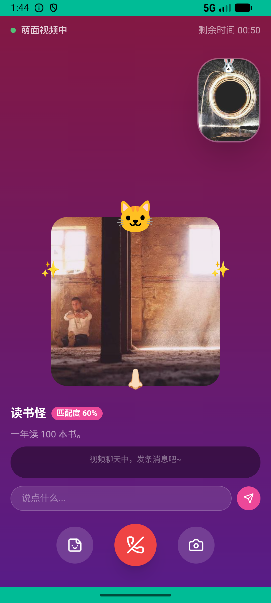
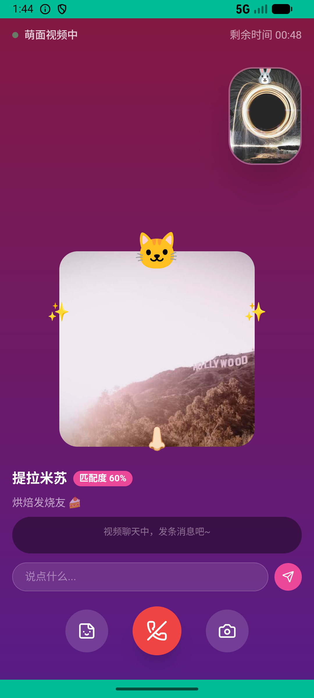
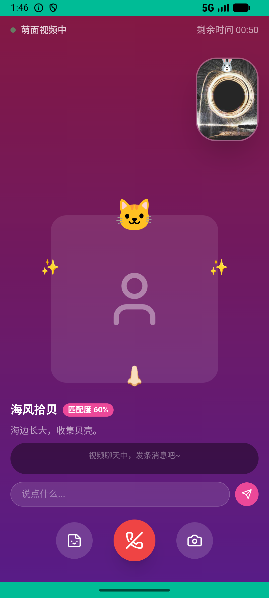

# party_v008_cute_match_video  ❌

- **Brand**: `xingqiushejiaowang`
- **Class**: `XingqiushejiaowangPartyV008CuteMatchVideoTask`
- **Pass@3**: **0/3**  (score = 0.00)
- **Elapsed**: 157s (~2.6 min)
- **Model**: `doubao-seed-2-0-lite-260428`
- **Raw log**: [./raw_logs/XingqiushejiaowangPartyV008CuteMatchVideoTask.log](./raw_logs/XingqiushejiaowangPartyV008CuteMatchVideoTask.log)
- **Generated**: 2026-06-01T01:57:38+08:00

## Task Goal

> 【当前账户档案】账号：demo@rlbox.ai；昵称：张小星；支付密码：无需密码，如需支付直接确认即可。请基于以上档案打开 com.xingqiushejiaowang 并完成以下任务：试试萌面匹配，视频聊聊天

## Attempts

| # | Outcome | Steps | Terminated | Reason | Start → End |
|---|---------|-------|------------|--------|-------------|
| 1 | ❌ failed | 5 | answer | 至少发了一条消息: 视频通话中没发消息 Diff: @@ -1 +1 @@ -true +false | 2026-06-01 01:43:33 → 2026-06-01 01:44:16 |
| 2 | ❌ failed | 5 | answer | 至少发了一条消息: 视频通话中没发消息 Diff: @@ -1 +1 @@ -true +false | 2026-06-01 01:44:16 → 2026-06-01 01:44:59 |
| 3 | ❌ failed | 8 | answer | 至少发了一条消息: 视频通话中没发消息 Diff: @@ -1 +1 @@ -true +false | 2026-06-01 01:44:59 → 2026-06-01 01:46:09 |

## Failure Details

### Episode 1 — ❌ failed

- steps_used: `5`
- terminated_reason: `answer`
- reason:

  ```
  至少发了一条消息: 视频通话中没发消息
  Diff:
  @@ -1 +1 @@
  -true
  +false
  ```
- death shot: 
  - state: [`./death_shots/XingqiushejiaowangPartyV008CuteMatchVideoTask/episode_001/step_005.json`](./death_shots/XingqiushejiaowangPartyV008CuteMatchVideoTask/episode_001/step_005.json)
  - digest: [`episode_digest.md`](./death_shots/XingqiushejiaowangPartyV008CuteMatchVideoTask/episode_001/episode_digest.md)

### Episode 2 — ❌ failed

- steps_used: `5`
- terminated_reason: `answer`
- reason:

  ```
  至少发了一条消息: 视频通话中没发消息
  Diff:
  @@ -1 +1 @@
  -true
  +false
  ```
- death shot: 
  - state: [`./death_shots/XingqiushejiaowangPartyV008CuteMatchVideoTask/episode_002/step_005.json`](./death_shots/XingqiushejiaowangPartyV008CuteMatchVideoTask/episode_002/step_005.json)
  - digest: [`episode_digest.md`](./death_shots/XingqiushejiaowangPartyV008CuteMatchVideoTask/episode_002/episode_digest.md)

### Episode 3 — ❌ failed

- steps_used: `8`
- terminated_reason: `answer`
- reason:

  ```
  至少发了一条消息: 视频通话中没发消息
  Diff:
  @@ -1 +1 @@
  -true
  +false
  ```
- death shot: 
  - state: [`./death_shots/XingqiushejiaowangPartyV008CuteMatchVideoTask/episode_003/step_008.json`](./death_shots/XingqiushejiaowangPartyV008CuteMatchVideoTask/episode_003/step_008.json)
  - digest: [`episode_digest.md`](./death_shots/XingqiushejiaowangPartyV008CuteMatchVideoTask/episode_003/episode_digest.md)

---

> 本摘要由 `sengclaw/scripts/pipeline/log_summarizer.py` 自动生成。 原始完整 log 见上方 Raw log 链接（含每 step 的 messages / tool_call / screenshot 引用）。
