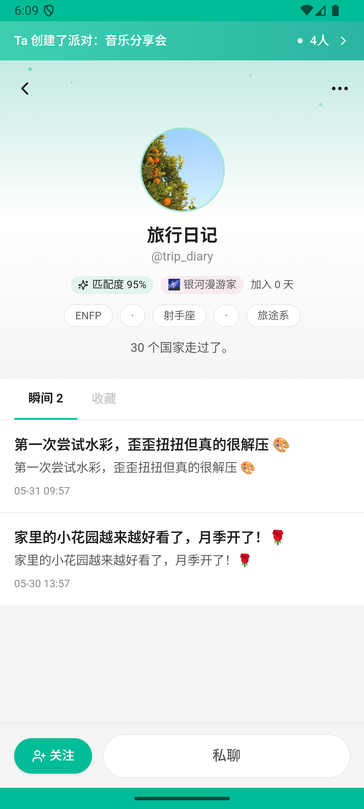
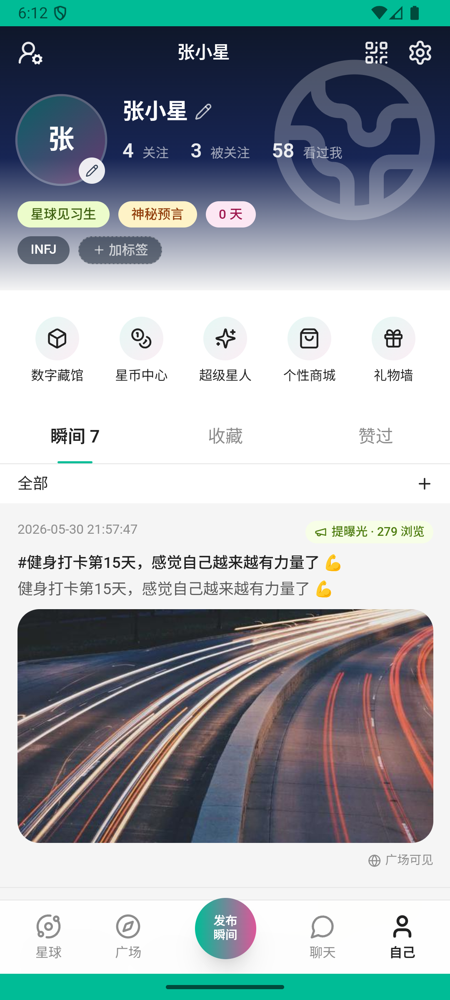

# chat_v004_unfollow  ❌

- **Brand**: `xingqiushejiaowang`
- **Class**: `XingqiushejiaowangChatV004UnfollowTask`
- **Pass@3**: **0/3**  (score = 0.00)
- **Elapsed**: 418s (~7.0 min)
- **Model**: `doubao-seed-2-0-lite-260428`
- **Raw log**: [./raw_logs/XingqiushejiaowangChatV004UnfollowTask.log](./raw_logs/XingqiushejiaowangChatV004UnfollowTask.log)
- **Generated**: 2026-06-01T06:29:31+08:00

## Task Goal

> 【当前账户档案】账号：demo@rlbox.ai；昵称：张小星；支付密码：无需密码，如需支付直接确认即可。请基于以上档案打开 com.xingqiushejiaowang 并完成以下任务：最近 trip_diary 发的内容不太感兴趣了，取消关注吧

## Attempts

| # | Outcome | Steps | Terminated | Reason | Start → End |
|---|---------|-------|------------|--------|-------------|
| 1 | ❌ failed | 15 | answer | session 内存在 demo → trip_diary 的 Follow 覆盖: data_version=8af51f7ab82ffac1 下缺少 demo → trip_diary 的 Follow 覆盖行 | 2026-06-01 06:05:19 → 2026-06-01 06:07:24 |
| 2 | ❌ failed | 12 | answer | session 内存在 demo → trip_diary 的 Follow 覆盖: data_version=a39f117656bcec8b 下缺少 demo → trip_diary 的 Follow 覆盖行 | 2026-06-01 06:07:24 → 2026-06-01 06:09:04 |
| 3 | ❌ failed | 21 | answer | session 内存在 demo → trip_diary 的 Follow 覆盖: data_version=536403051dd2021c 下缺少 demo → trip_diary 的 Follow 覆盖行 | 2026-06-01 06:09:04 → 2026-06-01 06:12:17 |

## Failure Details

### Episode 1 — ❌ failed

- steps_used: `15`
- terminated_reason: `answer`
- reason:

  ```
  session 内存在 demo → trip_diary 的 Follow 覆盖: data_version=8af51f7ab82ffac1 下缺少 demo → trip_diary 的 Follow 覆盖行
  ```
- death shot: 
  - state: [`./death_shots/XingqiushejiaowangChatV004UnfollowTask/episode_001/step_015.json`](./death_shots/XingqiushejiaowangChatV004UnfollowTask/episode_001/step_015.json)
  - digest: [`episode_digest.md`](./death_shots/XingqiushejiaowangChatV004UnfollowTask/episode_001/episode_digest.md)

### Episode 2 — ❌ failed

- steps_used: `12`
- terminated_reason: `answer`
- reason:

  ```
  session 内存在 demo → trip_diary 的 Follow 覆盖: data_version=a39f117656bcec8b 下缺少 demo → trip_diary 的 Follow 覆盖行
  ```
- death shot: 
  - state: [`./death_shots/XingqiushejiaowangChatV004UnfollowTask/episode_002/step_012.json`](./death_shots/XingqiushejiaowangChatV004UnfollowTask/episode_002/step_012.json)
  - digest: [`episode_digest.md`](./death_shots/XingqiushejiaowangChatV004UnfollowTask/episode_002/episode_digest.md)

### Episode 3 — ❌ failed

- steps_used: `21`
- terminated_reason: `answer`
- reason:

  ```
  session 内存在 demo → trip_diary 的 Follow 覆盖: data_version=536403051dd2021c 下缺少 demo → trip_diary 的 Follow 覆盖行
  ```
- death shot: 
  - state: [`./death_shots/XingqiushejiaowangChatV004UnfollowTask/episode_003/step_021.json`](./death_shots/XingqiushejiaowangChatV004UnfollowTask/episode_003/step_021.json)
  - digest: [`episode_digest.md`](./death_shots/XingqiushejiaowangChatV004UnfollowTask/episode_003/episode_digest.md)

---

> 本摘要由 `sengclaw/scripts/pipeline/log_summarizer.py` 自动生成。 原始完整 log 见上方 Raw log 链接（含每 step 的 messages / tool_call / screenshot 引用）。
