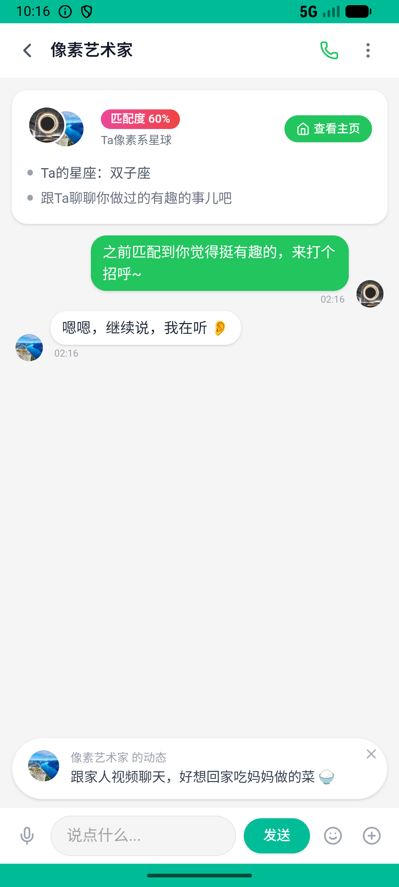
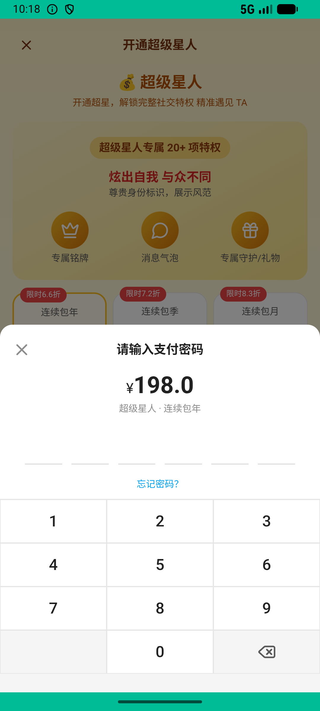
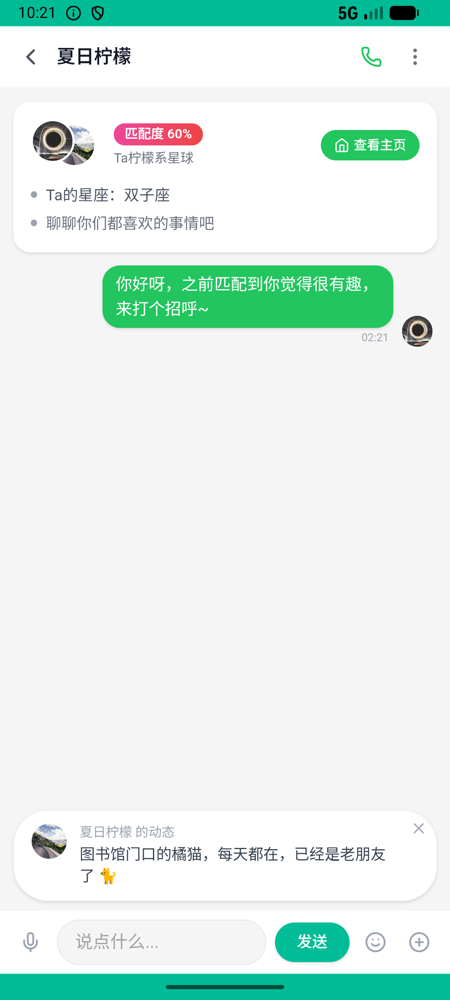

# matching_v002_continue_chat  ❌

- **Brand**: `xingqiushejiaowang`
- **Class**: `XingqiushejiaowangMatchingV002ContinueChatTask`
- **Pass@3**: **0/3**  (score = 0.00)
- **Elapsed**: 974s (~16.2 min)
- **Model**: `doubao-seed-2-0-lite-260428`
- **Raw log**: [./raw_logs/XingqiushejiaowangMatchingV002ContinueChatTask.log](./raw_logs/XingqiushejiaowangMatchingV002ContinueChatTask.log)
- **Generated**: 2026-06-02T11:03:15+08:00

## Task Goal

> 【当前账户档案】账号：demo@rlbox.ai；昵称：张小星；支付密码：无需密码，如需支付直接确认即可。请基于以上档案打开 com.xingqiushejiaowang 并完成以下任务：之前匹配到的那个人挺有趣，开通超级星人找回 ta 聊几句

## Attempts

| # | Outcome | Steps | Terminated | Reason | Start → End |
|---|---------|-------|------------|--------|-------------|
| 1 | ❌ failed | 70 | answer | 与对方建立了 direct 私聊会话: 未找到 张小星 与 银河方程 的私聊会话; 关注了对方: 未找到 张小星 → 银河方程 的有效关注 Diff: @@ -1 +1 @@ -true +false | 2026-06-02 10:05:46 → 2026-06-02 10:16:47 |
| 2 | ❌ failed | 8 | answer | 超级星人会员已激活: 未找到 demo 的超级星人会员记录; 与对方建立了 direct 私聊会话: 未找到 张小星 与 银河方程 的私聊会话; 关注了对方: 未找到 张小星 → 银河方程 的有效关注 Diff: @@ -1 +1 @@ -true +false | 2026-06-02 10:16:47 → 2026-06-02 10:18:06 |
| 3 | ❌ failed | 26 | answer | 超级星人会员已激活: 未找到 demo 的超级星人会员记录; 与对方建立了 direct 私聊会话: 未找到 张小星 与 银河方程 的私聊会话; 关注了对方: 未找到 张小星 → 银河方程 的有效关注 Diff: @@ -1 +1 @@ -true +false | 2026-06-02 10:18:06 → 2026-06-02 10:21:59 |

## Failure Details

### Episode 1 — ❌ failed

- steps_used: `70`
- terminated_reason: `answer`
- reason:

  ```
  与对方建立了 direct 私聊会话: 未找到 张小星 与 银河方程 的私聊会话; 关注了对方: 未找到 张小星 → 银河方程 的有效关注
  Diff:
  @@ -1 +1 @@
  -true
  +false
  ```
- death shot: 
  - state: [`./death_shots/XingqiushejiaowangMatchingV002ContinueChatTask/episode_001/step_070.json`](./death_shots/XingqiushejiaowangMatchingV002ContinueChatTask/episode_001/step_070.json)
  - digest: [`episode_digest.md`](./death_shots/XingqiushejiaowangMatchingV002ContinueChatTask/episode_001/episode_digest.md)

### Episode 2 — ❌ failed

- steps_used: `8`
- terminated_reason: `answer`
- reason:

  ```
  超级星人会员已激活: 未找到 demo 的超级星人会员记录; 与对方建立了 direct 私聊会话: 未找到 张小星 与 银河方程 的私聊会话; 关注了对方: 未找到 张小星 → 银河方程 的有效关注
  Diff:
  @@ -1 +1 @@
  -true
  +false
  ```
- death shot: 
  - state: [`./death_shots/XingqiushejiaowangMatchingV002ContinueChatTask/episode_002/step_008.json`](./death_shots/XingqiushejiaowangMatchingV002ContinueChatTask/episode_002/step_008.json)
  - digest: [`episode_digest.md`](./death_shots/XingqiushejiaowangMatchingV002ContinueChatTask/episode_002/episode_digest.md)

### Episode 3 — ❌ failed

- steps_used: `26`
- terminated_reason: `answer`
- reason:

  ```
  超级星人会员已激活: 未找到 demo 的超级星人会员记录; 与对方建立了 direct 私聊会话: 未找到 张小星 与 银河方程 的私聊会话; 关注了对方: 未找到 张小星 → 银河方程 的有效关注
  Diff:
  @@ -1 +1 @@
  -true
  +false
  ```
- death shot: 
  - state: [`./death_shots/XingqiushejiaowangMatchingV002ContinueChatTask/episode_003/step_026.json`](./death_shots/XingqiushejiaowangMatchingV002ContinueChatTask/episode_003/step_026.json)
  - digest: [`episode_digest.md`](./death_shots/XingqiushejiaowangMatchingV002ContinueChatTask/episode_003/episode_digest.md)

---

> 本摘要由 `sengclaw/scripts/pipeline/log_summarizer.py` 自动生成。 原始完整 log 见上方 Raw log 链接（含每 step 的 messages / tool_call / screenshot 引用）。
