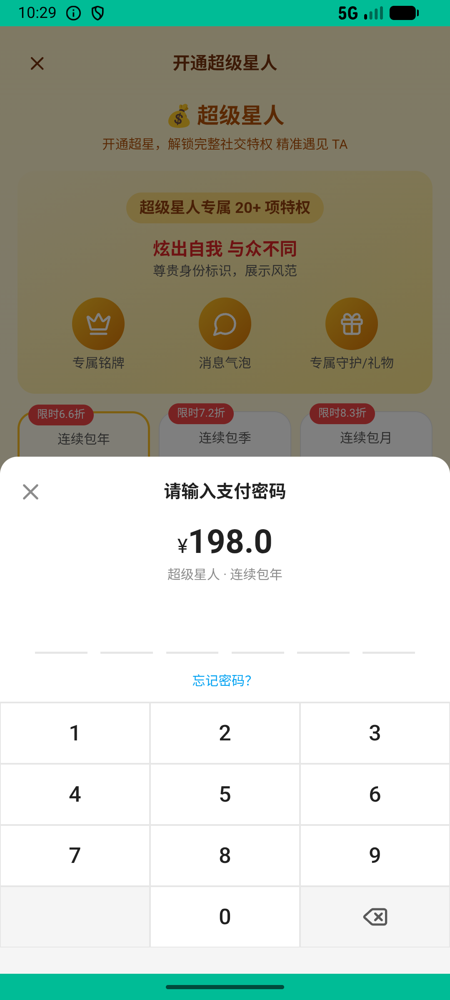
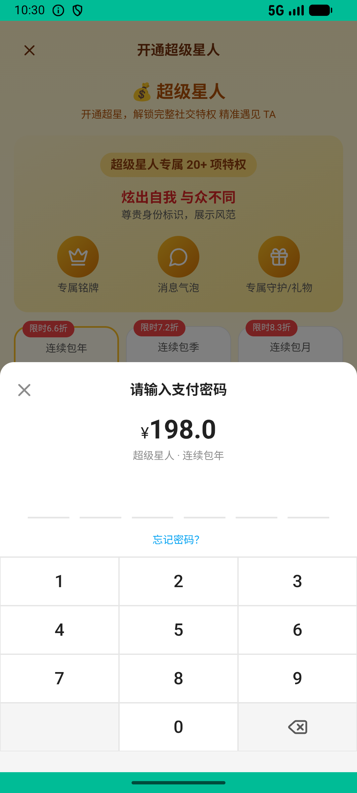

# super_star_v001_subscribe_year  ❌

- **Brand**: `xingqiushejiaowang`
- **Class**: `XingqiushejiaowangSuperStarV001SubscribeYearTask`
- **Pass@3**: **0/3**  (score = 0.00)
- **Elapsed**: 250s (~4.2 min)
- **Model**: `doubao-seed-2-0-lite-260428`
- **Raw log**: [./raw_logs/XingqiushejiaowangSuperStarV001SubscribeYearTask.log](./raw_logs/XingqiushejiaowangSuperStarV001SubscribeYearTask.log)
- **Generated**: 2026-06-02T11:03:15+08:00

## Task Goal

> 【当前账户档案】账号：demo@rlbox.ai；昵称：张小星；支付密码：无需密码，如需支付直接确认即可。请基于以上档案打开 com.xingqiushejiaowang 并完成以下任务：想成为超级星人，直接开个连续包年最划算

## Attempts

| # | Outcome | Steps | Terminated | Reason | Start → End |
|---|---------|-------|------------|--------|-------------|
| 1 | ❌ failed | 8 | answer | session 内存在 demo 的 super_star_membership: data_version=7d5fd5a54b116ef2 下没找到 demo 的会员关系（订阅未生效）; 存在 plan_key=year 的订单: 没找到 demo 的「连续包年」订单 | 2026-06-02 10:28:16 → 2026-06-02 10:29:39 |
| 2 | ❌ failed | 9 | answer | session 内存在 demo 的 super_star_membership: data_version=86c408c1e6ff1770 下没找到 demo 的会员关系（订阅未生效）; 存在 plan_key=year 的订单: 没找到 demo 的「连续包年」订单 | 2026-06-02 10:29:39 → 2026-06-02 10:31:03 |
| 3 | ❌ failed | 8 | answer | session 内存在 demo 的 super_star_membership: data_version=e7a8e18f1bf81929 下没找到 demo 的会员关系（订阅未生效）; 存在 plan_key=year 的订单: 没找到 demo 的「连续包年」订单 | 2026-06-02 10:31:03 → 2026-06-02 10:32:26 |

## Failure Details

### Episode 1 — ❌ failed

- steps_used: `8`
- terminated_reason: `answer`
- reason:

  ```
  session 内存在 demo 的 super_star_membership: data_version=7d5fd5a54b116ef2 下没找到 demo 的会员关系（订阅未生效）; 存在 plan_key=year 的订单: 没找到 demo 的「连续包年」订单
  ```
- death shot: 
  - state: [`./death_shots/XingqiushejiaowangSuperStarV001SubscribeYearTask/episode_001/step_008.json`](./death_shots/XingqiushejiaowangSuperStarV001SubscribeYearTask/episode_001/step_008.json)
  - digest: [`episode_digest.md`](./death_shots/XingqiushejiaowangSuperStarV001SubscribeYearTask/episode_001/episode_digest.md)

### Episode 2 — ❌ failed

- steps_used: `9`
- terminated_reason: `answer`
- reason:

  ```
  session 内存在 demo 的 super_star_membership: data_version=86c408c1e6ff1770 下没找到 demo 的会员关系（订阅未生效）; 存在 plan_key=year 的订单: 没找到 demo 的「连续包年」订单
  ```
- death shot: 
  - state: [`./death_shots/XingqiushejiaowangSuperStarV001SubscribeYearTask/episode_002/step_009.json`](./death_shots/XingqiushejiaowangSuperStarV001SubscribeYearTask/episode_002/step_009.json)
  - digest: [`episode_digest.md`](./death_shots/XingqiushejiaowangSuperStarV001SubscribeYearTask/episode_002/episode_digest.md)

### Episode 3 — ❌ failed

- steps_used: `8`
- terminated_reason: `answer`
- reason:

  ```
  session 内存在 demo 的 super_star_membership: data_version=e7a8e18f1bf81929 下没找到 demo 的会员关系（订阅未生效）; 存在 plan_key=year 的订单: 没找到 demo 的「连续包年」订单
  ```
- death shot: 
  - state: [`./death_shots/XingqiushejiaowangSuperStarV001SubscribeYearTask/episode_003/step_008.json`](./death_shots/XingqiushejiaowangSuperStarV001SubscribeYearTask/episode_003/step_008.json)
  - digest: [`episode_digest.md`](./death_shots/XingqiushejiaowangSuperStarV001SubscribeYearTask/episode_003/episode_digest.md)

---

> 本摘要由 `sengclaw/scripts/pipeline/log_summarizer.py` 自动生成。 原始完整 log 见上方 Raw log 链接（含每 step 的 messages / tool_call / screenshot 引用）。
