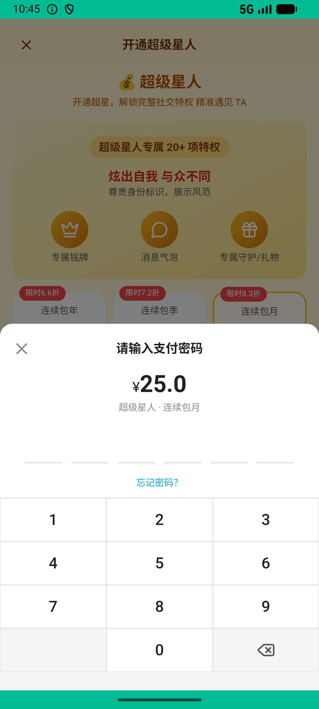
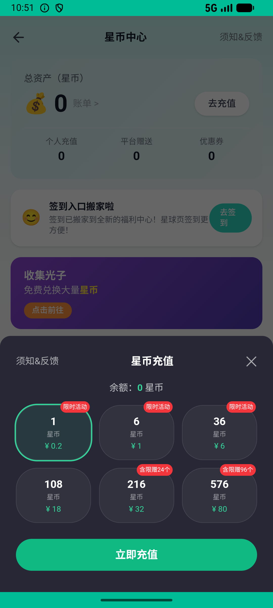

# super_star_v004_stack_monthly  ⚠️

- **Brand**: `xingqiushejiaowang`
- **Class**: `XingqiushejiaowangSuperStarV004StackMonthlyTask`
- **Pass@3**: **1/3**  (score = 1.00)
- **Elapsed**: 703s (~11.7 min)
- **Model**: `doubao-seed-2-0-lite-260428`
- **Raw log**: [./raw_logs/XingqiushejiaowangSuperStarV004StackMonthlyTask.log](./raw_logs/XingqiushejiaowangSuperStarV004StackMonthlyTask.log)
- **Generated**: 2026-06-02T11:03:15+08:00

## Task Goal

> 【当前账户档案】账号：demo@rlbox.ai；昵称：张小星；支付密码：无需密码，如需支付直接确认即可。请基于以上档案打开 com.xingqiushejiaowang 并完成以下任务：超级星人快到期了，再续一个月

## Attempts

| # | Outcome | Steps | Terminated | Reason | Start → End |
|---|---------|-------|------------|--------|-------------|
| 1 | ❌ failed | 11 | answer | 新增续费订单（共 2 笔月订单）: 只找到 1 笔月套餐订单（应 ≥ 2，含初始 1 笔 + 续费 1 笔）; active_until 延长到约 33 天后（3 + 30）: active_until 仅剩 3.0 天，续费未生效（应 ≥ 28） | 2026-06-02 10:43:28 → 2026-06-02 10:45:39 |
| 2 | ❌ failed | 36 | answer | 新增续费订单（共 2 笔月订单）: 只找到 1 笔月套餐订单（应 ≥ 2，含初始 1 笔 + 续费 1 笔）; active_until 延长到约 33 天后（3 + 30）: active_until 仅剩 3.0 天，续费未生效（应 ≥ 28） | 2026-06-02 10:45:39 → 2026-06-02 10:51:34 |
| 3 | ✅ passed | 25 | answer | – | 2026-06-02 10:51:34 → 2026-06-02 10:55:11 |

## Failure Details

### Episode 1 — ❌ failed

- steps_used: `11`
- terminated_reason: `answer`
- reason:

  ```
  新增续费订单（共 2 笔月订单）: 只找到 1 笔月套餐订单（应 ≥ 2，含初始 1 笔 + 续费 1 笔）; active_until 延长到约 33 天后（3 + 30）: active_until 仅剩 3.0 天，续费未生效（应 ≥ 28）
  ```
- death shot: 
  - state: [`./death_shots/XingqiushejiaowangSuperStarV004StackMonthlyTask/episode_001/step_011.json`](./death_shots/XingqiushejiaowangSuperStarV004StackMonthlyTask/episode_001/step_011.json)
  - digest: [`episode_digest.md`](./death_shots/XingqiushejiaowangSuperStarV004StackMonthlyTask/episode_001/episode_digest.md)

### Episode 2 — ❌ failed

- steps_used: `36`
- terminated_reason: `answer`
- reason:

  ```
  新增续费订单（共 2 笔月订单）: 只找到 1 笔月套餐订单（应 ≥ 2，含初始 1 笔 + 续费 1 笔）; active_until 延长到约 33 天后（3 + 30）: active_until 仅剩 3.0 天，续费未生效（应 ≥ 28）
  ```
- death shot: 
  - state: [`./death_shots/XingqiushejiaowangSuperStarV004StackMonthlyTask/episode_002/step_036.json`](./death_shots/XingqiushejiaowangSuperStarV004StackMonthlyTask/episode_002/step_036.json)
  - digest: [`episode_digest.md`](./death_shots/XingqiushejiaowangSuperStarV004StackMonthlyTask/episode_002/episode_digest.md)

---

> 本摘要由 `sengclaw/scripts/pipeline/log_summarizer.py` 自动生成。 原始完整 log 见上方 Raw log 链接（含每 step 的 messages / tool_call / screenshot 引用）。
