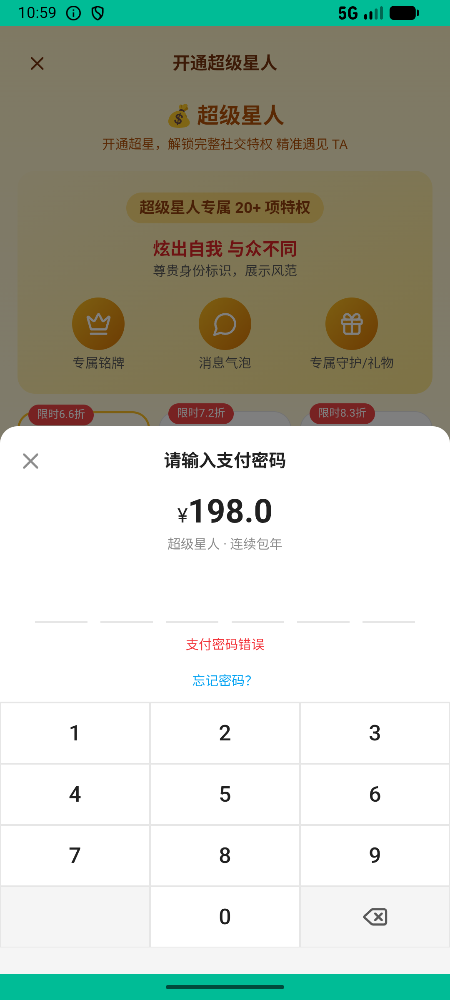
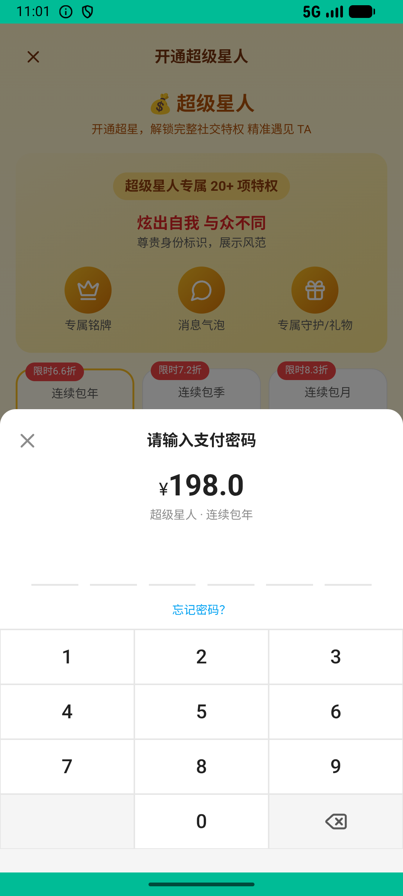

# super_star_v005_stack_year_after_month  ❌

- **Brand**: `xingqiushejiaowang`
- **Class**: `XingqiushejiaowangSuperStarV005StackYearAfterMonthTask`
- **Pass@3**: **0/3**  (score = 0.00)
- **Elapsed**: 441s (~7.3 min)
- **Model**: `doubao-seed-2-0-lite-260428`
- **Raw log**: [./raw_logs/XingqiushejiaowangSuperStarV005StackYearAfterMonthTask.log](./raw_logs/XingqiushejiaowangSuperStarV005StackYearAfterMonthTask.log)
- **Generated**: 2026-06-02T11:03:15+08:00

## Task Goal

> 【当前账户档案】账号：demo@rlbox.ai；昵称：张小星；支付密码：无需密码，如需支付直接确认即可。请基于以上档案打开 com.xingqiushejiaowang 并完成以下任务：包月用着不过瘾，帮我升级成包年的吧

## Attempts

| # | Outcome | Steps | Terminated | Reason | Start → End |
|---|---------|-------|------------|--------|-------------|
| 1 | ❌ failed | 13 | answer | 存在 1 笔 year 已支付订单: 没找到 year 套餐已支付订单; active_until 距今 ≥ 360 天（包年叠加生效）: active_until 仅剩 30.0 天，包年没叠加（应 ≥ 360） | 2026-06-02 10:55:54 → 2026-06-02 10:59:33 |
| 2 | ❌ failed | 10 | answer | 存在 1 笔 year 已支付订单: 没找到 year 套餐已支付订单; active_until 距今 ≥ 360 天（包年叠加生效）: active_until 仅剩 30.0 天，包年没叠加（应 ≥ 360） | 2026-06-02 10:59:33 → 2026-06-02 11:01:27 |
| 3 | ❌ failed | 9 | answer | 存在 1 笔 year 已支付订单: 没找到 year 套餐已支付订单; active_until 距今 ≥ 360 天（包年叠加生效）: active_until 仅剩 30.0 天，包年没叠加（应 ≥ 360） | 2026-06-02 11:01:27 → 2026-06-02 11:03:15 |

## Failure Details

### Episode 1 — ❌ failed

- steps_used: `13`
- terminated_reason: `answer`
- reason:

  ```
  存在 1 笔 year 已支付订单: 没找到 year 套餐已支付订单; active_until 距今 ≥ 360 天（包年叠加生效）: active_until 仅剩 30.0 天，包年没叠加（应 ≥ 360）
  ```
- death shot: 
  - state: [`./death_shots/XingqiushejiaowangSuperStarV005StackYearAfterMonthTask/episode_001/step_013.json`](./death_shots/XingqiushejiaowangSuperStarV005StackYearAfterMonthTask/episode_001/step_013.json)
  - digest: [`episode_digest.md`](./death_shots/XingqiushejiaowangSuperStarV005StackYearAfterMonthTask/episode_001/episode_digest.md)

### Episode 2 — ❌ failed

- steps_used: `10`
- terminated_reason: `answer`
- reason:

  ```
  存在 1 笔 year 已支付订单: 没找到 year 套餐已支付订单; active_until 距今 ≥ 360 天（包年叠加生效）: active_until 仅剩 30.0 天，包年没叠加（应 ≥ 360）
  ```
- death shot: 
  - state: [`./death_shots/XingqiushejiaowangSuperStarV005StackYearAfterMonthTask/episode_002/step_010.json`](./death_shots/XingqiushejiaowangSuperStarV005StackYearAfterMonthTask/episode_002/step_010.json)
  - digest: [`episode_digest.md`](./death_shots/XingqiushejiaowangSuperStarV005StackYearAfterMonthTask/episode_002/episode_digest.md)

### Episode 3 — ❌ failed

- steps_used: `9`
- terminated_reason: `answer`
- reason:

  ```
  存在 1 笔 year 已支付订单: 没找到 year 套餐已支付订单; active_until 距今 ≥ 360 天（包年叠加生效）: active_until 仅剩 30.0 天，包年没叠加（应 ≥ 360）
  ```
- death shot: 
  - state: [`./death_shots/XingqiushejiaowangSuperStarV005StackYearAfterMonthTask/episode_003/step_009.json`](./death_shots/XingqiushejiaowangSuperStarV005StackYearAfterMonthTask/episode_003/step_009.json)
  - digest: [`episode_digest.md`](./death_shots/XingqiushejiaowangSuperStarV005StackYearAfterMonthTask/episode_003/episode_digest.md)

---

> 本摘要由 `sengclaw/scripts/pipeline/log_summarizer.py` 自动生成。 原始完整 log 见上方 Raw log 链接（含每 step 的 messages / tool_call / screenshot 引用）。
