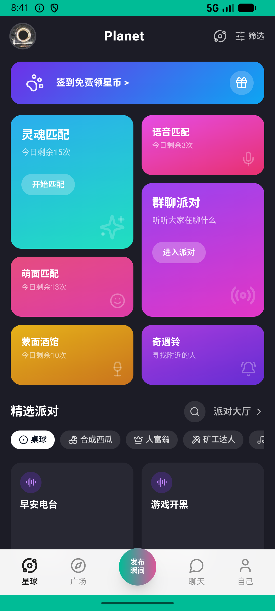

# group_v003_toggle_approval  ❌

- **Brand**: `xingqiushejiaowang`
- **Class**: `XingqiushejiaowangGroupV003ToggleApprovalTask`
- **Pass@3**: **0/3**  (score = 0.00)
- **Elapsed**: 1921s (~32.0 min)
- **Model**: `doubao-seed-2-0-lite-260428`
- **Raw log**: [./raw_logs/XingqiushejiaowangGroupV003ToggleApprovalTask.log](./raw_logs/XingqiushejiaowangGroupV003ToggleApprovalTask.log)
- **Generated**: 2026-06-05T00:38:18+08:00

## Task Goal

> 【当前账户档案】账号：demo@rlbox.ai；昵称：张小星；支付密码：123456，如需支付请使用此密码完成支付。请基于以上档案打开 com.xingqiushejiaowang 并完成以下任务：最近老有我不喜欢的人进我的「深夜话痨群」，得打开加群审核才行

## Attempts

| # | Outcome | Steps | Terminated | Reason | Start → End |
|---|---------|-------|------------|--------|-------------|
| 1 | 💥 error | 0 | exception | exception: 404 Not Found for url: http://localhost:6800/step \\| detail: No available devices found | 2026-06-04 20:29:27 → 2026-06-04 20:41:55 |
| 2 | ❌ failed | 44 | answer | task 'XingqiushejiaowangGroupV003ToggleApprovalTask' was not initialized; current initialized task is 'XianzhiershouwangOrderV030OrderVal... | 2026-06-04 20:42:25 → 2026-06-04 20:49:21 |
| 3 | ⏰ timeout | 80 | max_steps | task 'XingqiushejiaowangGroupV003ToggleApprovalTask' was not initialized; current initialized task is 'XianzhiershouwangOrderV030OrderVal... | 2026-06-04 20:49:21 → 2026-06-04 21:01:27 |

## Failure Details

### Episode 1 — 💥 error

- steps_used: `0`
- terminated_reason: `exception`
- reason:

  ```
  exception: 404 Not Found for url: http://localhost:6800/step | detail: No available devices found
  ```
- death shot: 
  - state: [`./death_shots/XingqiushejiaowangGroupV003ToggleApprovalTask/episode_001/step_075.json`](./death_shots/XingqiushejiaowangGroupV003ToggleApprovalTask/episode_001/step_075.json)
  - digest: [`episode_digest.md`](./death_shots/XingqiushejiaowangGroupV003ToggleApprovalTask/episode_001/episode_digest.md)

### Episode 2 — ❌ failed

- steps_used: `44`
- terminated_reason: `answer`
- reason:

  ```
  task 'XingqiushejiaowangGroupV003ToggleApprovalTask' was not initialized; current initialized task is 'XianzhiershouwangOrderV030OrderValidatorTask'
  ```
- death shot: 
  - state: [`./death_shots/XingqiushejiaowangGroupV003ToggleApprovalTask/episode_002/step_044.json`](./death_shots/XingqiushejiaowangGroupV003ToggleApprovalTask/episode_002/step_044.json)
  - digest: [`episode_digest.md`](./death_shots/XingqiushejiaowangGroupV003ToggleApprovalTask/episode_002/episode_digest.md)

### Episode 3 — ⏰ timeout

- steps_used: `80`
- terminated_reason: `max_steps`
- reason:

  ```
  task 'XingqiushejiaowangGroupV003ToggleApprovalTask' was not initialized; current initialized task is 'XianzhiershouwangOrderV030OrderValidatorTask'
  ```
- death shot: 
  - state: [`./death_shots/XingqiushejiaowangGroupV003ToggleApprovalTask/episode_003/step_080.json`](./death_shots/XingqiushejiaowangGroupV003ToggleApprovalTask/episode_003/step_080.json)
  - digest: [`episode_digest.md`](./death_shots/XingqiushejiaowangGroupV003ToggleApprovalTask/episode_003/episode_digest.md)

---

> 本摘要由 `sengclaw/scripts/pipeline/log_summarizer.py` 自动生成。 原始完整 log 见上方 Raw log 链接（含每 step 的 messages / tool_call / screenshot 引用）。
