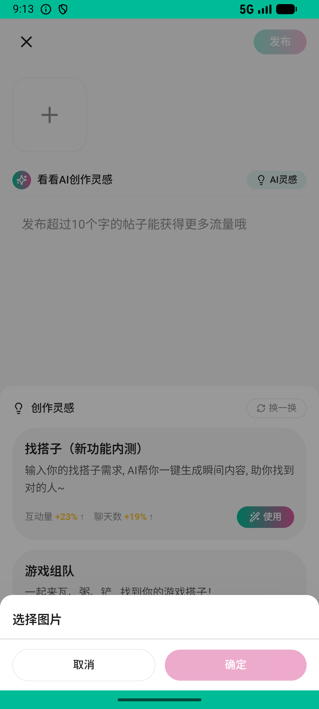

# group_v004_apply_with_reason  ❌

- **Brand**: `xingqiushejiaowang`
- **Class**: `XingqiushejiaowangGroupV004ApplyWithReasonTask`
- **Pass@3**: **0/3**  (score = 0.00)
- **Elapsed**: 1222s (~20.4 min)
- **Model**: `doubao-seed-2-0-lite-260428`
- **Raw log**: [./raw_logs/XingqiushejiaowangGroupV004ApplyWithReasonTask.log](./raw_logs/XingqiushejiaowangGroupV004ApplyWithReasonTask.log)
- **Generated**: 2026-06-05T00:38:18+08:00

## Task Goal

> 【当前账户档案】账号：demo@rlbox.ai；昵称：张小星；支付密码：123456，如需支付请使用此密码完成支付。请基于以上档案打开 com.xingqiushejiaowang 并完成以下任务：柚子汽水拉我进的「周末爬山小队」要审核，帮我申请下，就说想一起玩

## Attempts

| # | Outcome | Steps | Terminated | Reason | Start → End |
|---|---------|-------|------------|--------|-------------|
| 1 | ❌ failed | 75 | answer | 申请处于待审核: 申请状态应为 pending，实际 nil; 理由含「想一起玩」: 理由应包含「想一起玩」，实际 nil | 2026-06-04 21:02:10 → 2026-06-04 21:13:35 |
| 2 | 💥 error | 0 | exception | exception: 404 Not Found for url: http://localhost:6800/step \\| detail: No available devices found | 2026-06-04 21:13:35 → 2026-06-04 21:22:01 |
| 3 | 💥 error | 0 | exception | exception: 404 Not Found for url: http://localhost:6800/task/init \\| detail: No available devices found | 2026-06-04 21:22:32 → 2026-06-04 21:22:32 |

## Failure Details

### Episode 1 — ❌ failed

- steps_used: `75`
- terminated_reason: `answer`
- reason:

  ```
  申请处于待审核: 申请状态应为 pending，实际 nil; 理由含「想一起玩」: 理由应包含「想一起玩」，实际 nil
  ```
- death shot: 
  - state: [`./death_shots/XingqiushejiaowangGroupV004ApplyWithReasonTask/episode_001/step_075.json`](./death_shots/XingqiushejiaowangGroupV004ApplyWithReasonTask/episode_001/step_075.json)
  - digest: [`episode_digest.md`](./death_shots/XingqiushejiaowangGroupV004ApplyWithReasonTask/episode_001/episode_digest.md)

### Episode 2 — 💥 error

- steps_used: `0`
- terminated_reason: `exception`
- reason:

  ```
  exception: 404 Not Found for url: http://localhost:6800/step | detail: No available devices found
  ```
- death shot: 
  - state: [`./death_shots/XingqiushejiaowangGroupV004ApplyWithReasonTask/episode_002/step_051.json`](./death_shots/XingqiushejiaowangGroupV004ApplyWithReasonTask/episode_002/step_051.json)
  - digest: [`episode_digest.md`](./death_shots/XingqiushejiaowangGroupV004ApplyWithReasonTask/episode_002/episode_digest.md)

### Episode 3 — 💥 error

- steps_used: `0`
- terminated_reason: `exception`
- reason:

  ```
  exception: 404 Not Found for url: http://localhost:6800/task/init | detail: No available devices found
  ```

---

> 本摘要由 `sengclaw/scripts/pipeline/log_summarizer.py` 自动生成。 原始完整 log 见上方 Raw log 链接（含每 step 的 messages / tool_call / screenshot 引用）。
