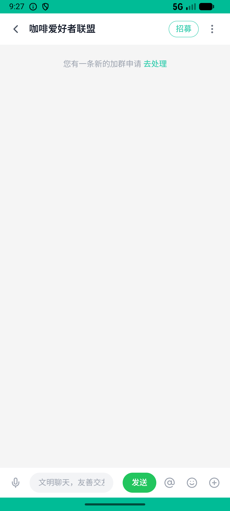

# group_v005_approve_request  ❌

- **Brand**: `xingqiushejiaowang`
- **Class**: `XingqiushejiaowangGroupV005ApproveRequestTask`
- **Pass@3**: **0/3**  (score = 0.00)
- **Elapsed**: 551s (~9.2 min)
- **Model**: `doubao-seed-2-0-lite-260428`
- **Raw log**: [./raw_logs/XingqiushejiaowangGroupV005ApproveRequestTask.log](./raw_logs/XingqiushejiaowangGroupV005ApproveRequestTask.log)
- **Generated**: 2026-06-05T00:38:18+08:00

## Task Goal

> 【当前账户档案】账号：demo@rlbox.ai；昵称：张小星；支付密码：123456，如需支付请使用此密码完成支付。请基于以上档案打开 com.xingqiushejiaowang 并完成以下任务：樱花饼干申请进我的「咖啡爱好者联盟」了，通过一下吧

## Attempts

| # | Outcome | Steps | Terminated | Reason | Start → End |
|---|---------|-------|------------|--------|-------------|
| 1 | ❌ failed | 15 | answer | 申请已通过: 申请状态应为 approved，实际 "pending"; 记录了审批人: 没记录 reviewed_by; 申请人成为群成员: 樱花饼干 还不是群成员; 产生欢迎 system 消息: 没找到欢迎该成员的 system 消息 | 2026-06-04 21:23:05 → 2026-06-04 21:25:28 |
| 2 | ❌ failed | 12 | answer | 申请已通过: 申请状态应为 approved，实际 "pending"; 记录了审批人: 没记录 reviewed_by; 申请人成为群成员: 樱花饼干 还不是群成员; 产生欢迎 system 消息: 没找到欢迎该成员的 system 消息 | 2026-06-04 21:25:28 → 2026-06-04 21:27:28 |
| 3 | ❌ failed | 28 | answer | 申请已通过: 申请状态应为 approved，实际 "pending"; 记录了审批人: 没记录 reviewed_by; 申请人成为群成员: 樱花饼干 还不是群成员; 产生欢迎 system 消息: 没找到欢迎该成员的 system 消息 | 2026-06-04 21:27:28 → 2026-06-04 21:32:16 |

## Failure Details

### Episode 1 — ❌ failed

- steps_used: `15`
- terminated_reason: `answer`
- reason:

  ```
  申请已通过: 申请状态应为 approved，实际 "pending"; 记录了审批人: 没记录 reviewed_by; 申请人成为群成员: 樱花饼干 还不是群成员; 产生欢迎 system 消息: 没找到欢迎该成员的 system 消息
  ```
- death shot: 
  - state: [`./death_shots/XingqiushejiaowangGroupV005ApproveRequestTask/episode_001/step_015.json`](./death_shots/XingqiushejiaowangGroupV005ApproveRequestTask/episode_001/step_015.json)
  - digest: [`episode_digest.md`](./death_shots/XingqiushejiaowangGroupV005ApproveRequestTask/episode_001/episode_digest.md)

### Episode 2 — ❌ failed

- steps_used: `12`
- terminated_reason: `answer`
- reason:

  ```
  申请已通过: 申请状态应为 approved，实际 "pending"; 记录了审批人: 没记录 reviewed_by; 申请人成为群成员: 樱花饼干 还不是群成员; 产生欢迎 system 消息: 没找到欢迎该成员的 system 消息
  ```
- death shot: 
  - state: [`./death_shots/XingqiushejiaowangGroupV005ApproveRequestTask/episode_002/step_012.json`](./death_shots/XingqiushejiaowangGroupV005ApproveRequestTask/episode_002/step_012.json)
  - digest: [`episode_digest.md`](./death_shots/XingqiushejiaowangGroupV005ApproveRequestTask/episode_002/episode_digest.md)

### Episode 3 — ❌ failed

- steps_used: `28`
- terminated_reason: `answer`
- reason:

  ```
  申请已通过: 申请状态应为 approved，实际 "pending"; 记录了审批人: 没记录 reviewed_by; 申请人成为群成员: 樱花饼干 还不是群成员; 产生欢迎 system 消息: 没找到欢迎该成员的 system 消息
  ```
- death shot: 
  - state: [`./death_shots/XingqiushejiaowangGroupV005ApproveRequestTask/episode_003/step_028.json`](./death_shots/XingqiushejiaowangGroupV005ApproveRequestTask/episode_003/step_028.json)
  - digest: [`episode_digest.md`](./death_shots/XingqiushejiaowangGroupV005ApproveRequestTask/episode_003/episode_digest.md)

---

> 本摘要由 `sengclaw/scripts/pipeline/log_summarizer.py` 自动生成。 原始完整 log 见上方 Raw log 链接（含每 step 的 messages / tool_call / screenshot 引用）。
