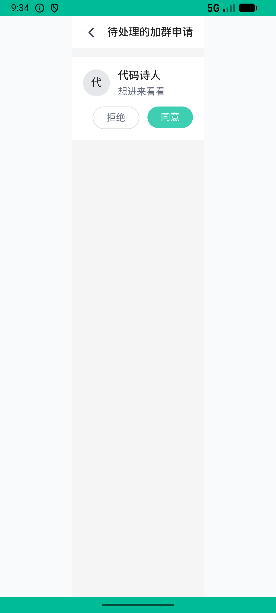
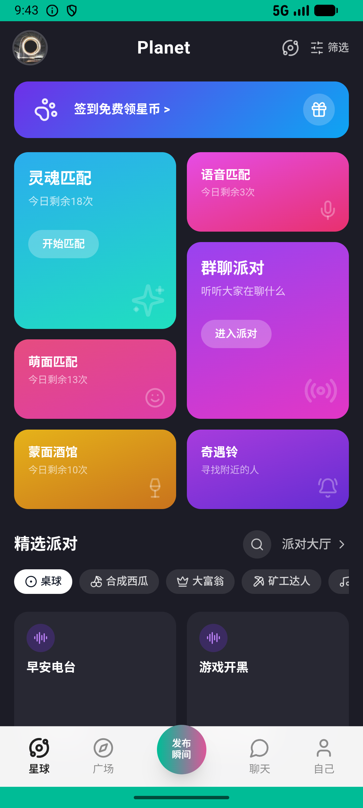

# group_v006_reject_request  ❌

- **Brand**: `xingqiushejiaowang`
- **Class**: `XingqiushejiaowangGroupV006RejectRequestTask`
- **Pass@3**: **0/3**  (score = 0.00)
- **Elapsed**: 641s (~10.7 min)
- **Model**: `doubao-seed-2-0-lite-260428`
- **Raw log**: [./raw_logs/XingqiushejiaowangGroupV006RejectRequestTask.log](./raw_logs/XingqiushejiaowangGroupV006RejectRequestTask.log)
- **Generated**: 2026-06-05T00:38:18+08:00

## Task Goal

> 【当前账户档案】账号：demo@rlbox.ai；昵称：张小星；支付密码：123456，如需支付请使用此密码完成支付。请基于以上档案打开 com.xingqiushejiaowang 并完成以下任务：代码诗人想进我的「读书会」，这个申请我不想通过，拒了吧

## Attempts

| # | Outcome | Steps | Terminated | Reason | Start → End |
|---|---------|-------|------------|--------|-------------|
| 1 | 💥 error | 0 | exception | exception: 404 Not Found for url: http://localhost:6800/step \\| detail: No available devices found | 2026-06-04 21:32:57 → 2026-06-04 21:34:19 |
| 2 | 💥 error | 0 | exception | exception: 404 Not Found for url: http://localhost:6800/task/init \\| detail: No available devices found | 2026-06-04 21:34:49 → 2026-06-04 21:34:49 |
| 3 | 💥 error | 0 | exception | exception: 404 Not Found for url: http://localhost:6800/step \\| detail: No available devices found | 2026-06-04 21:34:52 → 2026-06-04 21:43:37 |

## Failure Details

### Episode 1 — 💥 error

- steps_used: `0`
- terminated_reason: `exception`
- reason:

  ```
  exception: 404 Not Found for url: http://localhost:6800/step | detail: No available devices found
  ```
- death shot: 
  - state: [`./death_shots/XingqiushejiaowangGroupV006RejectRequestTask/episode_001/step_010.json`](./death_shots/XingqiushejiaowangGroupV006RejectRequestTask/episode_001/step_010.json)
  - digest: [`episode_digest.md`](./death_shots/XingqiushejiaowangGroupV006RejectRequestTask/episode_001/episode_digest.md)

### Episode 2 — 💥 error

- steps_used: `0`
- terminated_reason: `exception`
- reason:

  ```
  exception: 404 Not Found for url: http://localhost:6800/task/init | detail: No available devices found
  ```

### Episode 3 — 💥 error

- steps_used: `0`
- terminated_reason: `exception`
- reason:

  ```
  exception: 404 Not Found for url: http://localhost:6800/step | detail: No available devices found
  ```
- death shot: 
  - state: [`./death_shots/XingqiushejiaowangGroupV006RejectRequestTask/episode_003/step_050.json`](./death_shots/XingqiushejiaowangGroupV006RejectRequestTask/episode_003/step_050.json)
  - digest: [`episode_digest.md`](./death_shots/XingqiushejiaowangGroupV006RejectRequestTask/episode_003/episode_digest.md)

---

> 本摘要由 `sengclaw/scripts/pipeline/log_summarizer.py` 自动生成。 原始完整 log 见上方 Raw log 链接（含每 step 的 messages / tool_call / screenshot 引用）。
