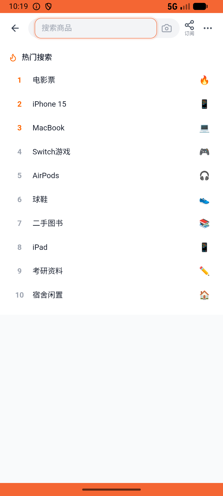

# group_v008_promote_admin  ❌

- **Brand**: `xingqiushejiaowang`
- **Class**: `XingqiushejiaowangGroupV008PromoteAdminTask`
- **Pass@3**: **0/3**  (score = 0.00)
- **Elapsed**: 999s (~16.6 min)
- **Model**: `doubao-seed-2-0-lite-260428`
- **Raw log**: [./raw_logs/XingqiushejiaowangGroupV008PromoteAdminTask.log](./raw_logs/XingqiushejiaowangGroupV008PromoteAdminTask.log)
- **Generated**: 2026-06-05T00:38:18+08:00

## Task Goal

> 【当前账户档案】账号：demo@rlbox.ai；昵称：张小星；支付密码：123456，如需支付请使用此密码完成支付。请基于以上档案打开 com.xingqiushejiaowang 并完成以下任务：银河方程挺靠谱的，让他在我的「羽毛球约球群」当个管理员帮我管群

> 🔴 **基建重试记录**：本 task 发生 1 次基建重试（原因：ep-1:runner_crash），重试后仍全部失败，**建议排查 infra 而非 Agent 能力**。

## Attempts

| # | Outcome | Steps | Terminated | Reason | Start → End |
|---|---------|-------|------------|--------|-------------|
| 1 | ❌ failed | 32 | answer | task 'XingqiushejiaowangGroupV008PromoteAdminTask' was not initialized; current initialized task is 'XianzhiershouwangPostV034PostValidat... | 2026-06-04 22:06:28 → 2026-06-04 22:10:38 |
| 2 | ❌ failed | 52 | answer | task 'XingqiushejiaowangGroupV008PromoteAdminTask' was not initialized; current initialized task is 'XianzhiershouwangPostV034PostValidat... | 2026-06-04 22:10:38 → 2026-06-04 22:19:22 |
| 3 | ❌ failed | 28 | answer | 成员已被设为管理员: 银河方程 的 role 应为 admin，实际 "member" | 2026-06-04 22:19:23 → 2026-06-04 22:23:07 |

## Failure Details

### Episode 1 — ❌ failed

- steps_used: `32`
- terminated_reason: `answer`
- reason:

  ```
  task 'XingqiushejiaowangGroupV008PromoteAdminTask' was not initialized; current initialized task is 'XianzhiershouwangPostV034PostValidatorTask'
  ```
- death shot: 
  - state: [`./death_shots/XingqiushejiaowangGroupV008PromoteAdminTask/episode_001/step_032.json`](./death_shots/XingqiushejiaowangGroupV008PromoteAdminTask/episode_001/step_032.json)
  - digest: [`episode_digest.md`](./death_shots/XingqiushejiaowangGroupV008PromoteAdminTask/episode_001/episode_digest.md)

### Episode 2 — ❌ failed

- steps_used: `52`
- terminated_reason: `answer`
- reason:

  ```
  task 'XingqiushejiaowangGroupV008PromoteAdminTask' was not initialized; current initialized task is 'XianzhiershouwangPostV034PostValidatorTask'
  ```
- death shot: 
  - state: [`./death_shots/XingqiushejiaowangGroupV008PromoteAdminTask/episode_002/step_052.json`](./death_shots/XingqiushejiaowangGroupV008PromoteAdminTask/episode_002/step_052.json)
  - digest: [`episode_digest.md`](./death_shots/XingqiushejiaowangGroupV008PromoteAdminTask/episode_002/episode_digest.md)

### Episode 3 — ❌ failed

- steps_used: `28`
- terminated_reason: `answer`
- reason:

  ```
  成员已被设为管理员: 银河方程 的 role 应为 admin，实际 "member"
  ```
- death shot: 
  - state: [`./death_shots/XingqiushejiaowangGroupV008PromoteAdminTask/episode_003/step_028.json`](./death_shots/XingqiushejiaowangGroupV008PromoteAdminTask/episode_003/step_028.json)
  - digest: [`episode_digest.md`](./death_shots/XingqiushejiaowangGroupV008PromoteAdminTask/episode_003/episode_digest.md)

---

> 本摘要由 `sengclaw/scripts/pipeline/log_summarizer.py` 自动生成。 原始完整 log 见上方 Raw log 链接（含每 step 的 messages / tool_call / screenshot 引用）。
