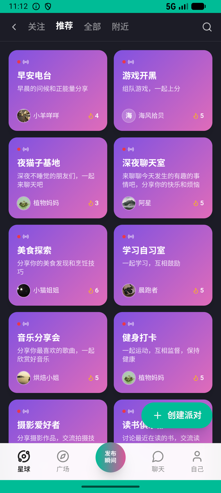

# group_v015_demote_admin  ❌

- **Brand**: `xingqiushejiaowang`
- **Class**: `XingqiushejiaowangGroupV015DemoteAdminTask`
- **Pass@3**: **0/3**  (score = 0.00)
- **Elapsed**: 1150s (~19.2 min)
- **Model**: `doubao-seed-2-0-lite-260428`
- **Raw log**: [./raw_logs/XingqiushejiaowangGroupV015DemoteAdminTask.log](./raw_logs/XingqiushejiaowangGroupV015DemoteAdminTask.log)
- **Generated**: 2026-06-05T00:38:19+08:00

## Task Goal

> 【当前账户档案】账号：demo@rlbox.ai；昵称：张小星；支付密码：123456，如需支付请使用此密码完成支付。请基于以上档案打开 com.xingqiushejiaowang 并完成以下任务：银河方程最近不太活跃，把他在「羽毛球约球群」的管理员身份取消了吧

## Attempts

| # | Outcome | Steps | Terminated | Reason | Start → End |
|---|---------|-------|------------|--------|-------------|
| 1 | ❌ failed | 27 | answer | 管理员已被取消: 银河方程 的 role 应回到 member，实际 "admin" | 2026-06-04 23:03:33 → 2026-06-04 23:07:04 |
| 2 | 💥 error | 0 | exception | exception: 404 Not Found for url: http://localhost:6800/step \\| detail: No available devices found | 2026-06-04 23:07:04 → 2026-06-04 23:12:54 |
| 3 | ❌ failed | 59 | answer | task 'XingqiushejiaowangGroupV015DemoteAdminTask' was not initialized; current initialized task is 'XianzhiershouwangRecycleV008RecycleVa... | 2026-06-04 23:13:24 → 2026-06-04 23:22:44 |

## Failure Details

### Episode 1 — ❌ failed

- steps_used: `27`
- terminated_reason: `answer`
- reason:

  ```
  管理员已被取消: 银河方程 的 role 应回到 member，实际 "admin"
  ```
- death shot: 
  - state: [`./death_shots/XingqiushejiaowangGroupV015DemoteAdminTask/episode_001/step_027.json`](./death_shots/XingqiushejiaowangGroupV015DemoteAdminTask/episode_001/step_027.json)
  - digest: [`episode_digest.md`](./death_shots/XingqiushejiaowangGroupV015DemoteAdminTask/episode_001/episode_digest.md)

### Episode 2 — 💥 error

- steps_used: `0`
- terminated_reason: `exception`
- reason:

  ```
  exception: 404 Not Found for url: http://localhost:6800/step | detail: No available devices found
  ```
- death shot: 
  - state: [`./death_shots/XingqiushejiaowangGroupV015DemoteAdminTask/episode_002/step_040.json`](./death_shots/XingqiushejiaowangGroupV015DemoteAdminTask/episode_002/step_040.json)
  - digest: [`episode_digest.md`](./death_shots/XingqiushejiaowangGroupV015DemoteAdminTask/episode_002/episode_digest.md)

### Episode 3 — ❌ failed

- steps_used: `59`
- terminated_reason: `answer`
- reason:

  ```
  task 'XingqiushejiaowangGroupV015DemoteAdminTask' was not initialized; current initialized task is 'XianzhiershouwangRecycleV008RecycleValidatorTask'
  ```
- death shot: 
  - state: [`./death_shots/XingqiushejiaowangGroupV015DemoteAdminTask/episode_003/step_059.json`](./death_shots/XingqiushejiaowangGroupV015DemoteAdminTask/episode_003/step_059.json)
  - digest: [`episode_digest.md`](./death_shots/XingqiushejiaowangGroupV015DemoteAdminTask/episode_003/episode_digest.md)

---

> 本摘要由 `sengclaw/scripts/pipeline/log_summarizer.py` 自动生成。 原始完整 log 见上方 Raw log 链接（含每 step 的 messages / tool_call / screenshot 引用）。
