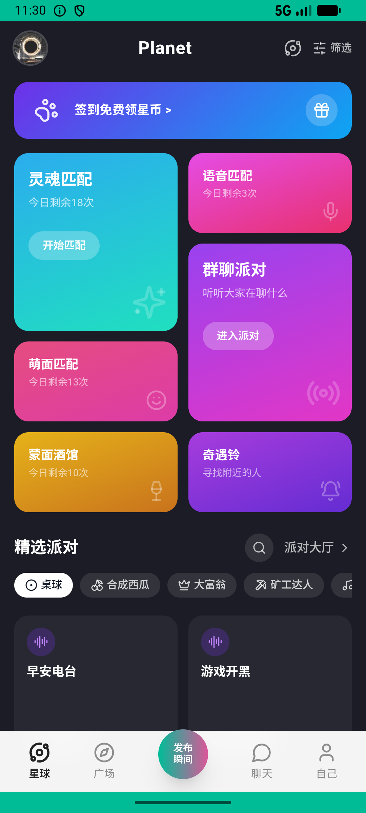

# super_star_v001_subscribe_year  ❌

- **Brand**: `xingqiushejiaowang`
- **Class**: `XingqiushejiaowangSuperStarV001SubscribeYearTask`
- **Pass@3**: **0/3**  (score = 0.00)
- **Elapsed**: 509s (~8.5 min)
- **Model**: `doubao-seed-2-0-lite-260428`
- **Raw log**: [./raw_logs/XingqiushejiaowangSuperStarV001SubscribeYearTask.log](./raw_logs/XingqiushejiaowangSuperStarV001SubscribeYearTask.log)
- **Generated**: 2026-06-05T00:38:19+08:00

## Task Goal

> 【当前账户档案】账号：demo@rlbox.ai；昵称：张小星；支付密码：123456，如需支付请使用此密码完成支付。请基于以上档案打开 com.xingqiushejiaowang 并完成以下任务：想成为超级星人，直接开个连续包年最划算

## Attempts

| # | Outcome | Steps | Terminated | Reason | Start → End |
|---|---------|-------|------------|--------|-------------|
| 1 | ❌ failed | 40 | answer | task 'XingqiushejiaowangSuperStarV001SubscribeYearTask' was not initialized; current initialized task is 'XianzhiershouwangRecycleV013Rec... | 2026-06-04 23:23:50 → 2026-06-04 23:30:10 |
| 2 | 💥 error | 0 | exception | exception: 404 Not Found for url: http://localhost:6800/step \\| detail: No available devices found | 2026-06-04 23:30:10 → 2026-06-04 23:31:48 |
| 3 | 💥 error | 0 | exception | exception: 404 Not Found for url: http://localhost:6800/task/init \\| detail: No available devices found | 2026-06-04 23:32:19 → 2026-06-04 23:32:19 |

## Failure Details

### Episode 1 — ❌ failed

- steps_used: `40`
- terminated_reason: `answer`
- reason:

  ```
  task 'XingqiushejiaowangSuperStarV001SubscribeYearTask' was not initialized; current initialized task is 'XianzhiershouwangRecycleV013RecycleValidatorTask'
  ```
- death shot: 
  - state: [`./death_shots/XingqiushejiaowangSuperStarV001SubscribeYearTask/episode_001/step_040.json`](./death_shots/XingqiushejiaowangSuperStarV001SubscribeYearTask/episode_001/step_040.json)
  - digest: [`episode_digest.md`](./death_shots/XingqiushejiaowangSuperStarV001SubscribeYearTask/episode_001/episode_digest.md)

### Episode 2 — 💥 error

- steps_used: `0`
- terminated_reason: `exception`
- reason:

  ```
  exception: 404 Not Found for url: http://localhost:6800/step | detail: No available devices found
  ```
- death shot: 
  - state: [`./death_shots/XingqiushejiaowangSuperStarV001SubscribeYearTask/episode_002/step_013.json`](./death_shots/XingqiushejiaowangSuperStarV001SubscribeYearTask/episode_002/step_013.json)
  - digest: [`episode_digest.md`](./death_shots/XingqiushejiaowangSuperStarV001SubscribeYearTask/episode_002/episode_digest.md)

### Episode 3 — 💥 error

- steps_used: `0`
- terminated_reason: `exception`
- reason:

  ```
  exception: 404 Not Found for url: http://localhost:6800/task/init | detail: No available devices found
  ```

---

> 本摘要由 `sengclaw/scripts/pipeline/log_summarizer.py` 自动生成。 原始完整 log 见上方 Raw log 链接（含每 step 的 messages / tool_call / screenshot 引用）。
