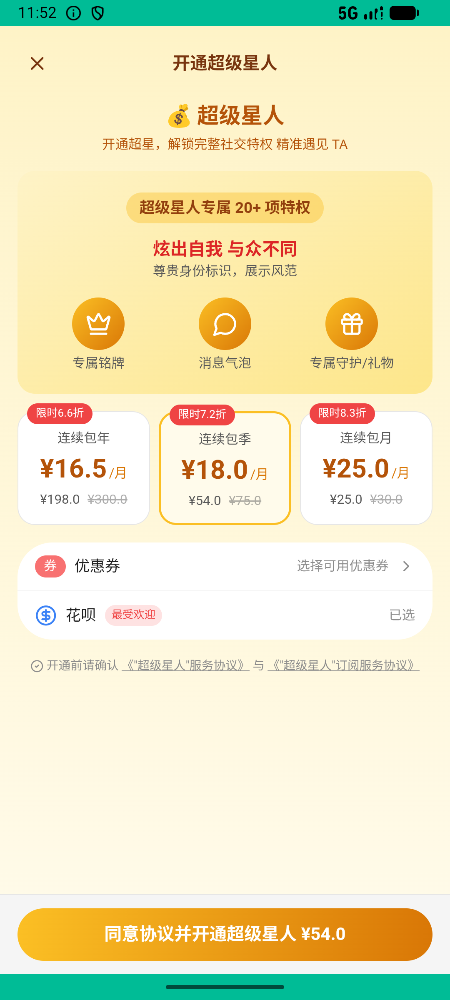

# super_star_v002_subscribe_quarter  ❌

- **Brand**: `xingqiushejiaowang`
- **Class**: `XingqiushejiaowangSuperStarV002SubscribeQuarterTask`
- **Pass@3**: **0/3**  (score = 0.00)
- **Elapsed**: 1275s (~21.2 min)
- **Model**: `doubao-seed-2-0-lite-260428`
- **Raw log**: [./raw_logs/XingqiushejiaowangSuperStarV002SubscribeQuarterTask.log](./raw_logs/XingqiushejiaowangSuperStarV002SubscribeQuarterTask.log)
- **Generated**: 2026-06-05T00:38:19+08:00

## Task Goal

> 【当前账户档案】账号：demo@rlbox.ai；昵称：张小星；支付密码：123456，如需支付请使用此密码完成支付。请基于以上档案打开 com.xingqiushejiaowang 并完成以下任务：先试试超级星人连续包季，感受一下值不值

## Attempts

| # | Outcome | Steps | Terminated | Reason | Start → End |
|---|---------|-------|------------|--------|-------------|
| 1 | ❌ failed | 55 | answer | task 'XingqiushejiaowangSuperStarV002SubscribeQuarterTask' was not initialized; current initialized task is 'XianzhiershouwangRecycleV017... | 2026-06-04 23:32:51 → 2026-06-04 23:40:25 |
| 2 | ❌ failed | 74 | answer | task 'XingqiushejiaowangSuperStarV002SubscribeQuarterTask' was not initialized; current initialized task is 'XianzhiershouwangRecycleV017... | 2026-06-04 23:40:25 → 2026-06-04 23:53:02 |
| 3 | ❌ failed | 8 | answer | 会员关系已建立且处于激活状态: 没找到 demo 的 SuperStarMembership 副本; 存在 plan_key=quarter 的 paid 订单: 没找到 demo 的「连续包季」已支付订单 | 2026-06-04 23:53:02 → 2026-06-04 23:54:06 |

## Failure Details

### Episode 1 — ❌ failed

- steps_used: `55`
- terminated_reason: `answer`
- reason:

  ```
  task 'XingqiushejiaowangSuperStarV002SubscribeQuarterTask' was not initialized; current initialized task is 'XianzhiershouwangRecycleV017RecycleValidatorTask'
  ```
- death shot: 
  - state: [`./death_shots/XingqiushejiaowangSuperStarV002SubscribeQuarterTask/episode_001/step_055.json`](./death_shots/XingqiushejiaowangSuperStarV002SubscribeQuarterTask/episode_001/step_055.json)
  - digest: [`episode_digest.md`](./death_shots/XingqiushejiaowangSuperStarV002SubscribeQuarterTask/episode_001/episode_digest.md)

### Episode 2 — ❌ failed

- steps_used: `74`
- terminated_reason: `answer`
- reason:

  ```
  task 'XingqiushejiaowangSuperStarV002SubscribeQuarterTask' was not initialized; current initialized task is 'XianzhiershouwangRecycleV017RecycleValidatorTask'
  ```
- death shot: 
  - state: [`./death_shots/XingqiushejiaowangSuperStarV002SubscribeQuarterTask/episode_002/step_074.json`](./death_shots/XingqiushejiaowangSuperStarV002SubscribeQuarterTask/episode_002/step_074.json)
  - digest: [`episode_digest.md`](./death_shots/XingqiushejiaowangSuperStarV002SubscribeQuarterTask/episode_002/episode_digest.md)

### Episode 3 — ❌ failed

- steps_used: `8`
- terminated_reason: `answer`
- reason:

  ```
  会员关系已建立且处于激活状态: 没找到 demo 的 SuperStarMembership 副本; 存在 plan_key=quarter 的 paid 订单: 没找到 demo 的「连续包季」已支付订单
  ```
- death shot: 
  - state: [`./death_shots/XingqiushejiaowangSuperStarV002SubscribeQuarterTask/episode_003/step_008.json`](./death_shots/XingqiushejiaowangSuperStarV002SubscribeQuarterTask/episode_003/step_008.json)
  - digest: [`episode_digest.md`](./death_shots/XingqiushejiaowangSuperStarV002SubscribeQuarterTask/episode_003/episode_digest.md)

---

> 本摘要由 `sengclaw/scripts/pipeline/log_summarizer.py` 自动生成。 原始完整 log 见上方 Raw log 链接（含每 step 的 messages / tool_call / screenshot 引用）。
