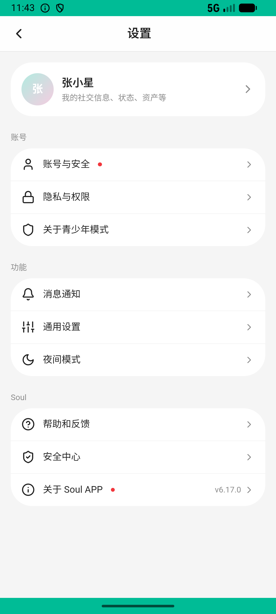
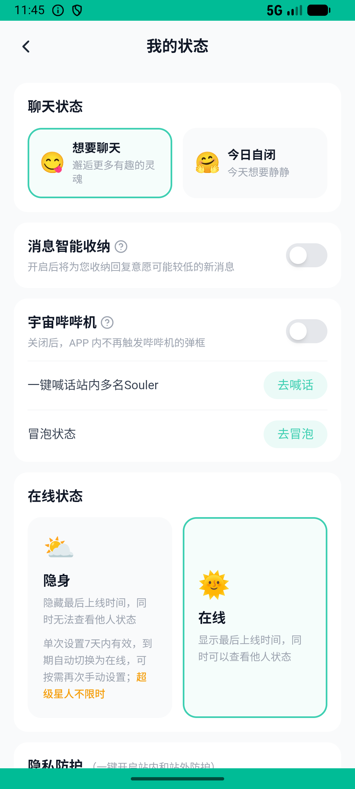
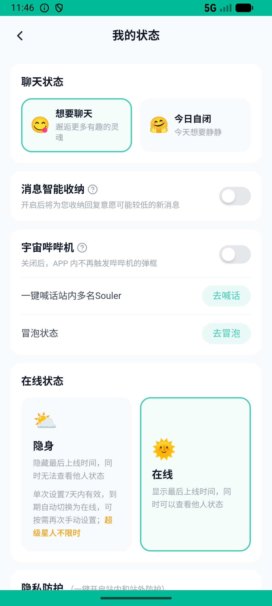

# my_status_v007_reset_to_normal  ❌

- **Brand**: `xingqiushejiaowang`
- **Class**: `XingqiushejiaowangMyStatusV007ResetToNormalTask`
- **Pass@3**: **0/3**  (score = 0.00)
- **Elapsed**: 473s (~7.9 min)
- **Model**: `doubao-seed-2-0-lite-260428`
- **Raw log**: [./raw_logs/XingqiushejiaowangMyStatusV007ResetToNormalTask.log](./raw_logs/XingqiushejiaowangMyStatusV007ResetToNormalTask.log)
- **Generated**: 2026-06-24T22:11:02+08:00

## Task Goal

> 前一阵开了静悄悄模式，现在帮我全部关掉恢复正常吧

## System Prompt

<details>
<summary>展开查看完整 System Prompt</summary>


> You are provided with a task description, a history of previous actions, and corresponding screenshots. Your goal is to perform the next action to complete the task. Please note that if performing the same action multiple times results in a static screen with no changes, you should attempt a modified or alternative action.
> 
> ---
> 
> ## Function Definition
> 
> - `clarify` — Ask the user for more information to complete the task.
> - `click` — Mouse left single click action.
> - `double_click` — Mouse left double click action.
> - `drag` — Perform a drag action from the start point to the end point. Typically used for swiping or selecting elements.
> - `long_press` — Perform a long press action at the specified coordinates.
> - `open_app` — Open the specified application.
> - `press_back` — Press the back button.
> - `press_enter` — Press the enter key.
> - `press_home` — Press the home button.
> - `take_notes` — Take notes and report the result in the specified content.
> - `type` — Type the specified content. You should manually delete any text from the input box that you want to remove.
> - `wait` — Wait for a certain period of time.

</details>

## User Query

> 请在 com.xingqiushejiaowang 里面完成以下任务：
> 前一阵开了静悄悄模式，现在帮我全部关掉恢复正常吧

## Attempts

| # | Outcome | Steps | Terminated | Reason | Start → End |
|---|---------|-------|------------|--------|-------------|
| 1 | ❌ failed | 4 | answer | 聊天状态恢复为想要聊天: chat_status="quiet_today"，应为 'want_chat'; 在线状态恢复为在线: online_status="invisible"，应为 'online'; 隐私防护已关闭: privacy_protection=true... | 2026-06-24 15:35:24 → 2026-06-24 15:36:13 |
| 2 | ❌ failed | 17 | answer | 隐私防护已关闭: privacy_protection=true，应为 false Diff: @@ -1 +1 @@ -false +true | 2026-06-24 15:36:13 → 2026-06-24 15:39:05 |
| 3 | ❌ failed | 26 | answer | 隐私防护已关闭: privacy_protection=true，应为 false Diff: @@ -1 +1 @@ -false +true | 2026-06-24 15:39:05 → 2026-06-24 15:43:17 |

## Failure Details

### Episode 1 — ❌ failed

- steps_used: `4`
- terminated_reason: `answer`
- reason:

  ```
  聊天状态恢复为想要聊天: chat_status="quiet_today"，应为 'want_chat'; 在线状态恢复为在线: online_status="invisible"，应为 'online'; 隐私防护已关闭: privacy_protection=true，应为 false
  Diff:
  @@ -1 +1 @@
  -false
  +true
  ; 智能收纳已关闭: smart_inbox=true，应为 false
  Diff:
  @@ -1 +1 @@
  -false
  +true
  ```
- death shot: 
  - state: [`./death_shots/XingqiushejiaowangMyStatusV007ResetToNormalTask/episode_001/step_004.json`](./death_shots/XingqiushejiaowangMyStatusV007ResetToNormalTask/episode_001/step_004.json)
  - digest: [`episode_digest.md`](./death_shots/XingqiushejiaowangMyStatusV007ResetToNormalTask/episode_001/episode_digest.md)

### Episode 2 — ❌ failed

- steps_used: `17`
- terminated_reason: `answer`
- reason:

  ```
  隐私防护已关闭: privacy_protection=true，应为 false
  Diff:
  @@ -1 +1 @@
  -false
  +true
  ```
- death shot: 
  - state: [`./death_shots/XingqiushejiaowangMyStatusV007ResetToNormalTask/episode_002/step_017.json`](./death_shots/XingqiushejiaowangMyStatusV007ResetToNormalTask/episode_002/step_017.json)
  - digest: [`episode_digest.md`](./death_shots/XingqiushejiaowangMyStatusV007ResetToNormalTask/episode_002/episode_digest.md)

### Episode 3 — ❌ failed

- steps_used: `26`
- terminated_reason: `answer`
- reason:

  ```
  隐私防护已关闭: privacy_protection=true，应为 false
  Diff:
  @@ -1 +1 @@
  -false
  +true
  ```
- death shot: 
  - state: [`./death_shots/XingqiushejiaowangMyStatusV007ResetToNormalTask/episode_003/step_026.json`](./death_shots/XingqiushejiaowangMyStatusV007ResetToNormalTask/episode_003/step_026.json)
  - digest: [`episode_digest.md`](./death_shots/XingqiushejiaowangMyStatusV007ResetToNormalTask/episode_003/episode_digest.md)

---

> 本摘要由 `sengclaw/scripts/pipeline/log_summarizer.py` 自动生成。 原始完整 log 见上方 Raw log 链接（含每 step 的 messages / tool_call / screenshot 引用）。
