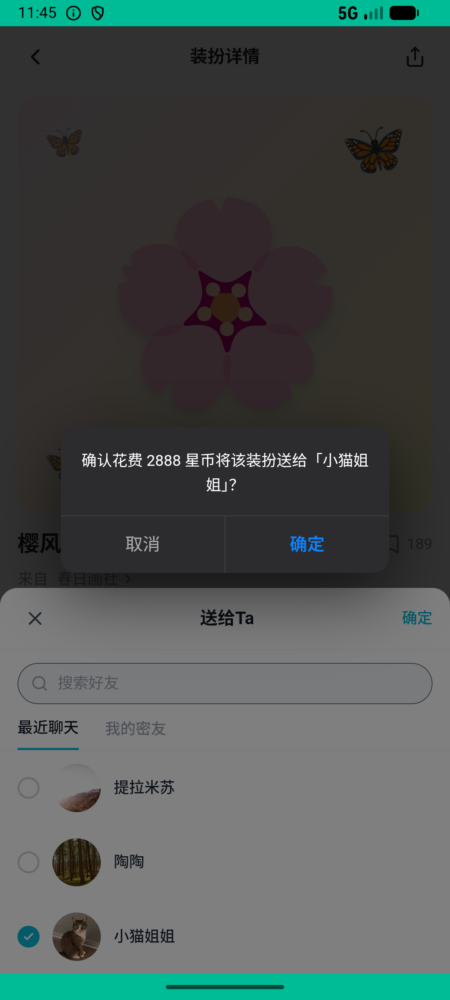

# gifting_v004_outfit_gift_to_cat_jie  ⚠️

- **Brand**: `xingqiushejiaowang`
- **Class**: `XingqiushejiaowangGiftingV004OutfitGiftToCatJieTask`
- **Pass@3**: **2/3**  (score = 1.00)
- **Elapsed**: 431s (~7.2 min)
- **Model**: `doubao-seed-2-0-lite-260428`
- **Raw log**: [./raw_logs/XingqiushejiaowangGiftingV004OutfitGiftToCatJieTask.log](./raw_logs/XingqiushejiaowangGiftingV004OutfitGiftToCatJieTask.log)
- **Generated**: 2026-06-25T15:02:45+08:00

## Task Goal

> 从个性商城给小猫姐姐送一对「樱风蝶 🌸」翅膀（2888 星币，作为礼物送给她，不是自己留着）

## System Prompt

<details>
<summary>展开查看完整 System Prompt</summary>


> You are provided with a task description, a history of previous actions, and corresponding screenshots. Your goal is to perform the next action to complete the task. Please note that if performing the same action multiple times results in a static screen with no changes, you should attempt a modified or alternative action.
> 
> ---
> 
> ## Function Definition
> 
> - `clarify` — Ask the user for more information to complete the task.
> - `click` — Mouse left single click action.
> - `double_click` — Mouse left double click action.
> - `drag` — Perform a drag action from the start point to the end point. Typically used for swiping or selecting elements.
> - `long_press` — Perform a long press action at the specified coordinates.
> - `open_app` — Open the specified application.
> - `press_back` — Press the back button.
> - `press_enter` — Press the enter key.
> - `press_home` — Press the home button.
> - `take_notes` — Take notes and report the result in the specified content.
> - `type` — Type the specified content. You should manually delete any text from the input box that you want to remove.
> - `wait` — Wait for a certain period of time.

</details>

## User Query

> 请在 com.xingqiushejiaowang 里面完成以下任务：
> 从个性商城给小猫姐姐送一对「樱风蝶 🌸」翅膀（2888 星币，作为礼物送给她，不是自己留着）

## Attempts

| # | Outcome | Steps | Terminated | Reason | Start → End |
|---|---------|-------|------------|--------|-------------|
| 1 | ✅ passed | 13 | answer | – | 2026-06-25 12:40:21 → 2026-06-25 12:42:12 |
| 2 | ✅ passed | 15 | answer | – | 2026-06-25 12:42:12 → 2026-06-25 12:44:53 |
| 3 | ❌ failed | 15 | answer | 把樱风蝶作为礼物送给了小猫姐姐（OutfitPurchase.gifted_by=我）: 未找到小猫姐姐的樱风蝶赠送记录（gifted_by 应为 1）; 私聊里出现一条 outfit_gift 礼物消息: 私聊里没找到 outfit_gift 消息（body 应为 out... | 2026-06-25 12:44:53 → 2026-06-25 12:47:32 |

## Failure Details

### Episode 3 — ❌ failed

- steps_used: `15`
- terminated_reason: `answer`
- reason:

  ```
  把樱风蝶作为礼物送给了小猫姐姐（OutfitPurchase.gifted_by=我）: 未找到小猫姐姐的樱风蝶赠送记录（gifted_by 应为 1）; 私聊里出现一条 outfit_gift 礼物消息: 私聊里没找到 outfit_gift 消息（body 应为 outfit_gift:4）; 余额扣减 = 2888: 余额应为 612，实际 3500
  ```
- death shot: 
  - state: [`./death_shots/XingqiushejiaowangGiftingV004OutfitGiftToCatJieTask/episode_003/step_015.json`](./death_shots/XingqiushejiaowangGiftingV004OutfitGiftToCatJieTask/episode_003/step_015.json)
  - digest: [`episode_digest.md`](./death_shots/XingqiushejiaowangGiftingV004OutfitGiftToCatJieTask/episode_003/episode_digest.md)

---

> 本摘要由 `sengclaw/scripts/pipeline/log_summarizer.py` 自动生成。 原始完整 log 见上方 Raw log 链接（含每 step 的 messages / tool_call / screenshot 引用）。
