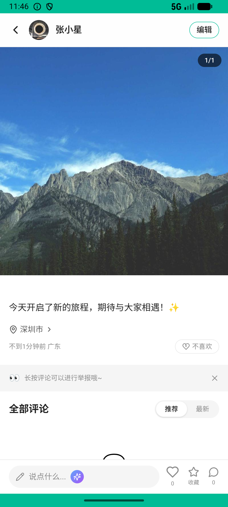
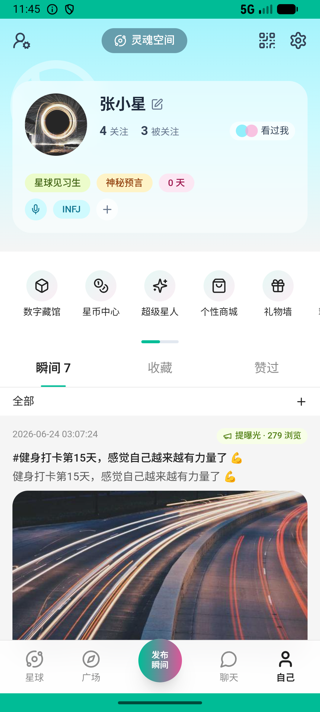
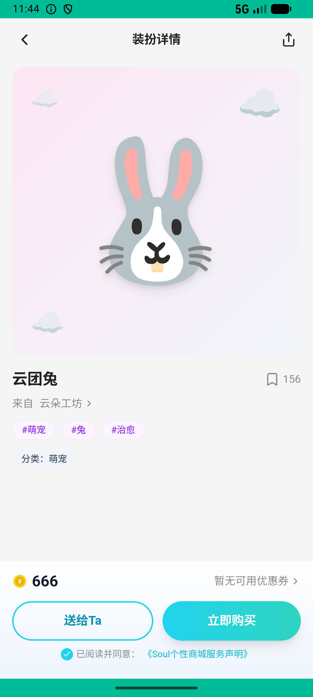

# journeys_v005_onboarding_match_outfit_post  ❌

- **Brand**: `xingqiushejiaowang`
- **Class**: `XingqiushejiaowangJourneysV005OnboardingMatchOutfitPostTask`
- **Pass@3**: **0/3**  (score = 0.00)
- **Elapsed**: 586s (~9.8 min)
- **Model**: `doubao-seed-2-0-lite-260428`
- **Raw log**: [./raw_logs/XingqiushejiaowangJourneysV005OnboardingMatchOutfitPostTask.log](./raw_logs/XingqiushejiaowangJourneysV005OnboardingMatchOutfitPostTask.log)
- **Generated**: 2026-06-25T15:02:45+08:00

## Task Goal

> 新人引导后：灵魂匹配一次、商城买装扮装备、回主页发动态

## System Prompt

<details>
<summary>展开查看完整 System Prompt</summary>


> You are provided with a task description, a history of previous actions, and corresponding screenshots. Your goal is to perform the next action to complete the task. Please note that if performing the same action multiple times results in a static screen with no changes, you should attempt a modified or alternative action.
> 
> ---
> 
> ## Function Definition
> 
> - `clarify` — Ask the user for more information to complete the task.
> - `click` — Mouse left single click action.
> - `double_click` — Mouse left double click action.
> - `drag` — Perform a drag action from the start point to the end point. Typically used for swiping or selecting elements.
> - `long_press` — Perform a long press action at the specified coordinates.
> - `open_app` — Open the specified application.
> - `press_back` — Press the back button.
> - `press_enter` — Press the enter key.
> - `press_home` — Press the home button.
> - `take_notes` — Take notes and report the result in the specified content.
> - `type` — Type the specified content. You should manually delete any text from the input box that you want to remove.
> - `wait` — Wait for a certain period of time.

</details>

## User Query

> 请在 com.xingqiushejiaowang 里面完成以下任务：
> 新人引导后：灵魂匹配一次、商城买装扮装备、回主页发动态

## Attempts

| # | Outcome | Steps | Terminated | Reason | Start → End |
|---|---------|-------|------------|--------|-------------|
| 1 | ❌ failed | 26 | answer | 装备了刚买的装扮: equipped_outfit_id=nil 应为 10 | 2026-06-25 13:42:14 → 2026-06-25 13:46:30 |
| 2 | ❌ failed | 17 | answer | 装备了刚买的装扮: equipped_outfit_id=nil 应为 10; 发了至少 1 条新动态: 没有发新帖 | 2026-06-25 13:46:30 → 2026-06-25 13:49:27 |
| 3 | ❌ failed | 13 | answer | 买了至少 1 个装扮: 没有 OutfitPurchase | 2026-06-25 13:49:27 → 2026-06-25 13:52:00 |

## Failure Details

### Episode 1 — ❌ failed

- steps_used: `26`
- terminated_reason: `answer`
- reason:

  ```
  装备了刚买的装扮: equipped_outfit_id=nil 应为 10
  ```
- death shot: 
  - state: [`./death_shots/XingqiushejiaowangJourneysV005OnboardingMatchOutfitPostTask/episode_001/step_026.json`](./death_shots/XingqiushejiaowangJourneysV005OnboardingMatchOutfitPostTask/episode_001/step_026.json)
  - digest: [`episode_digest.md`](./death_shots/XingqiushejiaowangJourneysV005OnboardingMatchOutfitPostTask/episode_001/episode_digest.md)

### Episode 2 — ❌ failed

- steps_used: `17`
- terminated_reason: `answer`
- reason:

  ```
  装备了刚买的装扮: equipped_outfit_id=nil 应为 10; 发了至少 1 条新动态: 没有发新帖
  ```
- death shot: 
  - state: [`./death_shots/XingqiushejiaowangJourneysV005OnboardingMatchOutfitPostTask/episode_002/step_017.json`](./death_shots/XingqiushejiaowangJourneysV005OnboardingMatchOutfitPostTask/episode_002/step_017.json)
  - digest: [`episode_digest.md`](./death_shots/XingqiushejiaowangJourneysV005OnboardingMatchOutfitPostTask/episode_002/episode_digest.md)

### Episode 3 — ❌ failed

- steps_used: `13`
- terminated_reason: `answer`
- reason:

  ```
  买了至少 1 个装扮: 没有 OutfitPurchase
  ```
- death shot: 
  - state: [`./death_shots/XingqiushejiaowangJourneysV005OnboardingMatchOutfitPostTask/episode_003/step_013.json`](./death_shots/XingqiushejiaowangJourneysV005OnboardingMatchOutfitPostTask/episode_003/step_013.json)
  - digest: [`episode_digest.md`](./death_shots/XingqiushejiaowangJourneysV005OnboardingMatchOutfitPostTask/episode_003/episode_digest.md)

---

> 本摘要由 `sengclaw/scripts/pipeline/log_summarizer.py` 自动生成。 原始完整 log 见上方 Raw log 链接（含每 step 的 messages / tool_call / screenshot 引用）。
