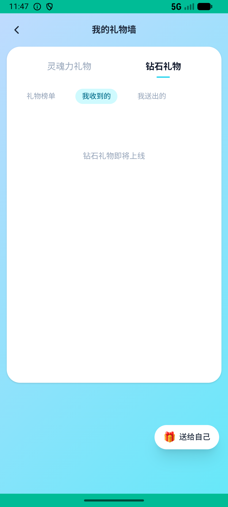
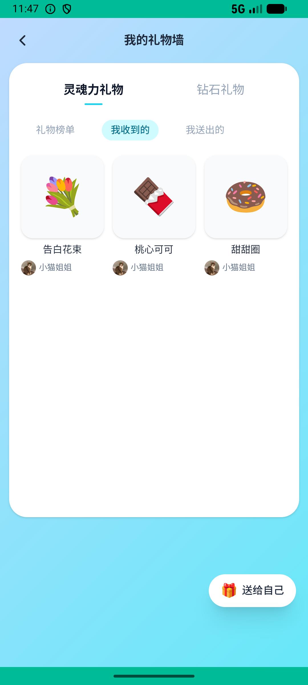

# gift_wall_v006_clear_and_rearrange_wall  ❌

- **Brand**: `xingqiushejiaowang`
- **Class**: `XingqiushejiaowangGiftWallV006ClearAndRearrangeWallTask`
- **Pass@3**: **0/3**  (score = 0.00)
- **Elapsed**: 946s (~15.8 min)
- **Model**: `doubao-seed-2-0-lite-260428`
- **Raw log**: [./raw_logs/XingqiushejiaowangGiftWallV006ClearAndRearrangeWallTask.log](./raw_logs/XingqiushejiaowangGiftWallV006ClearAndRearrangeWallTask.log)
- **Generated**: 2026-06-26T07:37:22+08:00

## Task Goal

> 礼物墙上展示的礼物想重新整理一遍——先把所有展示都移除，再从仓库里精选3份不同的礼物重新放上去

## System Prompt

<details>
<summary>展开查看完整 System Prompt</summary>


> You are provided with a task description, a history of previous actions, and corresponding screenshots. Your goal is to perform the next action to complete the task. Please note that if performing the same action multiple times results in a static screen with no changes, you should attempt a modified or alternative action.
> 
> ---
> 
> ## Function Definition
> 
> - `clarify` — Ask the user for more information to complete the task.
> - `click` — Mouse left single click action.
> - `double_click` — Mouse left double click action.
> - `drag` — Perform a drag action from the start point to the end point. Typically used for swiping or selecting elements.
> - `long_press` — Perform a long press action at the specified coordinates.
> - `open_app` — Open the specified application.
> - `press_back` — Press the back button.
> - `press_enter` — Press the enter key.
> - `press_home` — Press the home button.
> - `take_notes` — Take notes and report the result in the specified content.
> - `type` — Type the specified content. You should manually delete any text from the input box that you want to remove.
> - `wait` — Wait for a certain period of time.

</details>

## User Query

> 请在 com.xingqiushejiaowang 里面完成以下任务：
> 礼物墙上展示的礼物想重新整理一遍——先把所有展示都移除，再从仓库里精选3份不同的礼物重新放上去

## Attempts

| # | Outcome | Steps | Terminated | Reason | Start → End |
|---|---------|-------|------------|--------|-------------|
| 1 | ❌ failed | 39 | answer | 旧展示已全部清空，展示墙无旧礼物: 旧礼物仍有 3 件留在展示位，应全部清除; 新上墙的礼物来自本次收到的仓库礼物: 从本次收到的3份礼物中，只有 0 件被放上展示墙 | 2026-06-26 01:39:32 → 2026-06-26 01:45:24 |
| 2 | ❌ failed | 27 | answer | 旧展示已全部清空，展示墙无旧礼物: 旧礼物仍有 3 件留在展示位，应全部清除; 新上墙的礼物来自本次收到的仓库礼物: 从本次收到的3份礼物中，只有 0 件被放上展示墙 | 2026-06-26 01:45:24 → 2026-06-26 01:50:06 |
| 3 | ❌ failed | 29 | answer | 旧展示已全部清空，展示墙无旧礼物: 旧礼物仍有 3 件留在展示位，应全部清除; 新上墙的礼物来自本次收到的仓库礼物: 从本次收到的3份礼物中，只有 0 件被放上展示墙 | 2026-06-26 01:50:06 → 2026-06-26 01:55:18 |

## Failure Details

### Episode 1 — ❌ failed

- steps_used: `39`
- terminated_reason: `answer`
- reason:

  ```
  旧展示已全部清空，展示墙无旧礼物: 旧礼物仍有 3 件留在展示位，应全部清除; 新上墙的礼物来自本次收到的仓库礼物: 从本次收到的3份礼物中，只有 0 件被放上展示墙
  ```
- death shot: 
  - state: [`./death_shots/XingqiushejiaowangGiftWallV006ClearAndRearrangeWallTask/episode_001/step_039.json`](./death_shots/XingqiushejiaowangGiftWallV006ClearAndRearrangeWallTask/episode_001/step_039.json)
  - digest: [`episode_digest.md`](./death_shots/XingqiushejiaowangGiftWallV006ClearAndRearrangeWallTask/episode_001/episode_digest.md)

### Episode 2 — ❌ failed

- steps_used: `27`
- terminated_reason: `answer`
- reason:

  ```
  旧展示已全部清空，展示墙无旧礼物: 旧礼物仍有 3 件留在展示位，应全部清除; 新上墙的礼物来自本次收到的仓库礼物: 从本次收到的3份礼物中，只有 0 件被放上展示墙
  ```
- death shot: 
  - state: [`./death_shots/XingqiushejiaowangGiftWallV006ClearAndRearrangeWallTask/episode_002/step_027.json`](./death_shots/XingqiushejiaowangGiftWallV006ClearAndRearrangeWallTask/episode_002/step_027.json)
  - digest: [`episode_digest.md`](./death_shots/XingqiushejiaowangGiftWallV006ClearAndRearrangeWallTask/episode_002/episode_digest.md)

### Episode 3 — ❌ failed

- steps_used: `29`
- terminated_reason: `answer`
- reason:

  ```
  旧展示已全部清空，展示墙无旧礼物: 旧礼物仍有 3 件留在展示位，应全部清除; 新上墙的礼物来自本次收到的仓库礼物: 从本次收到的3份礼物中，只有 0 件被放上展示墙
  ```
- death shot: 
  - state: [`./death_shots/XingqiushejiaowangGiftWallV006ClearAndRearrangeWallTask/episode_003/step_029.json`](./death_shots/XingqiushejiaowangGiftWallV006ClearAndRearrangeWallTask/episode_003/step_029.json)
  - digest: [`episode_digest.md`](./death_shots/XingqiushejiaowangGiftWallV006ClearAndRearrangeWallTask/episode_003/episode_digest.md)

---

> 本摘要由 `sengclaw/scripts/pipeline/log_summarizer.py` 自动生成。 原始完整 log 见上方 Raw log 链接（含每 step 的 messages / tool_call / screenshot 引用）。
