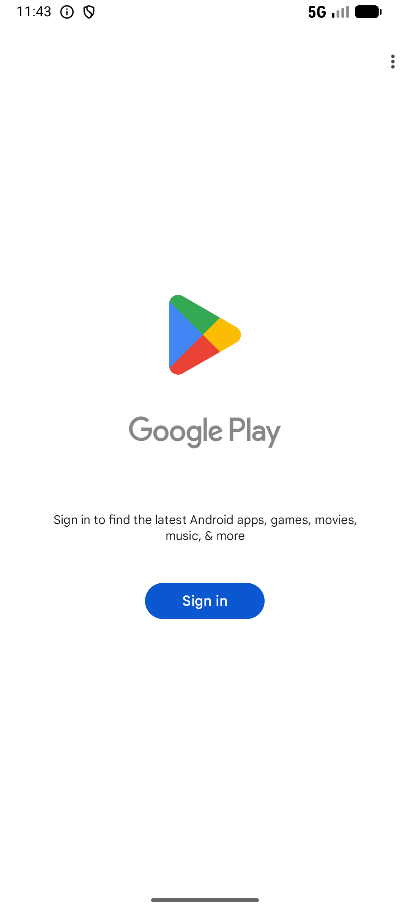
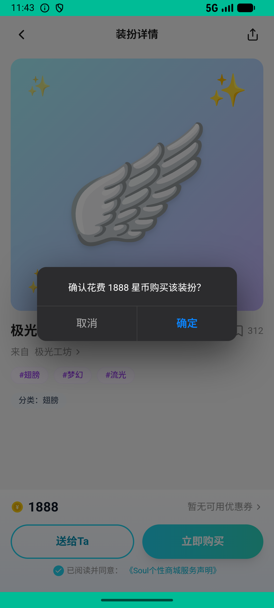
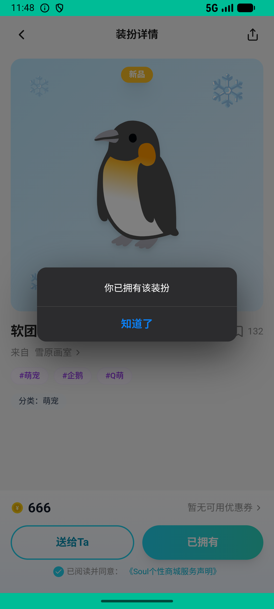

# journeys_v015_outfit_self_buy_gift_receive_back_equip  ❌

- **Brand**: `xingqiushejiaowang`
- **Class**: `XingqiushejiaowangJourneysV015OutfitSelfBuyGiftReceiveBackEquipTask`
- **Pass@3**: **0/3**  (score = 0.00)
- **Elapsed**: 501s (~8.3 min)
- **Model**: `doubao-seed-2-0-lite-260428`
- **Raw log**: [./raw_logs/XingqiushejiaowangJourneysV015OutfitSelfBuyGiftReceiveBackEquipTask.log](./raw_logs/XingqiushejiaowangJourneysV015OutfitSelfBuyGiftReceiveBackEquipTask.log)
- **Generated**: 2026-06-27T04:26:35+08:00

## Task Goal

> 装扮购买：给自己买一件 + 买一件送给小猫姐姐 + 装备她回赠的

## System Prompt

<details>
<summary>展开查看完整 System Prompt</summary>


> You are provided with a task description, a history of previous actions, and corresponding screenshots. Your goal is to perform the next action to complete the task. Please note that if performing the same action multiple times results in a static screen with no changes, you should attempt a modified or alternative action.
> 
> ---
> 
> ## Function Definition
> 
> - `clarify` — Ask the user for more information to complete the task.
> - `click` — Mouse left single click action.
> - `double_click` — Mouse left double click action.
> - `drag` — Perform a drag action from the start point to the end point. Typically used for swiping or selecting elements.
> - `long_press` — Perform a long press action at the specified coordinates.
> - `open_app` — Open the specified application.
> - `press_back` — Press the back button.
> - `press_enter` — Press the enter key.
> - `press_home` — Press the home button.
> - `take_notes` — Take notes and report the result in the specified content.
> - `type` — Type the specified content. You should manually delete any text from the input box that you want to remove.
> - `wait` — Wait for a certain period of time.

</details>

## User Query

> 请在 com.xingqiushejiaowang 里面完成以下任务：
> 装扮购买：给自己买一件 + 买一件送给小猫姐姐 + 装备她回赠的

## Attempts

| # | Outcome | Steps | Terminated | Reason | Start → End |
|---|---------|-------|------------|--------|-------------|
| 1 | ❌ failed | 7 | answer | 给自己买了一件装扮: 未找到自购装扮记录（需要点「立即购买」给自己买）; 买了一件装扮送给小猫姐姐: 未找到送给小猫姐姐的装扮（需要点「送给Ta」购买赠送）; 私聊里有送给小猫姐姐的 outfit_gift 消息: 私聊未找到 outfit_gift 消息; 装备了小猫姐姐... | 2026-06-26 21:08:55 → 2026-06-26 21:10:17 |
| 2 | ❌ failed | 8 | answer | 给自己买了一件装扮: 未找到自购装扮记录（需要点「立即购买」给自己买）; 买了一件装扮送给小猫姐姐: 未找到送给小猫姐姐的装扮（需要点「送给Ta」购买赠送）; 私聊里有送给小猫姐姐的 outfit_gift 消息: 私聊未找到 outfit_gift 消息; 装备了小猫姐姐... | 2026-06-26 21:10:17 → 2026-06-26 21:11:35 |
| 3 | ❌ failed | 37 | answer | 买了一件装扮送给小猫姐姐: 未找到送给小猫姐姐的装扮（需要点「送给Ta」购买赠送）; 私聊里有送给小猫姐姐的 outfit_gift 消息: 私聊未找到 outfit_gift 消息; 装备了小猫姐姐回赠的装扮（pet/wings/halo/outfit/ultimate ... | 2026-06-26 21:11:35 → 2026-06-26 21:17:15 |

## Failure Details

### Episode 1 — ❌ failed

- steps_used: `7`
- terminated_reason: `answer`
- reason:

  ```
  给自己买了一件装扮: 未找到自购装扮记录（需要点「立即购买」给自己买）; 买了一件装扮送给小猫姐姐: 未找到送给小猫姐姐的装扮（需要点「送给Ta」购买赠送）; 私聊里有送给小猫姐姐的 outfit_gift 消息: 私聊未找到 outfit_gift 消息; 装备了小猫姐姐回赠的装扮（pet/wings/halo/outfit/ultimate 任意槽位）: 未装备小猫姐姐送的装扮。已装备: []，可选: [13]; 完成了至少两次购买操作（自购 + 赠送）: 购买次数不足：自购 0 次，赠送 0 次，共 0 次，需要至少 2 次
  ```
- death shot: 
  - state: [`./death_shots/XingqiushejiaowangJourneysV015OutfitSelfBuyGiftReceiveBackEquipTask/episode_001/step_007.json`](./death_shots/XingqiushejiaowangJourneysV015OutfitSelfBuyGiftReceiveBackEquipTask/episode_001/step_007.json)
  - digest: [`episode_digest.md`](./death_shots/XingqiushejiaowangJourneysV015OutfitSelfBuyGiftReceiveBackEquipTask/episode_001/episode_digest.md)

### Episode 2 — ❌ failed

- steps_used: `8`
- terminated_reason: `answer`
- reason:

  ```
  给自己买了一件装扮: 未找到自购装扮记录（需要点「立即购买」给自己买）; 买了一件装扮送给小猫姐姐: 未找到送给小猫姐姐的装扮（需要点「送给Ta」购买赠送）; 私聊里有送给小猫姐姐的 outfit_gift 消息: 私聊未找到 outfit_gift 消息; 装备了小猫姐姐回赠的装扮（pet/wings/halo/outfit/ultimate 任意槽位）: 未装备小猫姐姐送的装扮。已装备: []，可选: [13]; 完成了至少两次购买操作（自购 + 赠送）: 购买次数不足：自购 0 次，赠送 0 次，共 0 次，需要至少 2 次
  ```
- death shot: 
  - state: [`./death_shots/XingqiushejiaowangJourneysV015OutfitSelfBuyGiftReceiveBackEquipTask/episode_002/step_008.json`](./death_shots/XingqiushejiaowangJourneysV015OutfitSelfBuyGiftReceiveBackEquipTask/episode_002/step_008.json)
  - digest: [`episode_digest.md`](./death_shots/XingqiushejiaowangJourneysV015OutfitSelfBuyGiftReceiveBackEquipTask/episode_002/episode_digest.md)

### Episode 3 — ❌ failed

- steps_used: `37`
- terminated_reason: `answer`
- reason:

  ```
  买了一件装扮送给小猫姐姐: 未找到送给小猫姐姐的装扮（需要点「送给Ta」购买赠送）; 私聊里有送给小猫姐姐的 outfit_gift 消息: 私聊未找到 outfit_gift 消息; 装备了小猫姐姐回赠的装扮（pet/wings/halo/outfit/ultimate 任意槽位）: 未装备小猫姐姐送的装扮。已装备: []，可选: [13]; 完成了至少两次购买操作（自购 + 赠送）: 购买次数不足：自购 1 次，赠送 0 次，共 1 次，需要至少 2 次
  ```
- death shot: 
  - state: [`./death_shots/XingqiushejiaowangJourneysV015OutfitSelfBuyGiftReceiveBackEquipTask/episode_003/step_037.json`](./death_shots/XingqiushejiaowangJourneysV015OutfitSelfBuyGiftReceiveBackEquipTask/episode_003/step_037.json)
  - digest: [`episode_digest.md`](./death_shots/XingqiushejiaowangJourneysV015OutfitSelfBuyGiftReceiveBackEquipTask/episode_003/episode_digest.md)

---

> 本摘要由 `sengclaw/scripts/pipeline/log_summarizer.py` 自动生成。 原始完整 log 见上方 Raw log 链接（含每 step 的 messages / tool_call / screenshot 引用）。
