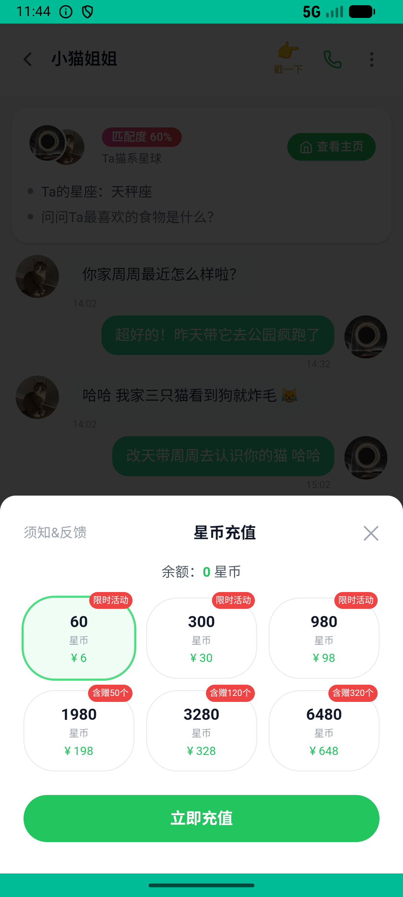

# journeys_v019_double_recharge_and_two_gifts  ❌

- **Brand**: `xingqiushejiaowang`
- **Class**: `XingqiushejiaowangJourneysV019DoubleRechargeAndTwoGiftsTask`
- **Pass@3**: **0/3**  (score = 0.00)
- **Elapsed**: 1368s (~22.8 min)
- **Model**: `doubao-seed-2-0-lite-260428`
- **Raw log**: [./raw_logs/XingqiushejiaowangJourneysV019DoubleRechargeAndTwoGiftsTask.log](./raw_logs/XingqiushejiaowangJourneysV019DoubleRechargeAndTwoGiftsTask.log)
- **Generated**: 2026-06-27T04:26:35+08:00

## Task Goal

> 充 60 送桃心给小猫姐姐，再充 300 送水晶球给小羊咩咩

## System Prompt

<details>
<summary>展开查看完整 System Prompt</summary>


> You are provided with a task description, a history of previous actions, and corresponding screenshots. Your goal is to perform the next action to complete the task. Please note that if performing the same action multiple times results in a static screen with no changes, you should attempt a modified or alternative action.
> 
> ---
> 
> ## Function Definition
> 
> - `clarify` — Ask the user for more information to complete the task.
> - `click` — Mouse left single click action.
> - `double_click` — Mouse left double click action.
> - `drag` — Perform a drag action from the start point to the end point. Typically used for swiping or selecting elements.
> - `long_press` — Perform a long press action at the specified coordinates.
> - `open_app` — Open the specified application.
> - `press_back` — Press the back button.
> - `press_enter` — Press the enter key.
> - `press_home` — Press the home button.
> - `take_notes` — Take notes and report the result in the specified content.
> - `type` — Type the specified content. You should manually delete any text from the input box that you want to remove.
> - `wait` — Wait for a certain period of time.

</details>

## User Query

> 请在 com.xingqiushejiaowang 里面完成以下任务：
> 充 60 送桃心给小猫姐姐，再充 300 送水晶球给小羊咩咩

## Attempts

| # | Outcome | Steps | Terminated | Reason | Start → End |
|---|---------|-------|------------|--------|-------------|
| 1 | ❌ failed | 11 | answer | 充值了 60 星币档: 未找到 60 档订单，订单档位=[] Diff: @@ -1 +1 @@ -true +false ; 充值了 300 星币档: 未找到 300 档订单，订单档位=[] Diff: @@ -1 +1 @@ -true +false ; 总充值订单 ≥... | 2026-06-26 21:38:36 → 2026-06-26 21:40:32 |
| 2 | ❌ failed | 63 | answer | 给小猫姐姐送了「桃心可可」: 未找到给小猫姐姐的桃心可可记录; 余额 ≥ 360 - 36 - 99 = 225（验证账没乱扣）: 余额 201，应 ≥ 225 | 2026-06-26 21:40:32 → 2026-06-26 21:50:30 |
| 3 | ❌ failed | 70 | answer | 给小猫姐姐送了「桃心可可」: 未找到给小猫姐姐的桃心可可记录; 余额 ≥ 360 - 36 - 99 = 225（验证账没乱扣）: 余额 201，应 ≥ 225 | 2026-06-26 21:50:30 → 2026-06-26 22:01:24 |

## Failure Details

### Episode 1 — ❌ failed

- steps_used: `11`
- terminated_reason: `answer`
- reason:

  ```
  充值了 60 星币档: 未找到 60 档订单，订单档位=[]
  Diff:
  @@ -1 +1 @@
  -true
  +false
  ; 充值了 300 星币档: 未找到 300 档订单，订单档位=[]
  Diff:
  @@ -1 +1 @@
  -true
  +false
  ; 总充值订单 ≥ 2 笔: 订单仅 0 笔; 给小猫姐姐送了「桃心可可」: 未找到给小猫姐姐的桃心可可记录; 给小羊咩咩送了「水晶球」: 未找到给小羊咩咩的水晶球记录; 余额 ≥ 360 - 36 - 99 = 225（验证账没乱扣）: 余额 0，应 ≥ 225
  ```
- death shot: 
  - state: [`./death_shots/XingqiushejiaowangJourneysV019DoubleRechargeAndTwoGiftsTask/episode_001/step_011.json`](./death_shots/XingqiushejiaowangJourneysV019DoubleRechargeAndTwoGiftsTask/episode_001/step_011.json)
  - digest: [`episode_digest.md`](./death_shots/XingqiushejiaowangJourneysV019DoubleRechargeAndTwoGiftsTask/episode_001/episode_digest.md)

### Episode 2 — ❌ failed

- steps_used: `63`
- terminated_reason: `answer`
- reason:

  ```
  给小猫姐姐送了「桃心可可」: 未找到给小猫姐姐的桃心可可记录; 余额 ≥ 360 - 36 - 99 = 225（验证账没乱扣）: 余额 201，应 ≥ 225
  ```
- death shot: 
  - state: [`./death_shots/XingqiushejiaowangJourneysV019DoubleRechargeAndTwoGiftsTask/episode_002/step_063.json`](./death_shots/XingqiushejiaowangJourneysV019DoubleRechargeAndTwoGiftsTask/episode_002/step_063.json)
  - digest: [`episode_digest.md`](./death_shots/XingqiushejiaowangJourneysV019DoubleRechargeAndTwoGiftsTask/episode_002/episode_digest.md)

### Episode 3 — ❌ failed

- steps_used: `70`
- terminated_reason: `answer`
- reason:

  ```
  给小猫姐姐送了「桃心可可」: 未找到给小猫姐姐的桃心可可记录; 余额 ≥ 360 - 36 - 99 = 225（验证账没乱扣）: 余额 201，应 ≥ 225
  ```
- death shot: 
  - state: [`./death_shots/XingqiushejiaowangJourneysV019DoubleRechargeAndTwoGiftsTask/episode_003/step_070.json`](./death_shots/XingqiushejiaowangJourneysV019DoubleRechargeAndTwoGiftsTask/episode_003/step_070.json)
  - digest: [`episode_digest.md`](./death_shots/XingqiushejiaowangJourneysV019DoubleRechargeAndTwoGiftsTask/episode_003/episode_digest.md)

---

> 本摘要由 `sengclaw/scripts/pipeline/log_summarizer.py` 自动生成。 原始完整 log 见上方 Raw log 链接（含每 step 的 messages / tool_call / screenshot 引用）。
