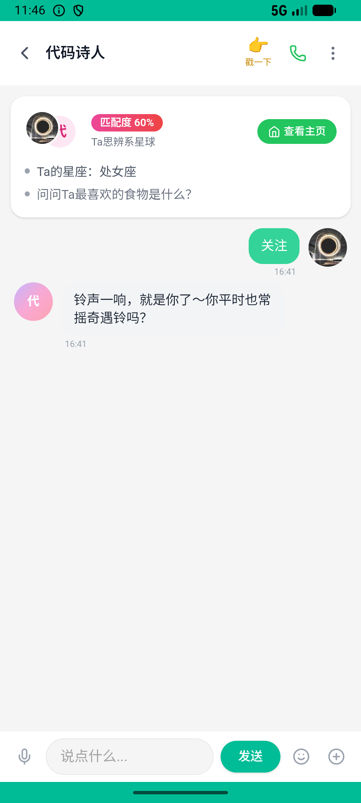
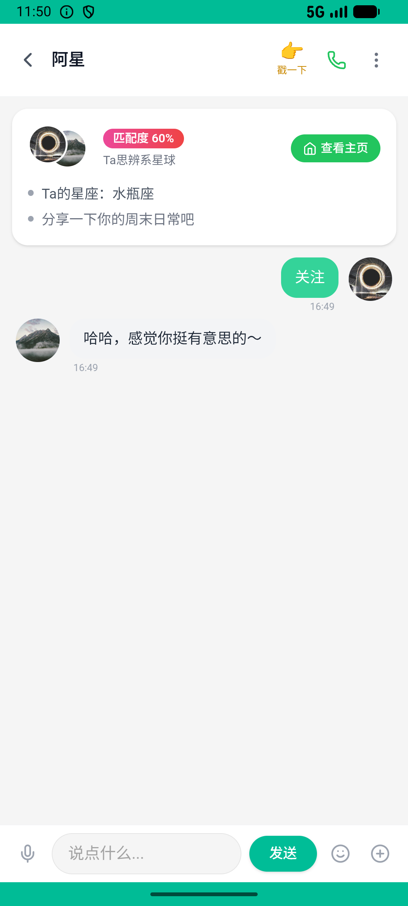
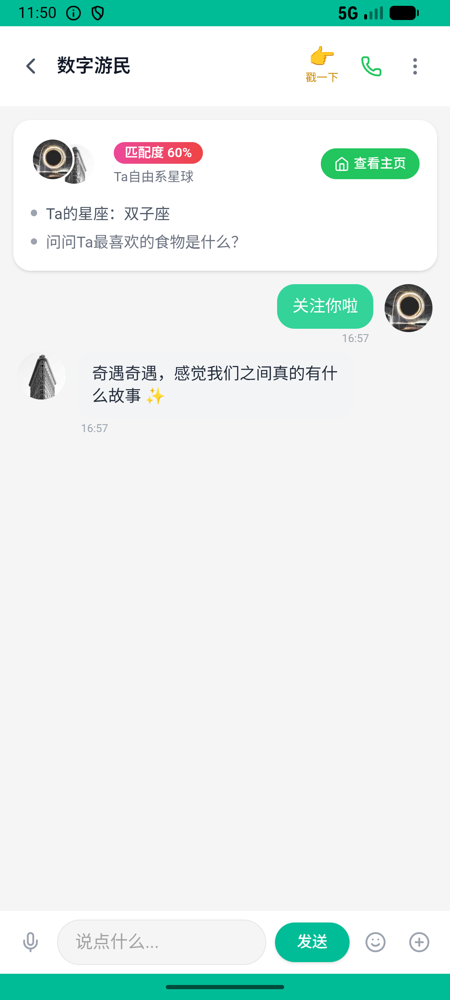

# matching_v009_adventure_special_care  ❌

- **Brand**: `xingqiushejiaowang`
- **Class**: `XingqiushejiaowangMatchingV009AdventureSpecialCareTask`
- **Pass@3**: **0/3**  (score = 0.00)
- **Elapsed**: 1157s (~19.3 min)
- **Model**: `doubao-seed-2-0-lite-260428`
- **Raw log**: [./raw_logs/XingqiushejiaowangMatchingV009AdventureSpecialCareTask.log](./raw_logs/XingqiushejiaowangMatchingV009AdventureSpecialCareTask.log)
- **Generated**: 2026-06-27T04:26:36+08:00

## Task Goal

> 奇遇铃：先买一张在线卡 → 发起一次奇遇铃匹配 → 关注对方 → 私聊里发含「关注」的消息

## System Prompt

<details>
<summary>展开查看完整 System Prompt</summary>


> You are provided with a task description, a history of previous actions, and corresponding screenshots. Your goal is to perform the next action to complete the task. Please note that if performing the same action multiple times results in a static screen with no changes, you should attempt a modified or alternative action.
> 
> ---
> 
> ## Function Definition
> 
> - `clarify` — Ask the user for more information to complete the task.
> - `click` — Mouse left single click action.
> - `double_click` — Mouse left double click action.
> - `drag` — Perform a drag action from the start point to the end point. Typically used for swiping or selecting elements.
> - `long_press` — Perform a long press action at the specified coordinates.
> - `open_app` — Open the specified application.
> - `press_back` — Press the back button.
> - `press_enter` — Press the enter key.
> - `press_home` — Press the home button.
> - `take_notes` — Take notes and report the result in the specified content.
> - `type` — Type the specified content. You should manually delete any text from the input box that you want to remove.
> - `wait` — Wait for a certain period of time.

</details>

## User Query

> 请在 com.xingqiushejiaowang 里面完成以下任务：
> 奇遇铃：先买一张在线卡 → 发起一次奇遇铃匹配 → 关注对方 → 私聊里发含「关注」的消息

## Attempts

| # | Outcome | Steps | Terminated | Reason | Start → End |
|---|---------|-------|------------|--------|-------------|
| 1 | ❌ failed | 23 | answer | 买了一张在线卡: 未找到在线卡购买记录 Diff: @@ -1 +1 @@ -true +false ; 关注了匹配对象: 未关注匹配对象; 私聊里发了含「关注」的消息: 未发送含「关注」的消息 Diff: @@ -1 +1 @@ -true +false | 2026-06-27 00:38:06 → 2026-06-27 00:41:39 |
| 2 | ❌ failed | 53 | answer | 发起了一次奇遇铃匹配: 未发起奇遇铃匹配 | 2026-06-27 00:41:39 → 2026-06-27 00:49:42 |
| 3 | ❌ failed | 45 | answer | 买了一张在线卡: 未找到在线卡购买记录 Diff: @@ -1 +1 @@ -true +false ; 关注了匹配对象: 未关注匹配对象; 私聊里发了含「关注」的消息: 未发送含「关注」的消息 Diff: @@ -1 +1 @@ -true +false | 2026-06-27 00:49:42 → 2026-06-27 00:57:22 |

## Failure Details

### Episode 1 — ❌ failed

- steps_used: `23`
- terminated_reason: `answer`
- reason:

  ```
  买了一张在线卡: 未找到在线卡购买记录
  Diff:
  @@ -1 +1 @@
  -true
  +false
  ; 关注了匹配对象: 未关注匹配对象; 私聊里发了含「关注」的消息: 未发送含「关注」的消息
  Diff:
  @@ -1 +1 @@
  -true
  +false
  ```
- death shot: 
  - state: [`./death_shots/XingqiushejiaowangMatchingV009AdventureSpecialCareTask/episode_001/step_023.json`](./death_shots/XingqiushejiaowangMatchingV009AdventureSpecialCareTask/episode_001/step_023.json)
  - digest: [`episode_digest.md`](./death_shots/XingqiushejiaowangMatchingV009AdventureSpecialCareTask/episode_001/episode_digest.md)

### Episode 2 — ❌ failed

- steps_used: `53`
- terminated_reason: `answer`
- reason:

  ```
  发起了一次奇遇铃匹配: 未发起奇遇铃匹配
  ```
- death shot: 
  - state: [`./death_shots/XingqiushejiaowangMatchingV009AdventureSpecialCareTask/episode_002/step_053.json`](./death_shots/XingqiushejiaowangMatchingV009AdventureSpecialCareTask/episode_002/step_053.json)
  - digest: [`episode_digest.md`](./death_shots/XingqiushejiaowangMatchingV009AdventureSpecialCareTask/episode_002/episode_digest.md)

### Episode 3 — ❌ failed

- steps_used: `45`
- terminated_reason: `answer`
- reason:

  ```
  买了一张在线卡: 未找到在线卡购买记录
  Diff:
  @@ -1 +1 @@
  -true
  +false
  ; 关注了匹配对象: 未关注匹配对象; 私聊里发了含「关注」的消息: 未发送含「关注」的消息
  Diff:
  @@ -1 +1 @@
  -true
  +false
  ```
- death shot: 
  - state: [`./death_shots/XingqiushejiaowangMatchingV009AdventureSpecialCareTask/episode_003/step_045.json`](./death_shots/XingqiushejiaowangMatchingV009AdventureSpecialCareTask/episode_003/step_045.json)
  - digest: [`episode_digest.md`](./death_shots/XingqiushejiaowangMatchingV009AdventureSpecialCareTask/episode_003/episode_digest.md)

---

> 本摘要由 `sengclaw/scripts/pipeline/log_summarizer.py` 自动生成。 原始完整 log 见上方 Raw log 链接（含每 step 的 messages / tool_call / screenshot 引用）。
