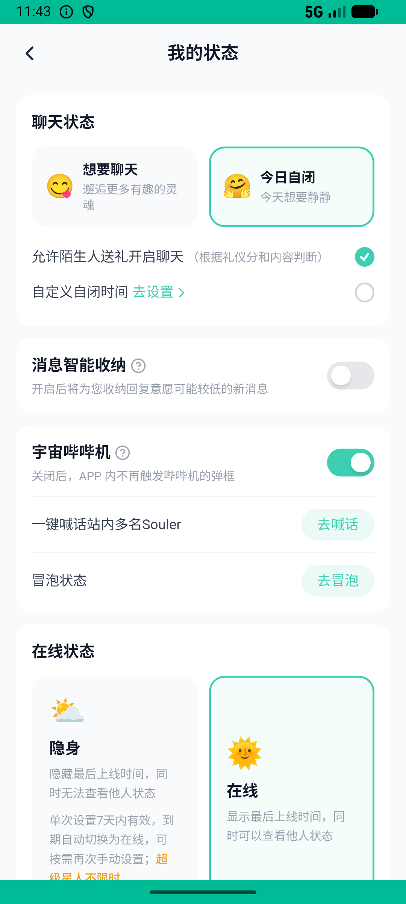

# journeys_v023_status_party_gift_post  ⚠️

- **Brand**: `xingqiushejiaowang`
- **Class**: `XingqiushejiaowangJourneysV023StatusPartyGiftPostTask`
- **Pass@3**: **2/3**  (score = 1.00)
- **Elapsed**: 479s (~8.0 min)
- **Model**: `doubao-seed-2-0-lite-260428`
- **Raw log**: [./raw_logs/XingqiushejiaowangJourneysV023StatusPartyGiftPostTask.log](./raw_logs/XingqiushejiaowangJourneysV023StatusPartyGiftPostTask.log)
- **Generated**: 2026-06-27T20:52:16+08:00

## Task Goal

> 切换为「想要聊天」状态 → 进「音乐分享会」发言 → 给主持人送「甜甜圈」(8星币) → 发帖含「夜聊」

## System Prompt

<details>
<summary>展开查看完整 System Prompt</summary>


> You are provided with a task description, a history of previous actions, and corresponding screenshots. Your goal is to perform the next action to complete the task. Please note that if performing the same action multiple times results in a static screen with no changes, you should attempt a modified or alternative action.
> 
> ---
> 
> ## Function Definition
> 
> - `clarify` — Ask the user for more information to complete the task.
> - `click` — Mouse left single click action.
> - `double_click` — Mouse left double click action.
> - `drag` — Perform a drag action from the start point to the end point. Typically used for swiping or selecting elements.
> - `long_press` — Perform a long press action at the specified coordinates.
> - `open_app` — Open the specified application.
> - `press_back` — Press the back button.
> - `press_enter` — Press the enter key.
> - `press_home` — Press the home button.
> - `take_notes` — Take notes and report the result in the specified content.
> - `type` — Type the specified content. You should manually delete any text from the input box that you want to remove.
> - `wait` — Wait for a certain period of time.

</details>

## User Query

> 请在 com.xingqiushejiaowang 里面完成以下任务：
> 切换为「想要聊天」状态 → 进「音乐分享会」发言 → 给主持人送「甜甜圈」(8星币) → 发帖含「夜聊」

## Attempts

| # | Outcome | Steps | Terminated | Reason | Start → End |
|---|---------|-------|------------|--------|-------------|
| 1 | ❌ failed | 4 | answer | 聊天状态已切换为 want_chat: chat_status="quiet_today"，应为 want_chat; 在「音乐分享会」派对里发了至少 1 条消息: 未找到在「音乐分享会」派对里的发言记录; 给主持人送了「甜甜圈」: 主持人未确定（需先在「音乐分享会」里发言... | 2026-06-27 18:48:50 → 2026-06-27 18:49:27 |
| 2 | ✅ passed | 24 | answer | – | 2026-06-27 18:49:27 → 2026-06-27 18:53:01 |
| 3 | ✅ passed | 26 | answer | – | 2026-06-27 18:53:01 → 2026-06-27 18:56:49 |

## Failure Details

### Episode 1 — ❌ failed

- steps_used: `4`
- terminated_reason: `answer`
- reason:

  ```
  聊天状态已切换为 want_chat: chat_status="quiet_today"，应为 want_chat; 在「音乐分享会」派对里发了至少 1 条消息: 未找到在「音乐分享会」派对里的发言记录; 给主持人送了「甜甜圈」: 主持人未确定（需先在「音乐分享会」里发言）; 发了含「夜聊」的帖子: 未找到含「夜聊」的已发布帖子
  ```
- death shot: 
  - state: [`./death_shots/XingqiushejiaowangJourneysV023StatusPartyGiftPostTask/episode_001/step_004.json`](./death_shots/XingqiushejiaowangJourneysV023StatusPartyGiftPostTask/episode_001/step_004.json)
  - digest: [`episode_digest.md`](./death_shots/XingqiushejiaowangJourneysV023StatusPartyGiftPostTask/episode_001/episode_digest.md)

---

> 本摘要由 `sengclaw/scripts/pipeline/log_summarizer.py` 自动生成。 原始完整 log 见上方 Raw log 链接（含每 step 的 messages / tool_call / screenshot 引用）。
