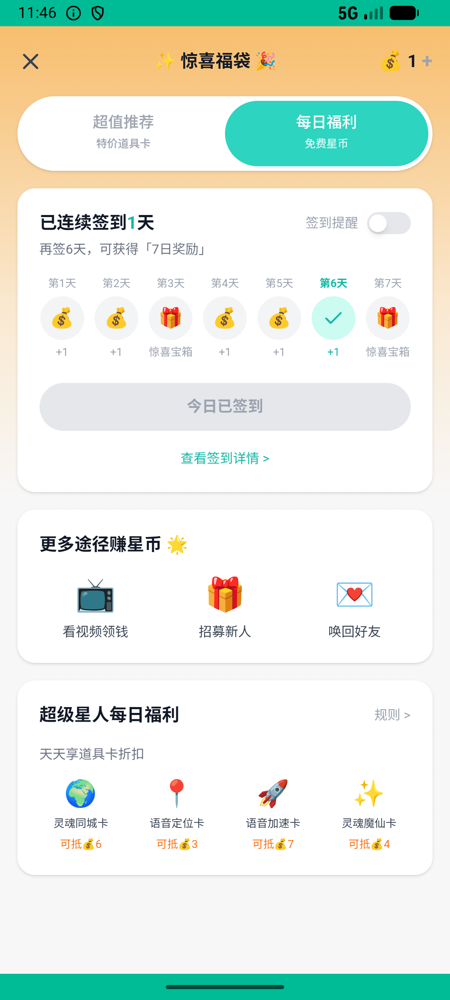
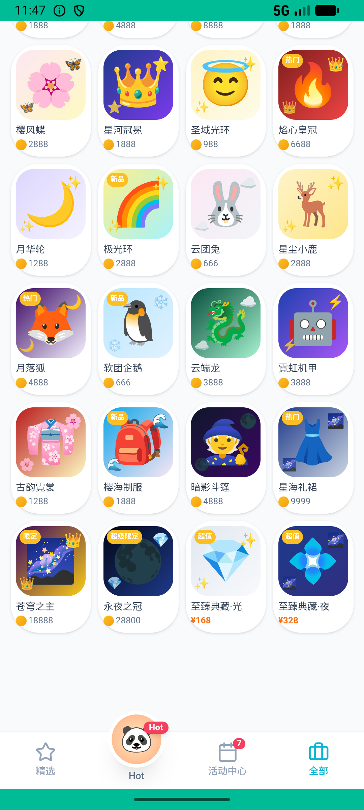
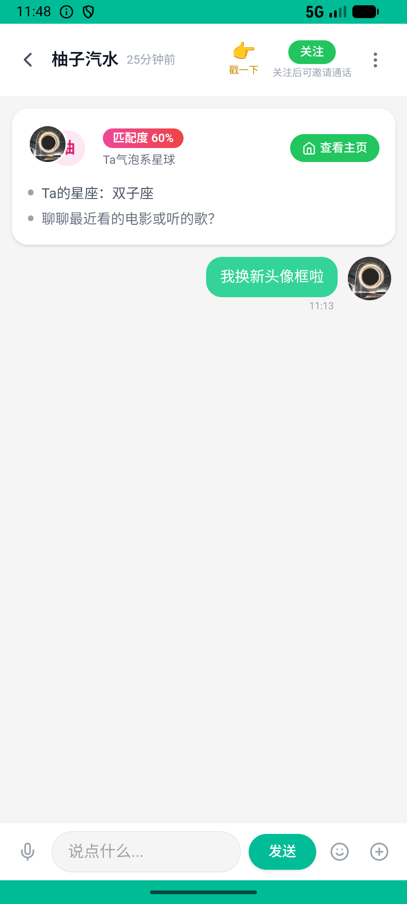

# journeys_v026_checkin_buy_frame_equip_dm  ❌

- **Brand**: `xingqiushejiaowang`
- **Class**: `XingqiushejiaowangJourneysV026CheckinBuyFrameEquipDmTask`
- **Pass@3**: **0/3**  (score = 0.00)
- **Elapsed**: 949s (~15.8 min)
- **Model**: `doubao-seed-2-0-lite-260428`
- **Raw log**: [./raw_logs/XingqiushejiaowangJourneysV026CheckinBuyFrameEquipDmTask.log](./raw_logs/XingqiushejiaowangJourneysV026CheckinBuyFrameEquipDmTask.log)
- **Generated**: 2026-06-27T20:52:16+08:00

## Task Goal

> 每日签到拿星币 → 在头像框背包购买「星光之环」挂件 → 装备到头像 → 私聊柚子汽水说「我换新头像框啦」

## System Prompt

<details>
<summary>展开查看完整 System Prompt</summary>


> You are provided with a task description, a history of previous actions, and corresponding screenshots. Your goal is to perform the next action to complete the task. Please note that if performing the same action multiple times results in a static screen with no changes, you should attempt a modified or alternative action.
> 
> ---
> 
> ## Function Definition
> 
> - `clarify` — Ask the user for more information to complete the task.
> - `click` — Mouse left single click action.
> - `double_click` — Mouse left double click action.
> - `drag` — Perform a drag action from the start point to the end point. Typically used for swiping or selecting elements.
> - `long_press` — Perform a long press action at the specified coordinates.
> - `open_app` — Open the specified application.
> - `press_back` — Press the back button.
> - `press_enter` — Press the enter key.
> - `press_home` — Press the home button.
> - `take_notes` — Take notes and report the result in the specified content.
> - `type` — Type the specified content. You should manually delete any text from the input box that you want to remove.
> - `wait` — Wait for a certain period of time.

</details>

## User Query

> 请在 com.xingqiushejiaowang 里面完成以下任务：
> 每日签到拿星币 → 在头像框背包购买「星光之环」挂件 → 装备到头像 → 私聊柚子汽水说「我换新头像框啦」

## Attempts

| # | Outcome | Steps | Terminated | Reason | Start → End |
|---|---------|-------|------------|--------|-------------|
| 1 | ❌ failed | 29 | answer | 拥有星光之环挂件: 未找到用户持有星光之环的记录 Diff: @@ -1 +1 @@ -true +false ; 已将星光之环装备到头像: equipped_avatar_frame_id=nil，未装备星光之环; 私聊柚子汽水发了含「换新头像框」的消息: 未找到与柚子汽... | 2026-06-27 18:57:28 → 2026-06-27 19:01:46 |
| 2 | ❌ failed | 28 | answer | 拥有星光之环挂件: 未找到用户持有星光之环的记录 Diff: @@ -1 +1 @@ -true +false ; 已将星光之环装备到头像: equipped_avatar_frame_id=nil，未装备星光之环; 私聊柚子汽水发了含「换新头像框」的消息: 未找到与柚子汽... | 2026-06-27 19:01:46 → 2026-06-27 19:06:59 |
| 3 | ❌ failed | 39 | answer | 拥有星光之环挂件: 未找到用户持有星光之环的记录 Diff: @@ -1 +1 @@ -true +false ; 已将星光之环装备到头像: equipped_avatar_frame_id=nil，未装备星光之环 | 2026-06-27 19:06:59 → 2026-06-27 19:13:17 |

## Failure Details

### Episode 1 — ❌ failed

- steps_used: `29`
- terminated_reason: `answer`
- reason:

  ```
  拥有星光之环挂件: 未找到用户持有星光之环的记录
  Diff:
  @@ -1 +1 @@
  -true
  +false
  ; 已将星光之环装备到头像: equipped_avatar_frame_id=nil，未装备星光之环; 私聊柚子汽水发了含「换新头像框」的消息: 未找到与柚子汽水的私聊会话
  ```
- death shot: 
  - state: [`./death_shots/XingqiushejiaowangJourneysV026CheckinBuyFrameEquipDmTask/episode_001/step_029.json`](./death_shots/XingqiushejiaowangJourneysV026CheckinBuyFrameEquipDmTask/episode_001/step_029.json)
  - digest: [`episode_digest.md`](./death_shots/XingqiushejiaowangJourneysV026CheckinBuyFrameEquipDmTask/episode_001/episode_digest.md)

### Episode 2 — ❌ failed

- steps_used: `28`
- terminated_reason: `answer`
- reason:

  ```
  拥有星光之环挂件: 未找到用户持有星光之环的记录
  Diff:
  @@ -1 +1 @@
  -true
  +false
  ; 已将星光之环装备到头像: equipped_avatar_frame_id=nil，未装备星光之环; 私聊柚子汽水发了含「换新头像框」的消息: 未找到与柚子汽水的私聊会话
  ```
- death shot: 
  - state: [`./death_shots/XingqiushejiaowangJourneysV026CheckinBuyFrameEquipDmTask/episode_002/step_028.json`](./death_shots/XingqiushejiaowangJourneysV026CheckinBuyFrameEquipDmTask/episode_002/step_028.json)
  - digest: [`episode_digest.md`](./death_shots/XingqiushejiaowangJourneysV026CheckinBuyFrameEquipDmTask/episode_002/episode_digest.md)

### Episode 3 — ❌ failed

- steps_used: `39`
- terminated_reason: `answer`
- reason:

  ```
  拥有星光之环挂件: 未找到用户持有星光之环的记录
  Diff:
  @@ -1 +1 @@
  -true
  +false
  ; 已将星光之环装备到头像: equipped_avatar_frame_id=nil，未装备星光之环
  ```
- death shot: 
  - state: [`./death_shots/XingqiushejiaowangJourneysV026CheckinBuyFrameEquipDmTask/episode_003/step_039.json`](./death_shots/XingqiushejiaowangJourneysV026CheckinBuyFrameEquipDmTask/episode_003/step_039.json)
  - digest: [`episode_digest.md`](./death_shots/XingqiushejiaowangJourneysV026CheckinBuyFrameEquipDmTask/episode_003/episode_digest.md)

---

> 本摘要由 `sengclaw/scripts/pipeline/log_summarizer.py` 自动生成。 原始完整 log 见上方 Raw log 链接（含每 step 的 messages / tool_call / screenshot 引用）。
