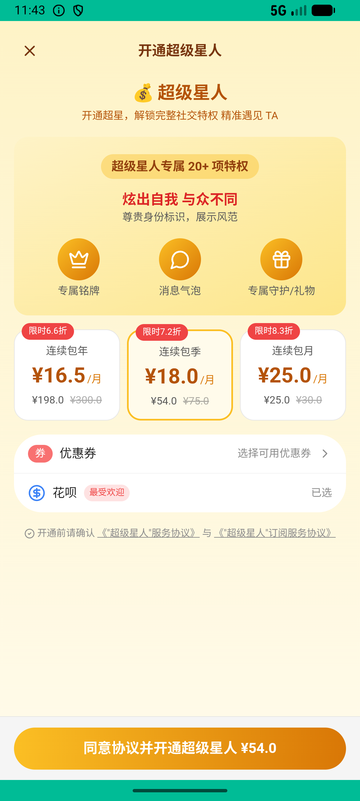
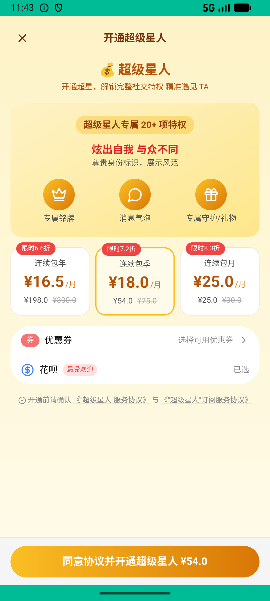

# journeys_v032_super_star_checkin_follow_engage_dm_galaxy  ❌

- **Brand**: `xingqiushejiaowang`
- **Class**: `XingqiushejiaowangJourneysV032SuperStarCheckinFollowEngageDmGalaxyTask`
- **Pass@3**: **0/3**  (score = 0.00)
- **Elapsed**: 150s (~2.5 min)
- **Model**: `doubao-seed-2-0-lite-260428`
- **Raw log**: [./raw_logs/XingqiushejiaowangJourneysV032SuperStarCheckinFollowEngageDmGalaxyTask.log](./raw_logs/XingqiushejiaowangJourneysV032SuperStarCheckinFollowEngageDmGalaxyTask.log)
- **Generated**: 2026-06-27T20:52:16+08:00

## Task Goal

> 开通超级星人季度会员 → 每日签到 → 关注银河方程并访问她主页 → 点赞并评论她的帖子 → 私聊提到「摄影」

## System Prompt

<details>
<summary>展开查看完整 System Prompt</summary>


> You are provided with a task description, a history of previous actions, and corresponding screenshots. Your goal is to perform the next action to complete the task. Please note that if performing the same action multiple times results in a static screen with no changes, you should attempt a modified or alternative action.
> 
> ---
> 
> ## Function Definition
> 
> - `clarify` — Ask the user for more information to complete the task.
> - `click` — Mouse left single click action.
> - `double_click` — Mouse left double click action.
> - `drag` — Perform a drag action from the start point to the end point. Typically used for swiping or selecting elements.
> - `long_press` — Perform a long press action at the specified coordinates.
> - `open_app` — Open the specified application.
> - `press_back` — Press the back button.
> - `press_enter` — Press the enter key.
> - `press_home` — Press the home button.
> - `take_notes` — Take notes and report the result in the specified content.
> - `type` — Type the specified content. You should manually delete any text from the input box that you want to remove.
> - `wait` — Wait for a certain period of time.

</details>

## User Query

> 请在 com.xingqiushejiaowang 里面完成以下任务：
> 开通超级星人季度会员 → 每日签到 → 关注银河方程并访问她主页 → 点赞并评论她的帖子 → 私聊提到「摄影」

## Attempts

| # | Outcome | Steps | Terminated | Reason | Start → End |
|---|---------|-------|------------|--------|-------------|
| 1 | ❌ failed | 6 | answer | 超级星人季度会员已激活: 未找到超级星人会员记录; 今日签到记录存在: 未找到今日签到记录 Diff: @@ -1 +1 @@ -true +false ; 关注了银河方程并访问了她的主页: 关注=false，访问主页=false，两者都需完成 Diff: @@ -1 +1... | 2026-06-27 19:57:01 → 2026-06-27 19:57:52 |
| 2 | ❌ failed | 6 | answer | 超级星人季度会员已激活: 未找到超级星人会员记录; 今日签到记录存在: 未找到今日签到记录 Diff: @@ -1 +1 @@ -true +false ; 关注了银河方程并访问了她的主页: 关注=false，访问主页=false，两者都需完成 Diff: @@ -1 +1... | 2026-06-27 19:57:52 → 2026-06-27 19:58:42 |
| 3 | ❌ failed | 6 | answer | 超级星人季度会员已激活: 未找到超级星人会员记录; 今日签到记录存在: 未找到今日签到记录 Diff: @@ -1 +1 @@ -true +false ; 关注了银河方程并访问了她的主页: 关注=false，访问主页=false，两者都需完成 Diff: @@ -1 +1... | 2026-06-27 19:58:42 → 2026-06-27 19:59:31 |

## Failure Details

### Episode 1 — ❌ failed

- steps_used: `6`
- terminated_reason: `answer`
- reason:

  ```
  超级星人季度会员已激活: 未找到超级星人会员记录; 今日签到记录存在: 未找到今日签到记录
  Diff:
  @@ -1 +1 @@
  -true
  +false
  ; 关注了银河方程并访问了她的主页: 关注=false，访问主页=false，两者都需完成
  Diff:
  @@ -1 +1 @@
  -true
  +false
  ; 点赞并评论了银河方程的帖子: 点赞=false，评论=false，两者都需完成
  Diff:
  @@ -1 +1 @@
  -true
  +false
  ; 私聊银河方程发了含「摄影」的消息: 未找到与银河方程的私聊会话
  ```
- death shot: 
  - state: [`./death_shots/XingqiushejiaowangJourneysV032SuperStarCheckinFollowEngageDmGalaxyTask/episode_001/step_006.json`](./death_shots/XingqiushejiaowangJourneysV032SuperStarCheckinFollowEngageDmGalaxyTask/episode_001/step_006.json)
  - digest: [`episode_digest.md`](./death_shots/XingqiushejiaowangJourneysV032SuperStarCheckinFollowEngageDmGalaxyTask/episode_001/episode_digest.md)

### Episode 2 — ❌ failed

- steps_used: `6`
- terminated_reason: `answer`
- reason:

  ```
  超级星人季度会员已激活: 未找到超级星人会员记录; 今日签到记录存在: 未找到今日签到记录
  Diff:
  @@ -1 +1 @@
  -true
  +false
  ; 关注了银河方程并访问了她的主页: 关注=false，访问主页=false，两者都需完成
  Diff:
  @@ -1 +1 @@
  -true
  +false
  ; 点赞并评论了银河方程的帖子: 点赞=false，评论=false，两者都需完成
  Diff:
  @@ -1 +1 @@
  -true
  +false
  ; 私聊银河方程发了含「摄影」的消息: 未找到与银河方程的私聊会话
  ```
- death shot: 
  - state: [`./death_shots/XingqiushejiaowangJourneysV032SuperStarCheckinFollowEngageDmGalaxyTask/episode_002/step_006.json`](./death_shots/XingqiushejiaowangJourneysV032SuperStarCheckinFollowEngageDmGalaxyTask/episode_002/step_006.json)
  - digest: [`episode_digest.md`](./death_shots/XingqiushejiaowangJourneysV032SuperStarCheckinFollowEngageDmGalaxyTask/episode_002/episode_digest.md)

### Episode 3 — ❌ failed

- steps_used: `6`
- terminated_reason: `answer`
- reason:

  ```
  超级星人季度会员已激活: 未找到超级星人会员记录; 今日签到记录存在: 未找到今日签到记录
  Diff:
  @@ -1 +1 @@
  -true
  +false
  ; 关注了银河方程并访问了她的主页: 关注=false，访问主页=false，两者都需完成
  Diff:
  @@ -1 +1 @@
  -true
  +false
  ; 点赞并评论了银河方程的帖子: 点赞=false，评论=false，两者都需完成
  Diff:
  @@ -1 +1 @@
  -true
  +false
  ; 私聊银河方程发了含「摄影」的消息: 未找到与银河方程的私聊会话
  ```
- death shot: 
  - state: [`./death_shots/XingqiushejiaowangJourneysV032SuperStarCheckinFollowEngageDmGalaxyTask/episode_003/step_006.json`](./death_shots/XingqiushejiaowangJourneysV032SuperStarCheckinFollowEngageDmGalaxyTask/episode_003/step_006.json)
  - digest: [`episode_digest.md`](./death_shots/XingqiushejiaowangJourneysV032SuperStarCheckinFollowEngageDmGalaxyTask/episode_003/episode_digest.md)

---

> 本摘要由 `sengclaw/scripts/pipeline/log_summarizer.py` 自动生成。 原始完整 log 见上方 Raw log 链接（含每 step 的 messages / tool_call / screenshot 引用）。
