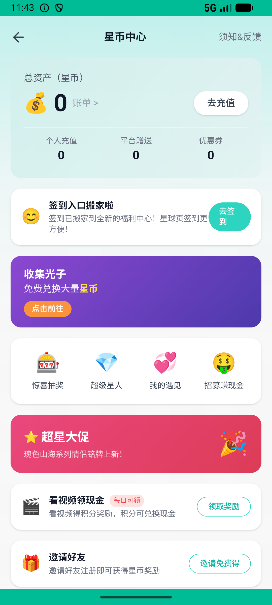

# journeys_v033_checkin_qr_download_dm_yuzi  ⚠️

- **Brand**: `xingqiushejiaowang`
- **Class**: `XingqiushejiaowangJourneysV033CheckinQrDownloadDmYuziTask`
- **Pass@3**: **2/3**  (score = 1.00)
- **Elapsed**: 384s (~6.4 min)
- **Model**: `doubao-seed-2-0-lite-260428`
- **Raw log**: [./raw_logs/XingqiushejiaowangJourneysV033CheckinQrDownloadDmYuziTask.log](./raw_logs/XingqiushejiaowangJourneysV033CheckinQrDownloadDmYuziTask.log)
- **Generated**: 2026-06-28T21:36:21+08:00

## Task Goal

> 每日签到拿星币 → 下载个人二维码名片 → 私聊柚子汽水发含「扫我」的消息

## System Prompt

<details>
<summary>展开查看完整 System Prompt</summary>


> You are provided with a task description, a history of previous actions, and corresponding screenshots. Your goal is to perform the next action to complete the task. Please note that if performing the same action multiple times results in a static screen with no changes, you should attempt a modified or alternative action.
> 
> ---
> 
> ## Function Definition
> 
> - `clarify` — Ask the user for more information to complete the task.
> - `click` — Mouse left single click action.
> - `double_click` — Mouse left double click action.
> - `drag` — Perform a drag action from the start point to the end point. Typically used for swiping or selecting elements.
> - `long_press` — Perform a long press action at the specified coordinates.
> - `open_app` — Open the specified application.
> - `press_back` — Press the back button.
> - `press_enter` — Press the enter key.
> - `press_home` — Press the home button.
> - `take_notes` — Take notes and report the result in the specified content.
> - `type` — Type the specified content. You should manually delete any text from the input box that you want to remove.
> - `wait` — Wait for a certain period of time.

</details>

## User Query

> 请在 com.xingqiushejiaowang 里面完成以下任务：
> 每日签到拿星币 → 下载个人二维码名片 → 私聊柚子汽水发含「扫我」的消息

## Attempts

| # | Outcome | Steps | Terminated | Reason | Start → End |
|---|---------|-------|------------|--------|-------------|
| 1 | ✅ passed | 18 | answer | – | 2026-06-28 19:10:58 → 2026-06-28 19:13:52 |
| 2 | ✅ passed | 20 | answer | – | 2026-06-28 19:13:52 → 2026-06-28 19:16:49 |
| 3 | ❌ failed | 4 | answer | 今日签到记录存在: 未找到今日签到记录 Diff: @@ -1 +1 @@ -true +false ; 已下载二维码名片: 未找到二维码下载记录，请确认点击了「下载」按钮 Diff: @@ -1 +1 @@ -true +false ; 私聊柚子汽水发了含「扫我」的消息:... | 2026-06-28 19:16:49 → 2026-06-28 19:17:22 |

## Failure Details

### Episode 3 — ❌ failed

- steps_used: `4`
- terminated_reason: `answer`
- reason:

  ```
  今日签到记录存在: 未找到今日签到记录
  Diff:
  @@ -1 +1 @@
  -true
  +false
  ; 已下载二维码名片: 未找到二维码下载记录，请确认点击了「下载」按钮
  Diff:
  @@ -1 +1 @@
  -true
  +false
  ; 私聊柚子汽水发了含「扫我」的消息: 未找到与柚子汽水的私聊会话
  ```
- death shot: 
  - state: [`./death_shots/XingqiushejiaowangJourneysV033CheckinQrDownloadDmYuziTask/episode_003/step_004.json`](./death_shots/XingqiushejiaowangJourneysV033CheckinQrDownloadDmYuziTask/episode_003/step_004.json)
  - digest: [`episode_digest.md`](./death_shots/XingqiushejiaowangJourneysV033CheckinQrDownloadDmYuziTask/episode_003/episode_digest.md)

---

> 本摘要由 `sengclaw/scripts/pipeline/log_summarizer.py` 自动生成。 原始完整 log 见上方 Raw log 链接（含每 step 的 messages / tool_call / screenshot 引用）。
