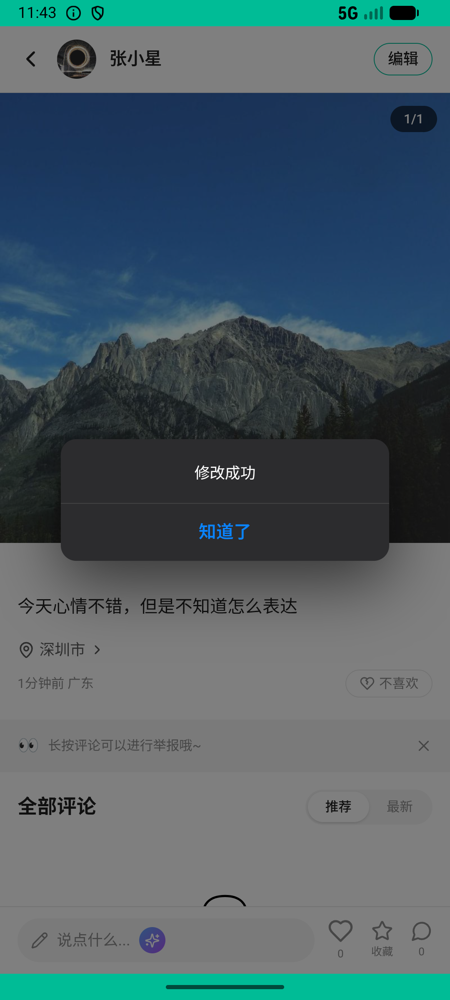
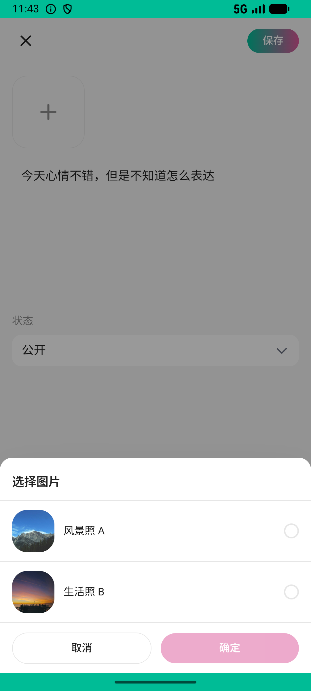

# post_v005_edit_post_add_image  ⚠️

- **Brand**: `xingqiushejiaowang`
- **Class**: `XingqiushejiaowangPostV005EditPostAddImageTask`
- **Pass@3**: **1/3**  (score = 1.00)
- **Elapsed**: 263s (~4.4 min)
- **Model**: `doubao-seed-2-0-lite-260428`
- **Raw log**: [./raw_logs/XingqiushejiaowangPostV005EditPostAddImageTask.log](./raw_logs/XingqiushejiaowangPostV005EditPostAddImageTask.log)
- **Generated**: 2026-06-30T00:36:56+08:00

## Task Goal

> 刚发的帖子有点单调，编辑一下再补张图

## System Prompt

<details>
<summary>展开查看完整 System Prompt</summary>


> You are provided with a task description, a history of previous actions, and corresponding screenshots. Your goal is to perform the next action to complete the task. Please note that if performing the same action multiple times results in a static screen with no changes, you should attempt a modified or alternative action.
> 
> ---
> 
> ## Function Definition
> 
> - `clarify` — Ask the user for more information to complete the task.
> - `click` — Mouse left single click action.
> - `double_click` — Mouse left double click action.
> - `drag` — Perform a drag action from the start point to the end point. Typically used for swiping or selecting elements.
> - `long_press` — Perform a long press action at the specified coordinates.
> - `open_app` — Open the specified application.
> - `press_back` — Press the back button.
> - `press_enter` — Press the enter key.
> - `press_home` — Press the home button.
> - `take_notes` — Take notes and report the result in the specified content.
> - `type` — Type the specified content. You should manually delete any text from the input box that you want to remove.
> - `wait` — Wait for a certain period of time.

</details>

## User Query

> 请在 com.xingqiushejiaowang 里面完成以下任务：
> 刚发的帖子有点单调，编辑一下再补张图

## Attempts

| # | Outcome | Steps | Terminated | Reason | Start → End |
|---|---------|-------|------------|--------|-------------|
| 1 | ❌ failed | 10 | answer | 验证执行出错: Couldn't find Post with 'id'=117 [WHERE "posts"."data_version" IN ($1, $2)]; /usr/local/bundle/ruby/3.3.0/gems/activerecord-7.2.2... | 2026-06-29 23:51:51 → 2026-06-29 23:53:18 |
| 2 | ❌ failed | 6 | answer | 帖子内容与原始不同: 帖子内容未被修改，仍是原始文本; 帖子添加了图片: 帖子未附加图片（当前 0 张） | 2026-06-29 23:53:18 → 2026-06-29 23:54:03 |
| 3 | ✅ passed | 16 | answer | – | 2026-06-29 23:54:03 → 2026-06-29 23:56:14 |

## Failure Details

### Episode 1 — ❌ failed

- steps_used: `10`
- terminated_reason: `answer`
- reason:

  ```
  验证执行出错: Couldn't find Post with 'id'=117 [WHERE "posts"."data_version" IN ($1, $2)]; /usr/local/bundle/ruby/3.3.0/gems/activerecord-7.2.2.2/lib/active_record/relation/finder_methods.rb:429:in `raise_record_not_found_exception!'
  /usr/local/bundle/ruby/3.3.0/gems/activerecord-7.2.2.2/lib/active_record/relation/finder_methods.rb:537:in `find_one'
  /usr/local/bundle/ruby/3.3.0/gems/activerecord-7.2.2.2/lib/active_record/relation/finder_methods.rb:514:in `find_with_ids'
  /usr/local/bundle/ruby/3.3.0/gems/activerecord-7.2.2.2/lib/active_record/relation/finder_methods.rb:100:in `find'
  /usr/local/bundle/ruby/3.3.0/gems/activerecord-7.2.2.2/lib/active_record/querying.rb:24:in `find'
  ```
- death shot: 
  - state: [`./death_shots/XingqiushejiaowangPostV005EditPostAddImageTask/episode_001/step_010.json`](./death_shots/XingqiushejiaowangPostV005EditPostAddImageTask/episode_001/step_010.json)
  - digest: [`episode_digest.md`](./death_shots/XingqiushejiaowangPostV005EditPostAddImageTask/episode_001/episode_digest.md)

### Episode 2 — ❌ failed

- steps_used: `6`
- terminated_reason: `answer`
- reason:

  ```
  帖子内容与原始不同: 帖子内容未被修改，仍是原始文本; 帖子添加了图片: 帖子未附加图片（当前 0 张）
  ```
- death shot: 
  - state: [`./death_shots/XingqiushejiaowangPostV005EditPostAddImageTask/episode_002/step_006.json`](./death_shots/XingqiushejiaowangPostV005EditPostAddImageTask/episode_002/step_006.json)
  - digest: [`episode_digest.md`](./death_shots/XingqiushejiaowangPostV005EditPostAddImageTask/episode_002/episode_digest.md)

---

> 本摘要由 `sengclaw/scripts/pipeline/log_summarizer.py` 自动生成。 原始完整 log 见上方 Raw log 链接（含每 step 的 messages / tool_call / screenshot 引用）。
