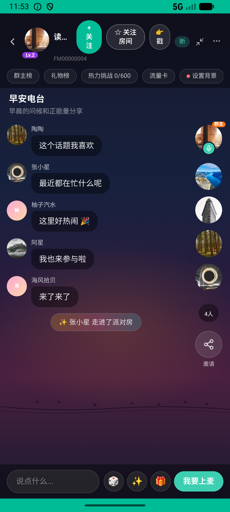
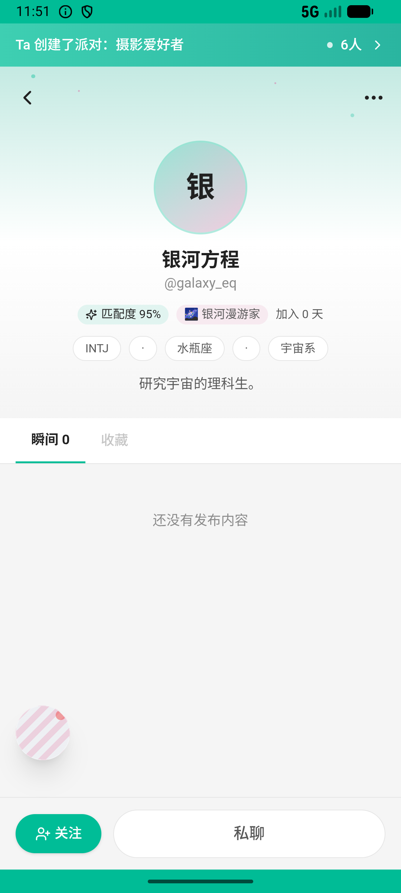

# journeys_v016_lottery_reward_then_soul_match_gift  ⚠️

- **Brand**: `xingqiushejiaowang`
- **Class**: `XingqiushejiaowangJourneysV016LotteryRewardThenSoulMatchGiftTask`
- **Pass@3**: **1/3**  (score = 1.00)
- **Elapsed**: 1742s (~29.0 min)
- **Model**: `doubao-seed-2-0-lite-260428`
- **Raw log**: [./raw_logs/XingqiushejiaowangJourneysV016LotteryRewardThenSoulMatchGiftTask.log](./raw_logs/XingqiushejiaowangJourneysV016LotteryRewardThenSoulMatchGiftTask.log)
- **Generated**: 2026-07-01T02:02:20+08:00

## Task Goal

> 深夜聊天室新手抽奖 → 灵魂匹配聊一句 → 给匹配对象送礼物

## System Prompt

<details>
<summary>展开查看完整 System Prompt</summary>


> You are provided with a task description, a history of previous actions, and corresponding screenshots. Your goal is to perform the next action to complete the task. Please note that if performing the same action multiple times results in a static screen with no changes, you should attempt a modified or alternative action.
> 
> ---
> 
> ## Function Definition
> 
> - `clarify` — Ask the user for more information to complete the task.
> - `click` — Mouse left single click action.
> - `double_click` — Mouse left double click action.
> - `drag` — Perform a drag action from the start point to the end point. Typically used for swiping or selecting elements.
> - `long_press` — Perform a long press action at the specified coordinates.
> - `open_app` — Open the specified application.
> - `press_back` — Press the back button.
> - `press_enter` — Press the enter key.
> - `press_home` — Press the home button.
> - `take_notes` — Take notes and report the result in the specified content.
> - `type` — Type the specified content. You should manually delete any text from the input box that you want to remove.
> - `wait` — Wait for a certain period of time.

</details>

## User Query

> 请在 com.xingqiushejiaowang 里面完成以下任务：
> 深夜聊天室新手抽奖 → 灵魂匹配聊一句 → 给匹配对象送礼物

## Attempts

| # | Outcome | Steps | Terminated | Reason | Start → End |
|---|---------|-------|------------|--------|-------------|
| 1 | ❌ failed | 57 | answer | 在派对里玩了新手抽奖: 未找到新手抽奖记录; 给匹配到的人送了礼物: 未找到送给 user 24 的礼物 Diff: @@ -1 +1 @@ -true +false | 2026-06-30 22:56:51 → 2026-06-30 23:07:55 |
| 2 | ✅ passed | 57 | answer | – | 2026-06-30 23:07:55 → 2026-06-30 23:16:51 |
| 3 | ❌ failed | 59 | answer | 在派对里玩了新手抽奖: 未找到新手抽奖记录; 发起了灵魂匹配并成功: 未找到灵魂匹配记录 | 2026-06-30 23:16:51 → 2026-06-30 23:25:53 |

## Failure Details

### Episode 1 — ❌ failed

- steps_used: `57`
- terminated_reason: `answer`
- reason:

  ```
  在派对里玩了新手抽奖: 未找到新手抽奖记录; 给匹配到的人送了礼物: 未找到送给 user 24 的礼物
  Diff:
  @@ -1 +1 @@
  -true
  +false
  ```
- death shot: 
  - state: [`./death_shots/XingqiushejiaowangJourneysV016LotteryRewardThenSoulMatchGiftTask/episode_001/step_057.json`](./death_shots/XingqiushejiaowangJourneysV016LotteryRewardThenSoulMatchGiftTask/episode_001/step_057.json)
  - digest: [`episode_digest.md`](./death_shots/XingqiushejiaowangJourneysV016LotteryRewardThenSoulMatchGiftTask/episode_001/episode_digest.md)

### Episode 3 — ❌ failed

- steps_used: `59`
- terminated_reason: `answer`
- reason:

  ```
  在派对里玩了新手抽奖: 未找到新手抽奖记录; 发起了灵魂匹配并成功: 未找到灵魂匹配记录
  ```
- death shot: 
  - state: [`./death_shots/XingqiushejiaowangJourneysV016LotteryRewardThenSoulMatchGiftTask/episode_003/step_059.json`](./death_shots/XingqiushejiaowangJourneysV016LotteryRewardThenSoulMatchGiftTask/episode_003/step_059.json)
  - digest: [`episode_digest.md`](./death_shots/XingqiushejiaowangJourneysV016LotteryRewardThenSoulMatchGiftTask/episode_003/episode_digest.md)

---

> 本摘要由 `sengclaw/scripts/pipeline/log_summarizer.py` 自动生成。 原始完整 log 见上方 Raw log 链接（含每 step 的 messages / tool_call / screenshot 引用）。
