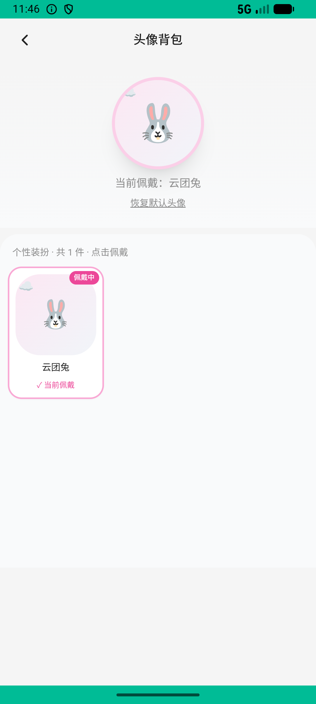
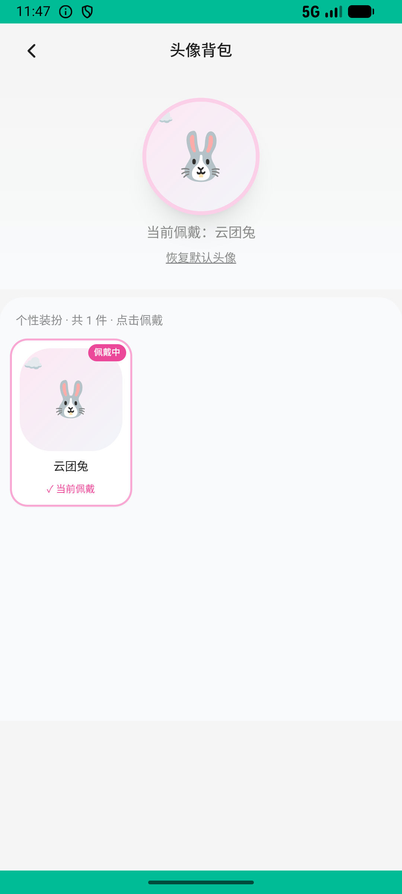
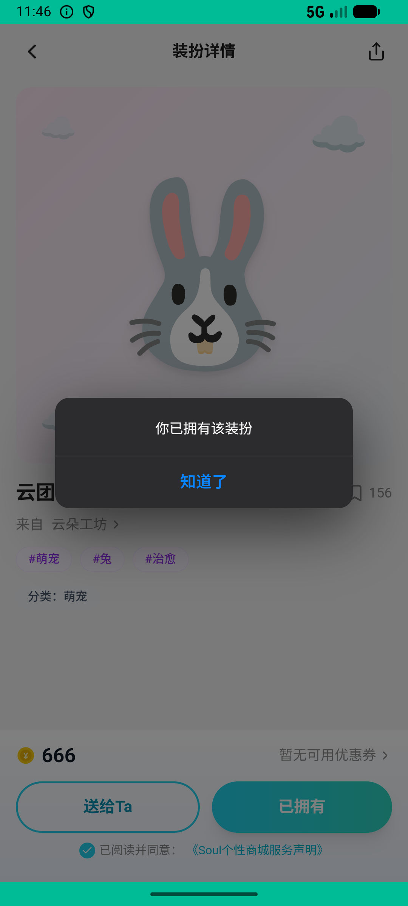

# onboarding_v008_new_avatar_after_onboard  ❌

- **Brand**: `xingqiushejiaowang`
- **Class**: `XingqiushejiaowangOnboardingV008NewAvatarAfterOnboardTask`
- **Pass@3**: **0/3**  (score = 0.00)
- **Elapsed**: 807s (~13.4 min)
- **Model**: `doubao-seed-2-0-lite-260428`
- **Raw log**: [./raw_logs/XingqiushejiaowangOnboardingV008NewAvatarAfterOnboardTask.log](./raw_logs/XingqiushejiaowangOnboardingV008NewAvatarAfterOnboardTask.log)
- **Generated**: 2026-07-01T13:43:10+08:00

## Task Goal

> 去装扮中心买个新头像，买完回到头像背包把新头像戴上。注意：买和戴是两步独立操作，必须先去商店完成购买，再到背包里点佩戴才算完成，不允许只买不戴，无需向我确认

## System Prompt

<details>
<summary>展开查看完整 System Prompt</summary>


> You are provided with a task description, a history of previous actions, and corresponding screenshots. Your goal is to perform the next action to complete the task. Please note that if performing the same action multiple times results in a static screen with no changes, you should attempt a modified or alternative action.
> 
> ---
> 
> ## Function Definition
> 
> - `clarify` — Ask the user for more information to complete the task.
> - `click` — Mouse left single click action.
> - `double_click` — Mouse left double click action.
> - `drag` — Perform a drag action from the start point to the end point. Typically used for swiping or selecting elements.
> - `long_press` — Perform a long press action at the specified coordinates.
> - `open_app` — Open the specified application.
> - `press_back` — Press the back button.
> - `press_enter` — Press the enter key.
> - `press_home` — Press the home button.
> - `take_notes` — Take notes and report the result in the specified content.
> - `type` — Type the specified content. You should manually delete any text from the input box that you want to remove.
> - `wait` — Wait for a certain period of time.

</details>

## User Query

> 请在 com.xingqiushejiaowang 里面完成以下任务：
> 去装扮中心买个新头像，买完回到头像背包把新头像戴上。注意：买和戴是两步独立操作，必须先去商店完成购买，再到背包里点佩戴才算完成，不允许只买不戴，无需向我确认

## Attempts

| # | Outcome | Steps | Terminated | Reason | Start → End |
|---|---------|-------|------------|--------|-------------|
| 1 | ❌ failed | 25 | answer | 购买了一个头像装扮: 未找到头像购买记录; 星币正确扣减: 没有购买记录，无法判断扣费 | 2026-07-01 13:29:43 → 2026-07-01 13:33:53 |
| 2 | ❌ failed | 21 | answer | 购买了一个头像装扮: 未找到头像购买记录; 星币正确扣减: 没有购买记录，无法判断扣费 | 2026-07-01 13:33:53 → 2026-07-01 13:39:02 |
| 3 | ❌ failed | 20 | answer | 购买了一个头像装扮: 未找到头像购买记录; 星币正确扣减: 没有购买记录，无法判断扣费 | 2026-07-01 13:39:02 → 2026-07-01 13:43:09 |

## Failure Details

### Episode 1 — ❌ failed

- steps_used: `25`
- terminated_reason: `answer`
- reason:

  ```
  购买了一个头像装扮: 未找到头像购买记录; 星币正确扣减: 没有购买记录，无法判断扣费
  ```
- death shot: 
  - state: [`./death_shots/XingqiushejiaowangOnboardingV008NewAvatarAfterOnboardTask/episode_001/step_025.json`](./death_shots/XingqiushejiaowangOnboardingV008NewAvatarAfterOnboardTask/episode_001/step_025.json)
  - digest: [`episode_digest.md`](./death_shots/XingqiushejiaowangOnboardingV008NewAvatarAfterOnboardTask/episode_001/episode_digest.md)

### Episode 2 — ❌ failed

- steps_used: `21`
- terminated_reason: `answer`
- reason:

  ```
  购买了一个头像装扮: 未找到头像购买记录; 星币正确扣减: 没有购买记录，无法判断扣费
  ```
- death shot: 
  - state: [`./death_shots/XingqiushejiaowangOnboardingV008NewAvatarAfterOnboardTask/episode_002/step_021.json`](./death_shots/XingqiushejiaowangOnboardingV008NewAvatarAfterOnboardTask/episode_002/step_021.json)
  - digest: [`episode_digest.md`](./death_shots/XingqiushejiaowangOnboardingV008NewAvatarAfterOnboardTask/episode_002/episode_digest.md)

### Episode 3 — ❌ failed

- steps_used: `20`
- terminated_reason: `answer`
- reason:

  ```
  购买了一个头像装扮: 未找到头像购买记录; 星币正确扣减: 没有购买记录，无法判断扣费
  ```
- death shot: 
  - state: [`./death_shots/XingqiushejiaowangOnboardingV008NewAvatarAfterOnboardTask/episode_003/step_020.json`](./death_shots/XingqiushejiaowangOnboardingV008NewAvatarAfterOnboardTask/episode_003/step_020.json)
  - digest: [`episode_digest.md`](./death_shots/XingqiushejiaowangOnboardingV008NewAvatarAfterOnboardTask/episode_003/episode_digest.md)

---

> 本摘要由 `sengclaw/scripts/pipeline/log_summarizer.py` 自动生成。 原始完整 log 见上方 Raw log 链接（含每 step 的 messages / tool_call / screenshot 引用）。
