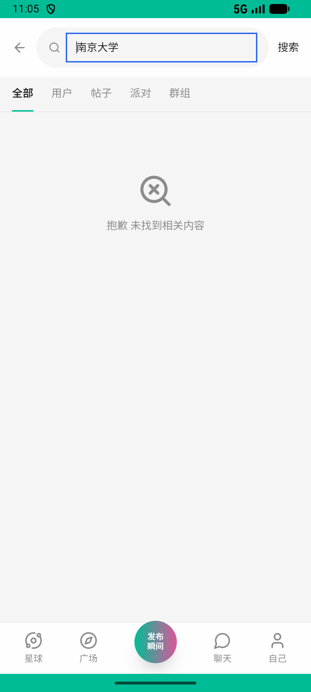
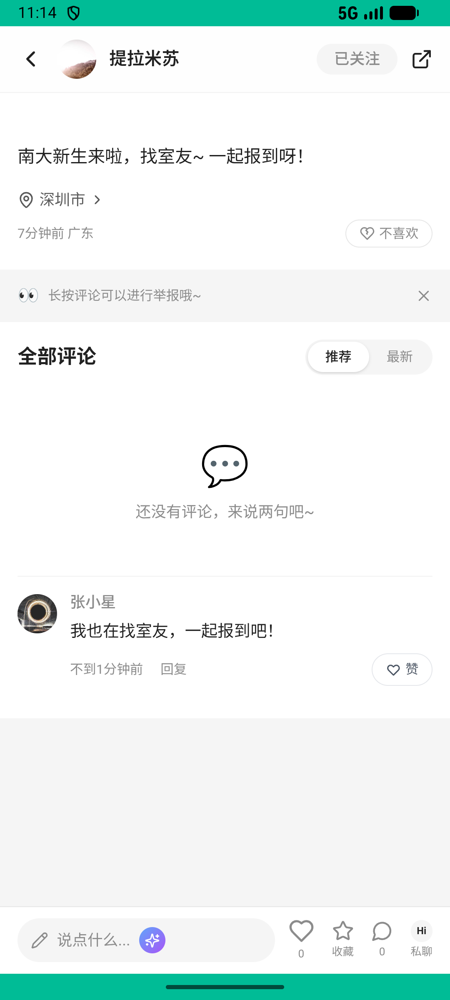

# campus_v003_join_and_comment  ❌

- **Brand**: `xingqiushejiaowang`
- **Class**: `XingqiushejiaowangCampusV003JoinAndCommentTask`
- **Pass@3**: **0/3**  (score = 0.00)
- **Elapsed**: 1139s (~19.0 min)
- **Model**: `doubao-seed-2-0-lite-260428`
- **Raw log**: [./raw_logs/XingqiushejiaowangCampusV003JoinAndCommentTask.log](./raw_logs/XingqiushejiaowangCampusV003JoinAndCommentTask.log)
- **Generated**: 2026-07-14T15:44:34+08:00
- **Note**: backfilled from /tmp/pass_at_3_full_<ts>/ on 2026-05-02

## Task Goal

> 帮我加入「南京大学」校园吧，并给那条「找室友」帖评论一句

## System Prompt

<details>
<summary>展开查看完整 System Prompt</summary>


> You are provided with a task description, a history of previous actions, and corresponding screenshots. Your goal is to perform the next action to complete the task. Please note that if performing the same action multiple times results in a static screen with no changes, you should attempt a modified or alternative action.
> 
> ---
> 
> ## Function Definition
> 
> - `clarify` — Ask the user for more information to complete the task.
> - `click` — Mouse left single click action.
> - `double_click` — Mouse left double click action.
> - `drag` — Perform a drag action from the start point to the end point. Typically used for swiping or selecting elements.
> - `long_press` — Perform a long press action at the specified coordinates.
> - `open_app` — Open the specified application.
> - `press_back` — Press the back button.
> - `press_enter` — Press the enter key.
> - `press_home` — Press the home button.
> - `take_notes` — Take notes and report the result in the specified content.
> - `type` — Type the specified content. You should manually delete any text from the input box that you want to remove.
> - `wait` — Wait for a certain period of time.

</details>

## User Query

> 请在 com.xingqiushejiaowang 里面完成以下任务：
> 帮我加入「南京大学」校园吧，并给那条「找室友」帖评论一句

## Attempts

| # | Outcome | Steps | Terminated | Reason | Start → End |
|---|---------|-------|------------|--------|-------------|
| 1 | ❌ failed | 47 | answer | 已加入「南京大学」校园: 没找到 CampusMembership 记录; 在该帖下发了一条带「室友」的评论: 没找到 xiaoxing 的评论 | 2026-07-14 10:56:50 → 2026-07-14 11:05:17 |
| 2 | ❌ failed | 52 | answer | 已加入「南京大学」校园: 没找到 CampusMembership 记录 | 2026-07-14 11:05:17 → 2026-07-14 11:14:10 |
| 3 | 💥 error | 0 | exception | exception: 500 Internal Server Error for url: http://localhost:6800/task/init \\| detail: init_task('XingqiushejiaowangCampusV003JoinAndC... | 2026-07-14 11:14:10 → 2026-07-14 11:15:48 |

## Failure Details

### Episode 1 — ❌ failed

- steps_used: `47`
- terminated_reason: `answer`
- reason:

  ```
  已加入「南京大学」校园: 没找到 CampusMembership 记录; 在该帖下发了一条带「室友」的评论: 没找到 xiaoxing 的评论
  ```
- death shot: 
  - state: [`./death_shots/XingqiushejiaowangCampusV003JoinAndCommentTask/episode_001/step_047.json`](./death_shots/XingqiushejiaowangCampusV003JoinAndCommentTask/episode_001/step_047.json)
  - digest: [`episode_digest.md`](./death_shots/XingqiushejiaowangCampusV003JoinAndCommentTask/episode_001/episode_digest.md)

### Episode 2 — ❌ failed

- steps_used: `52`
- terminated_reason: `answer`
- reason:

  ```
  已加入「南京大学」校园: 没找到 CampusMembership 记录
  ```
- death shot: 
  - state: [`./death_shots/XingqiushejiaowangCampusV003JoinAndCommentTask/episode_002/step_052.json`](./death_shots/XingqiushejiaowangCampusV003JoinAndCommentTask/episode_002/step_052.json)
  - digest: [`episode_digest.md`](./death_shots/XingqiushejiaowangCampusV003JoinAndCommentTask/episode_002/episode_digest.md)

### Episode 3 — 💥 error

- steps_used: `0`
- terminated_reason: `exception`
- reason:

  ```
  exception: 500 Internal Server Error for url: http://localhost:6800/task/init | detail: init_task('XingqiushejiaowangCampusV003JoinAndCommentTask') failed: Task 'XingqiushejiaowangCampusV003JoinAndCommentTask' failed during initialize_task()
  ```

---

> 本摘要由 `sengclaw/scripts/pipeline/log_summarizer.py` 自动生成。 原始完整 log 见上方 Raw log 链接（含每 step 的 messages / tool_call / screenshot 引用）。
