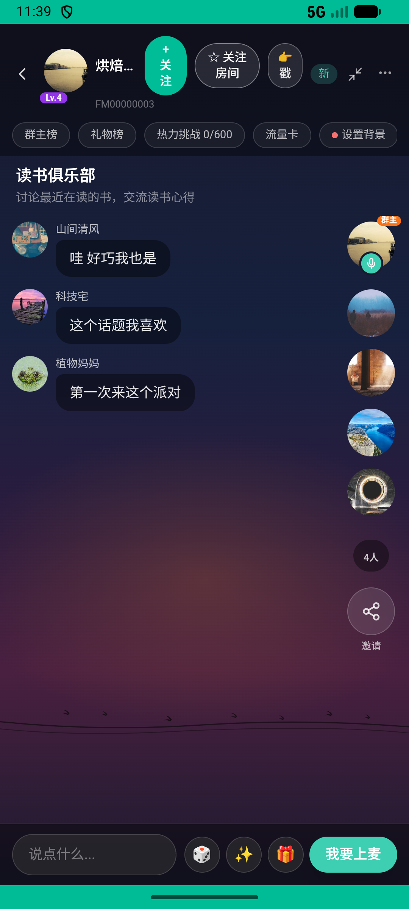

# party_v021_gift_back_in_party  ❌

- **Brand**: `xingqiushejiaowang`
- **Class**: `XingqiushejiaowangPartyV021GiftBackInPartyTask`
- **Pass@3**: **0/3**  (score = 0.00)
- **Elapsed**: 500s (~8.3 min)
- **Model**: `doubao-seed-2-0-lite-260428`
- **Raw log**: [./raw_logs/XingqiushejiaowangPartyV021GiftBackInPartyTask.log](./raw_logs/XingqiushejiaowangPartyV021GiftBackInPartyTask.log)
- **Generated**: 2026-07-15T02:44:22+08:00

## Task Goal

> 陶陶在读书俱乐部给我送了个甜甜圈，回她一个桃心可可（8 星币）表示感谢

## System Prompt

<details>
<summary>展开查看完整 System Prompt</summary>


> You are provided with a task description, a history of previous actions, and corresponding screenshots. Your goal is to perform the next action to complete the task. Please note that if performing the same action multiple times results in a static screen with no changes, you should attempt a modified or alternative action.
> 
> ---
> 
> ## Function Definition
> 
> - `clarify` — Ask the user for more information to complete the task.
> - `click` — Mouse left single click action.
> - `double_click` — Mouse left double click action.
> - `drag` — Perform a drag action from the start point to the end point. Typically used for swiping or selecting elements.
> - `long_press` — Perform a long press action at the specified coordinates.
> - `open_app` — Open the specified application.
> - `press_back` — Press the back button.
> - `press_enter` — Press the enter key.
> - `press_home` — Press the home button.
> - `take_notes` — Take notes and report the result in the specified content.
> - `type` — Type the specified content. You should manually delete any text from the input box that you want to remove.
> - `wait` — Wait for a certain period of time.

</details>

## User Query

> 请在 com.xingqiushejiaowang 里面完成以下任务：
> 陶陶在读书俱乐部给我送了个甜甜圈，回她一个桃心可可（8 星币）表示感谢

## Attempts

| # | Outcome | Steps | Terminated | Reason | Start → End |
|---|---------|-------|------------|--------|-------------|
| 1 | ❌ failed | 24 | answer | 回送了桃心可可通过派对: 未找到回赠记录; 星币正确扣减: 星币余额应为 164，实际 10 | 2026-07-14 23:34:27 → 2026-07-14 23:39:33 |
| 2 | 💥 error | 0 | exception | exception: 500 Internal Server Error for url: http://localhost:6800/task/init \\| detail: init_task('XingqiushejiaowangPartyV021GiftBackI... | 2026-07-14 23:39:33 → 2026-07-14 23:41:10 |
| 3 | 💥 error | 0 | exception | exception: 500 Internal Server Error for url: http://localhost:6800/task/init \\| detail: init_task('XingqiushejiaowangPartyV021GiftBackI... | 2026-07-14 23:41:10 → 2026-07-14 23:42:47 |

## Failure Details

### Episode 1 — ❌ failed

- steps_used: `24`
- terminated_reason: `answer`
- reason:

  ```
  回送了桃心可可通过派对: 未找到回赠记录; 星币正确扣减: 星币余额应为 164，实际 10
  ```
- death shot: 
  - state: [`./screenshots/XingqiushejiaowangPartyV021GiftBackInPartyTask/episode_001/step_024.json`](./screenshots/XingqiushejiaowangPartyV021GiftBackInPartyTask/episode_001/step_024.json)
  - digest: [`episode_digest.md`](./digests/XingqiushejiaowangPartyV021GiftBackInPartyTask/episode_001/episode_digest.md)

### Episode 2 — 💥 error

- steps_used: `0`
- terminated_reason: `exception`
- reason:

  ```
  exception: 500 Internal Server Error for url: http://localhost:6800/task/init | detail: init_task('XingqiushejiaowangPartyV021GiftBackInPartyTask') failed: Task 'XingqiushejiaowangPartyV021GiftBackInPartyTask' failed during initialize_task()
  ```
  - digest: [`episode_digest.md`](./digests/XingqiushejiaowangPartyV021GiftBackInPartyTask/episode_002/episode_digest.md)

### Episode 3 — 💥 error

- steps_used: `0`
- terminated_reason: `exception`
- reason:

  ```
  exception: 500 Internal Server Error for url: http://localhost:6800/task/init | detail: init_task('XingqiushejiaowangPartyV021GiftBackInPartyTask') failed: Task 'XingqiushejiaowangPartyV021GiftBackInPartyTask' failed during initialize_task()
  ```
  - digest: [`episode_digest.md`](./digests/XingqiushejiaowangPartyV021GiftBackInPartyTask/episode_003/episode_digest.md)

---

> 本摘要由 `sengclaw/scripts/pipeline/log_summarizer.py` 自动生成。 原始完整 log 见上方 Raw log 链接（含每 step 的 messages / tool_call / screenshot 引用）。
