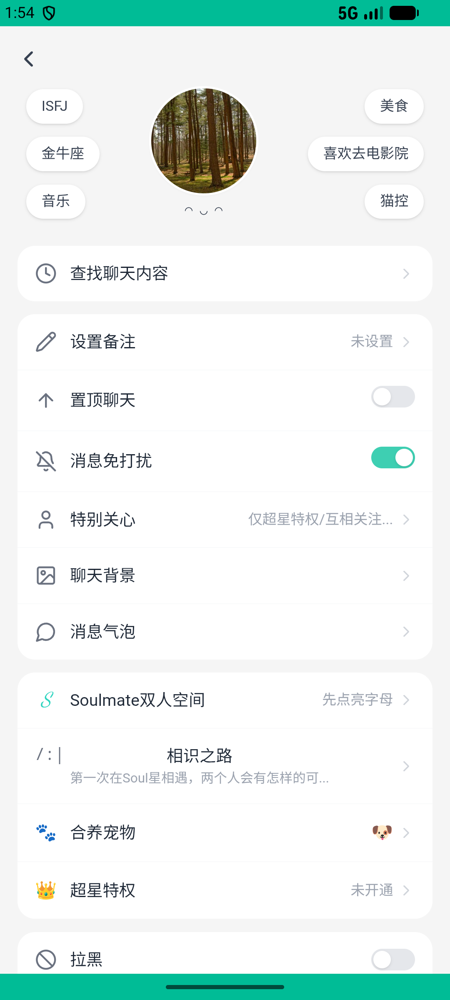

# journeys_v008_harassment_unfollow_mute_report_skeleton  ❌

- **Brand**: `xingqiushejiaowang`
- **Class**: `XingqiushejiaowangJourneysV008HarassmentUnfollowMuteReportSkeletonTask`
- **Pass@3**: **0/3**  (score = 0.00)
- **Elapsed**: 375s (~6.2 min)
- **Model**: `doubao-seed-2-0-lite-260428`
- **Raw log**: [./raw_logs/XingqiushejiaowangJourneysV008HarassmentUnfollowMuteReportSkeletonTask.log](./raw_logs/XingqiushejiaowangJourneysV008HarassmentUnfollowMuteReportSkeletonTask.log)
- **Generated**: 2026-07-15T18:18:24+08:00

## Task Goal

> 收到「陶陶」的骚扰消息后，去聊天设置里取消对 ta 的关注，再开启消息免打扰。注意：开启免打扰后会弹出「已开启消息免打扰」提示，点「知道了」关闭即为成功；如果弹出「功能开发中」说明点错了，关闭后重找「消息免打扰」那一行再点，无需向我确认

## System Prompt

<details>
<summary>展开查看完整 System Prompt</summary>


> You are provided with a task description, a history of previous actions, and corresponding screenshots. Your goal is to perform the next action to complete the task. Please note that if performing the same action multiple times results in a static screen with no changes, you should attempt a modified or alternative action.
> 
> ---
> 
> ## Function Definition
> 
> - `clarify` — Ask the user for more information to complete the task.
> - `click` — Mouse left single click action.
> - `double_click` — Mouse left double click action.
> - `drag` — Perform a drag action from the start point to the end point. Typically used for swiping or selecting elements.
> - `long_press` — Perform a long press action at the specified coordinates.
> - `open_app` — Open the specified application.
> - `press_back` — Press the back button.
> - `press_enter` — Press the enter key.
> - `press_home` — Press the home button.
> - `take_notes` — Take notes and report the result in the specified content.
> - `type` — Type the specified content. You should manually delete any text from the input box that you want to remove.
> - `wait` — Wait for a certain period of time.

</details>

## User Query

> 请在 com.xingqiushejiaowang 里面完成以下任务：
> 收到「陶陶」的骚扰消息后，去聊天设置里取消对 ta 的关注，再开启消息免打扰。注意：开启免打扰后会弹出「已开启消息免打扰」提示，点「知道了」关闭即为成功；如果弹出「功能开发中」说明点错了，关闭后重找「消息免打扰」那一行再点，无需向我确认

## Attempts

| # | Outcome | Steps | Terminated | Reason | Start → End |
|---|---------|-------|------------|--------|-------------|
| 1 | ❌ failed | 12 | answer | 取消了对 ta 的关注: Follow.active 应为 false（取消关注） Diff: @@ -1 +1 @@ -false +true | 2026-07-15 13:51:16 → 2026-07-15 13:54:18 |
| 2 | 💥 error | 0 | exception | exception: 500 Internal Server Error for url: http://localhost:6800/task/init \\| detail: init_task('XingqiushejiaowangJourneysV008Harass... | 2026-07-15 13:54:18 → 2026-07-15 13:55:55 |
| 3 | 💥 error | 0 | exception | exception: 500 Internal Server Error for url: http://localhost:6800/task/init \\| detail: init_task('XingqiushejiaowangJourneysV008Harass... | 2026-07-15 13:55:55 → 2026-07-15 13:57:31 |

## Failure Details

### Episode 1 — ❌ failed

- steps_used: `12`
- terminated_reason: `answer`
- reason:

  ```
  取消了对 ta 的关注: Follow.active 应为 false（取消关注）
  Diff:
  @@ -1 +1 @@
  -false
  +true
  ```
- death shot: 
  - state: [`./screenshots/XingqiushejiaowangJourneysV008HarassmentUnfollowMuteReportSkeletonTask/episode_001/step_012.json`](./screenshots/XingqiushejiaowangJourneysV008HarassmentUnfollowMuteReportSkeletonTask/episode_001/step_012.json)
  - digest: [`episode_digest.md`](./digests/XingqiushejiaowangJourneysV008HarassmentUnfollowMuteReportSkeletonTask/episode_001/episode_digest.md)

### Episode 2 — 💥 error

- steps_used: `0`
- terminated_reason: `exception`
- reason:

  ```
  exception: 500 Internal Server Error for url: http://localhost:6800/task/init | detail: init_task('XingqiushejiaowangJourneysV008HarassmentUnfollowMuteReportSkeletonTask') failed: Task 'XingqiushejiaowangJourneysV008HarassmentUnfollowMuteReportSkeletonTask' failed during initialize_task()
  ```
  - digest: [`episode_digest.md`](./digests/XingqiushejiaowangJourneysV008HarassmentUnfollowMuteReportSkeletonTask/episode_002/episode_digest.md)

### Episode 3 — 💥 error

- steps_used: `0`
- terminated_reason: `exception`
- reason:

  ```
  exception: 500 Internal Server Error for url: http://localhost:6800/task/init | detail: init_task('XingqiushejiaowangJourneysV008HarassmentUnfollowMuteReportSkeletonTask') failed: Task 'XingqiushejiaowangJourneysV008HarassmentUnfollowMuteReportSkeletonTask' failed during initialize_task()
  ```
  - digest: [`episode_digest.md`](./digests/XingqiushejiaowangJourneysV008HarassmentUnfollowMuteReportSkeletonTask/episode_003/episode_digest.md)

---

> 本摘要由 `sengclaw/scripts/pipeline/log_summarizer.py` 自动生成。 原始完整 log 见上方 Raw log 链接（含每 step 的 messages / tool_call / screenshot 引用）。
