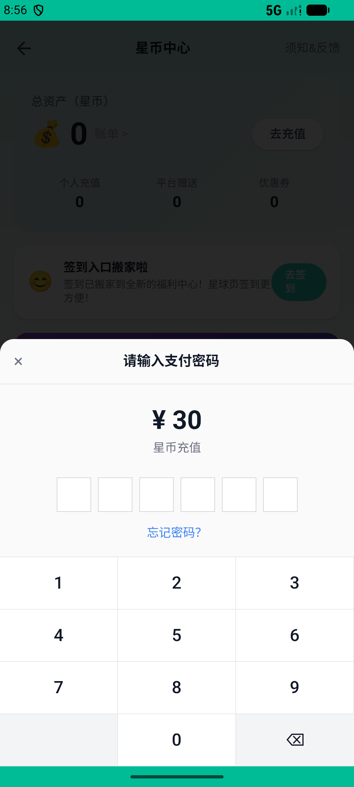

# journeys_v010_recharge_buy_card_match_gift_special_care  ❌

- **Brand**: `xingqiushejiaowang`
- **Class**: `XingqiushejiaowangJourneysV010RechargeBuyCardMatchGiftSpecialCareTask`
- **Pass@3**: **0/3**  (score = 0.00)
- **Elapsed**: 689s (~11.5 min)
- **Model**: `doubao-seed-2-0-lite-260428`
- **Raw log**: [./raw_logs/XingqiushejiaowangJourneysV010RechargeBuyCardMatchGiftSpecialCareTask.log](./raw_logs/XingqiushejiaowangJourneysV010RechargeBuyCardMatchGiftSpecialCareTask.log)
- **Generated**: 2026-07-17T05:43:45+08:00

## Task Goal

> 去星币中心充值300星币→回星球点签到→超值推荐→直接找MBTI卡点买1张→去灵魂匹配→送礼→关注，无需向我确认

## System Prompt

<details>
<summary>展开查看完整 System Prompt</summary>


> You are provided with a task description, a history of previous actions, and corresponding screenshots. Your goal is to perform the next action to complete the task. Please note that if performing the same action multiple times results in a static screen with no changes, you should attempt a modified or alternative action.
> 
> ---
> 
> ## Function Definition
> 
> - `clarify` — Ask the user for more information to complete the task.
> - `click` — Mouse left single click action.
> - `double_click` — Mouse left double click action.
> - `drag` — Perform a drag action from the start point to the end point. Typically used for swiping or selecting elements.
> - `long_press` — Perform a long press action at the specified coordinates.
> - `open_app` — Open the specified application.
> - `press_back` — Press the back button.
> - `press_enter` — Press the enter key.
> - `press_home` — Press the home button.
> - `take_notes` — Take notes and report the result in the specified content.
> - `type` — Type the specified content. You should manually delete any text from the input box that you want to remove.
> - `wait` — Wait for a certain period of time.

</details>

## User Query

> 请在 com.xingqiushejiaowang 里面完成以下任务：
> 去星币中心充值300星币→回星球点签到→超值推荐→直接找MBTI卡点买1张→去灵魂匹配→送礼→关注，无需向我确认

## Attempts

| # | Outcome | Steps | Terminated | Reason | Start → End |
|---|---------|-------|------------|--------|-------------|
| 1 | ❌ failed | 8 | answer | 完成 300 星币档充值（已支付）: 没找到 300 星币档已支付订单; 买了一张 MBTI 卡: 未找到 MBTI 卡购买记录; 发起了灵魂匹配并成功: 未找到灵魂匹配记录 | 2026-07-16 20:54:33 → 2026-07-16 20:56:42 |
| 2 | 💥 error | 0 | exception | exception: 500 Internal Server Error for url: http://localhost:6800/task/init \\| detail: init_task('XingqiushejiaowangJourneysV010Rechar... | 2026-07-16 20:56:42 → 2026-07-16 21:01:22 |
| 3 | 💥 error | 0 | exception | exception: 500 Internal Server Error for url: http://localhost:6800/task/init \\| detail: init_task('XingqiushejiaowangJourneysV010Rechar... | 2026-07-16 21:01:22 → 2026-07-16 21:06:02 |

## Failure Details

### Episode 1 — ❌ failed

- steps_used: `8`
- terminated_reason: `answer`
- reason:

  ```
  完成 300 星币档充值（已支付）: 没找到 300 星币档已支付订单; 买了一张 MBTI 卡: 未找到 MBTI 卡购买记录; 发起了灵魂匹配并成功: 未找到灵魂匹配记录
  ```
- death shot: 
  - state: [`./screenshots/XingqiushejiaowangJourneysV010RechargeBuyCardMatchGiftSpecialCareTask/episode_001/step_008.json`](./screenshots/XingqiushejiaowangJourneysV010RechargeBuyCardMatchGiftSpecialCareTask/episode_001/step_008.json)
  - digest: [`episode_digest.md`](./digests/XingqiushejiaowangJourneysV010RechargeBuyCardMatchGiftSpecialCareTask/episode_001/episode_digest.md)

### Episode 2 — 💥 error

- steps_used: `0`
- terminated_reason: `exception`
- reason:

  ```
  exception: 500 Internal Server Error for url: http://localhost:6800/task/init | detail: init_task('XingqiushejiaowangJourneysV010RechargeBuyCardMatchGiftSpecialCareTask') failed: Task 'XingqiushejiaowangJourneysV010RechargeBuyCardMatchGiftSpecialCareTask' failed during initialize_task()
  ```
  - digest: [`episode_digest.md`](./digests/XingqiushejiaowangJourneysV010RechargeBuyCardMatchGiftSpecialCareTask/episode_002/episode_digest.md)

### Episode 3 — 💥 error

- steps_used: `0`
- terminated_reason: `exception`
- reason:

  ```
  exception: 500 Internal Server Error for url: http://localhost:6800/task/init | detail: init_task('XingqiushejiaowangJourneysV010RechargeBuyCardMatchGiftSpecialCareTask') failed: Task 'XingqiushejiaowangJourneysV010RechargeBuyCardMatchGiftSpecialCareTask' failed during initialize_task()
  ```
  - digest: [`episode_digest.md`](./digests/XingqiushejiaowangJourneysV010RechargeBuyCardMatchGiftSpecialCareTask/episode_003/episode_digest.md)

---

> 本摘要由 `sengclaw/scripts/pipeline/log_summarizer.py` 自动生成。 原始完整 log 见上方 Raw log 链接（含每 step 的 messages / tool_call / screenshot 引用）。
