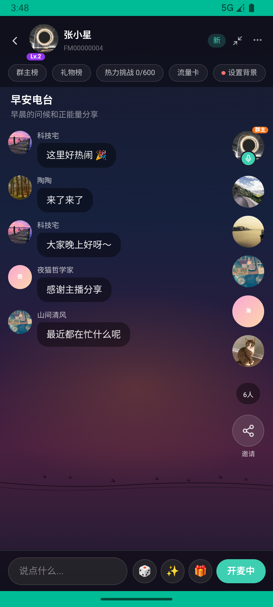
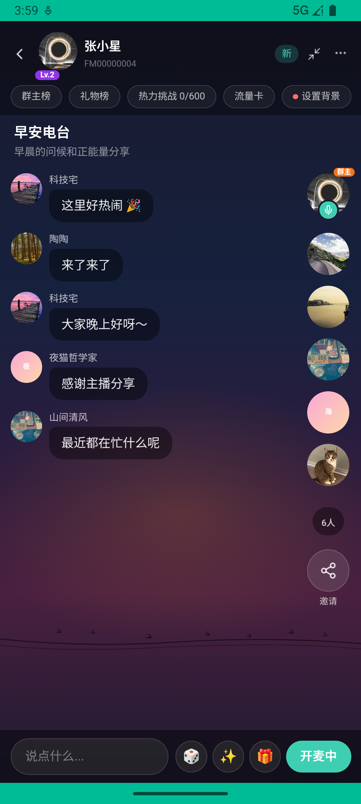

# onboarding_v005_gift_host_after_join  ❌

- **Brand**: `xingqiushejiaowang`
- **Class**: `XingqiushejiaowangOnboardingV005GiftHostAfterJoinTask`
- **Pass@3**: **0/3**  (score = 0.00)
- **Elapsed**: 974s (~16.2 min)
- **Model**: `doubao-seed-2-0-pro-260215`
- **Raw log**: [./raw_logs/XingqiushejiaowangOnboardingV005GiftHostAfterJoinTask.log](./raw_logs/XingqiushejiaowangOnboardingV005GiftHostAfterJoinTask.log)
- **Generated**: 2026-07-22T04:51:37+08:00

## Task Goal

> 注册后完善资料，进首页派对给房主送甜甜圈

## System Prompt

<details>
<summary>展开查看完整 System Prompt</summary>


> You are provided with a task description, a history of previous actions, and corresponding screenshots. Your goal is to perform the next action to complete the task. Please note that if performing the same action multiple times results in a static screen with no changes, you should attempt a modified or alternative action.
> 
> ---
> 
> ## Function Definition
> 
> - `clarify` — Ask the user for more information to complete the task.
> - `click` — Mouse left single click action.
> - `double_click` — Mouse left double click action.
> - `drag` — Perform a drag action from the start point to the end point. Typically used for swiping or selecting elements.
> - `long_press` — Perform a long press action at the specified coordinates.
> - `open_app` — Open the specified application.
> - `press_back` — Press the back button.
> - `press_enter` — Press the enter key.
> - `press_home` — Press the home button.
> - `take_notes` — Take notes and report the result in the specified content.
> - `type` — Type the specified content. You should manually delete any text from the input box that you want to remove.
> - `wait` — Wait for a certain period of time.

</details>

## User Query

> 请在 com.xingqiushejiaowang 里面完成以下任务：
> 注册后完善资料，进首页派对给房主送甜甜圈

## Attempts

| # | Outcome | Steps | Terminated | Reason | Start → End |
|---|---------|-------|------------|--------|-------------|
| 1 | ❌ failed | 30 | answer | 已进入一个 active 派对: 未找到任何派对在场记录; GiftSending 记录已创建: 没有找到送礼记录 | 2026-07-22 03:43:19 → 2026-07-22 03:48:22 |
| 2 | ❌ failed | 34 | answer | 已进入一个 active 派对: 未找到任何派对在场记录; GiftSending 记录已创建: 没有找到送礼记录 | 2026-07-22 03:48:22 → 2026-07-22 03:53:53 |
| 3 | ❌ failed | 34 | answer | 已进入一个 active 派对: 未找到任何派对在场记录; GiftSending 记录已创建: 没有找到送礼记录 | 2026-07-22 03:53:53 → 2026-07-22 03:59:33 |

## Failure Details

### Episode 1 — ❌ failed

- steps_used: `30`
- terminated_reason: `answer`
- reason:

  ```
  已进入一个 active 派对: 未找到任何派对在场记录; GiftSending 记录已创建: 没有找到送礼记录
  ```
- death shot:
  
- state: [`./death_shots/XingqiushejiaowangOnboardingV005GiftHostAfterJoinTask/episode_001/step_030.json`](./death_shots/XingqiushejiaowangOnboardingV005GiftHostAfterJoinTask/episode_001/step_030.json)
- digest: [`episode_digest.md`](./episode_digests/XingqiushejiaowangOnboardingV005GiftHostAfterJoinTask/episode_001/episode_digest.md)

### Episode 2 — ❌ failed

- steps_used: `34`
- terminated_reason: `answer`
- reason:

  ```
  已进入一个 active 派对: 未找到任何派对在场记录; GiftSending 记录已创建: 没有找到送礼记录
  ```
- death shot:
  
- state: [`./death_shots/XingqiushejiaowangOnboardingV005GiftHostAfterJoinTask/episode_002/step_034.json`](./death_shots/XingqiushejiaowangOnboardingV005GiftHostAfterJoinTask/episode_002/step_034.json)
- digest: [`episode_digest.md`](./episode_digests/XingqiushejiaowangOnboardingV005GiftHostAfterJoinTask/episode_002/episode_digest.md)

### Episode 3 — ❌ failed

- steps_used: `34`
- terminated_reason: `answer`
- reason:

  ```
  已进入一个 active 派对: 未找到任何派对在场记录; GiftSending 记录已创建: 没有找到送礼记录
  ```
- death shot:
  
- state: [`./death_shots/XingqiushejiaowangOnboardingV005GiftHostAfterJoinTask/episode_003/step_034.json`](./death_shots/XingqiushejiaowangOnboardingV005GiftHostAfterJoinTask/episode_003/step_034.json)
- digest: [`episode_digest.md`](./episode_digests/XingqiushejiaowangOnboardingV005GiftHostAfterJoinTask/episode_003/episode_digest.md)

---

> 本摘要由 `sengclaw/scripts/pipeline/log_summarizer.py` 自动生成。 原始完整 log 见上方 Raw log 链接（含每 step 的 messages / tool_call / screenshot 引用）。
