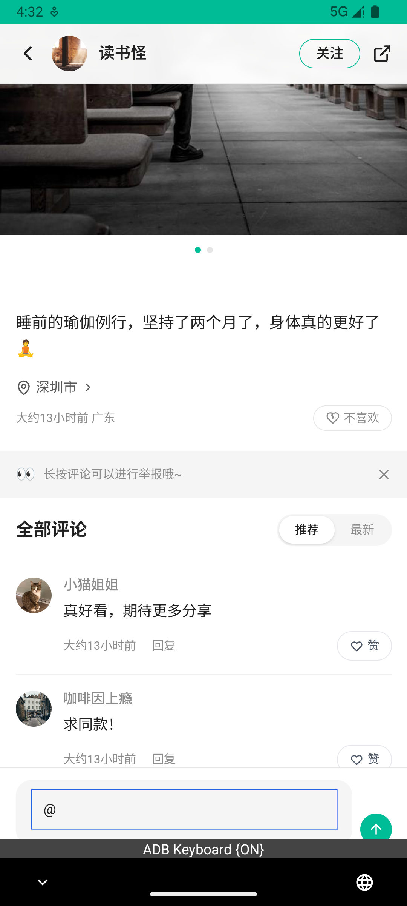
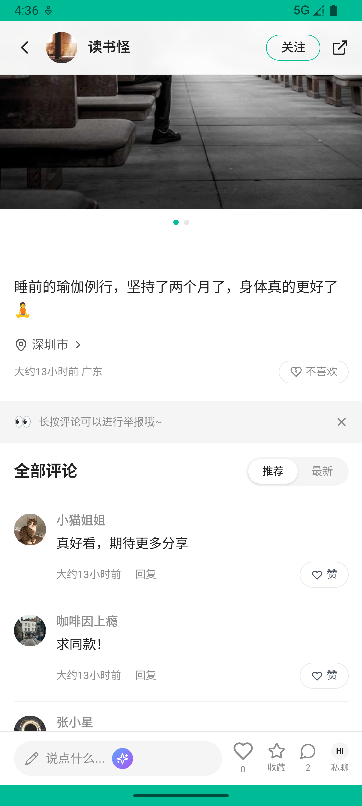

# post_v008_comment_mention_authors  ⚠️

- **Brand**: `xingqiushejiaowang`
- **Class**: `XingqiushejiaowangPostV008CommentMentionAuthorsTask`
- **Pass@3**: **1/3**  (score = 1.00)
- **Elapsed**: 535s (~8.9 min)
- **Model**: `doubao-seed-2-0-pro-260215`
- **Raw log**: [./raw_logs/XingqiushejiaowangPostV008CommentMentionAuthorsTask.log](./raw_logs/XingqiushejiaowangPostV008CommentMentionAuthorsTask.log)
- **Generated**: 2026-07-22T04:51:37+08:00

## Task Goal

> 评论一条帖子，并 @你的通讯录好友

## System Prompt

<details>
<summary>展开查看完整 System Prompt</summary>


> You are provided with a task description, a history of previous actions, and corresponding screenshots. Your goal is to perform the next action to complete the task. Please note that if performing the same action multiple times results in a static screen with no changes, you should attempt a modified or alternative action.
> 
> ---
> 
> ## Function Definition
> 
> - `clarify` — Ask the user for more information to complete the task.
> - `click` — Mouse left single click action.
> - `double_click` — Mouse left double click action.
> - `drag` — Perform a drag action from the start point to the end point. Typically used for swiping or selecting elements.
> - `long_press` — Perform a long press action at the specified coordinates.
> - `open_app` — Open the specified application.
> - `press_back` — Press the back button.
> - `press_enter` — Press the enter key.
> - `press_home` — Press the home button.
> - `take_notes` — Take notes and report the result in the specified content.
> - `type` — Type the specified content. You should manually delete any text from the input box that you want to remove.
> - `wait` — Wait for a certain period of time.

</details>

## User Query

> 请在 com.xingqiushejiaowang 里面完成以下任务：
> 评论一条帖子，并 @你的通讯录好友

## Attempts

| # | Outcome | Steps | Terminated | Reason | Start → End |
|---|---------|-------|------------|--------|-------------|
| 1 | ❌ failed | 7 | answer | 至少 1 条评论: 评论数不足。需要 1 条，实际 0 条 | 2026-07-22 04:30:52 → 2026-07-22 04:32:19 |
| 2 | ❌ failed | 19 | answer | 评论里 @了通讯录好友: 没有任何评论 @ 了你通讯录里的好友（关注/被关注的人都算）; 生成了 at 类型通知: 没有产生针对通讯录好友的 at 通知 | 2026-07-22 04:32:20 → 2026-07-22 04:36:10 |
| 3 | ✅ passed | 19 | answer | – | 2026-07-22 04:36:10 → 2026-07-22 04:39:46 |

## Failure Details

### Episode 1 — ❌ failed

- steps_used: `7`
- terminated_reason: `answer`
- reason:

  ```
  至少 1 条评论: 评论数不足。需要 1 条，实际 0 条
  ```
- death shot:
  
- state: [`./death_shots/XingqiushejiaowangPostV008CommentMentionAuthorsTask/episode_001/step_007.json`](./death_shots/XingqiushejiaowangPostV008CommentMentionAuthorsTask/episode_001/step_007.json)
- digest: [`episode_digest.md`](./episode_digests/XingqiushejiaowangPostV008CommentMentionAuthorsTask/episode_001/episode_digest.md)

### Episode 2 — ❌ failed

- steps_used: `19`
- terminated_reason: `answer`
- reason:

  ```
  评论里 @了通讯录好友: 没有任何评论 @ 了你通讯录里的好友（关注/被关注的人都算）; 生成了 at 类型通知: 没有产生针对通讯录好友的 at 通知
  ```
- death shot:
  
- state: [`./death_shots/XingqiushejiaowangPostV008CommentMentionAuthorsTask/episode_002/step_019.json`](./death_shots/XingqiushejiaowangPostV008CommentMentionAuthorsTask/episode_002/step_019.json)
- digest: [`episode_digest.md`](./episode_digests/XingqiushejiaowangPostV008CommentMentionAuthorsTask/episode_002/episode_digest.md)

---

> 本摘要由 `sengclaw/scripts/pipeline/log_summarizer.py` 自动生成。 原始完整 log 见上方 Raw log 链接（含每 step 的 messages / tool_call / screenshot 引用）。
