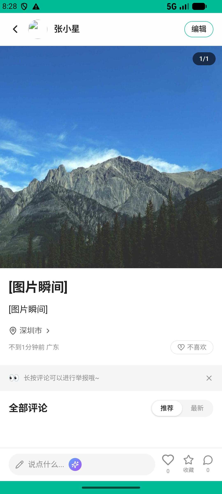
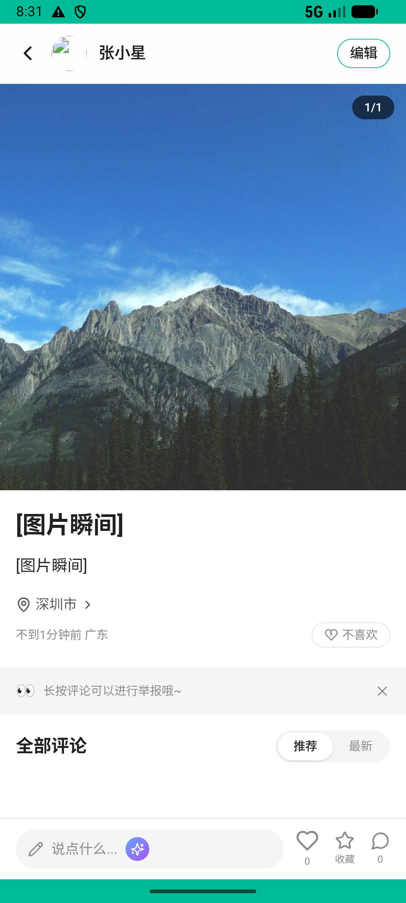
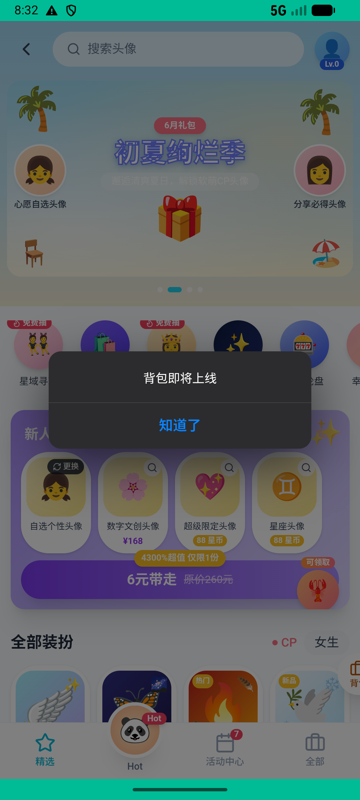

# journeys_v005_onboarding_match_outfit_post  ❌

- **Brand**: `xingqiushejiaowang`
- **Class**: `XingqiushejiaowangJourneysV005OnboardingMatchOutfitPostTask`
- **Pass@3**: **0/3**  (score = 0.00)
- **Elapsed**: 490s (~8.2 min)
- **Model**: `google/gemini-3.6-flash`
- **Raw log**: [./raw_logs/XingqiushejiaowangJourneysV005OnboardingMatchOutfitPostTask.log](./raw_logs/XingqiushejiaowangJourneysV005OnboardingMatchOutfitPostTask.log)
- **Generated**: 2026-07-23T20:33:05+08:00

## Task Goal

> 星球Tab→灵魂匹配→自己Tab→个性商城买装扮→点头像→更换头像→背包佩戴→广场Tab→发布瞬间带图。装备唯一入口：点头像→更换头像！

## System Prompt

<details>
<summary>展开查看完整 System Prompt</summary>


> You are provided with a task description, a history of previous actions, and corresponding screenshots. Your goal is to perform the next action to complete the task. Please note that if performing the same action multiple times results in a static screen with no changes, you should attempt a modified or alternative action.
> 
> ---
> 
> ## Function Definition
> 
> - `clarify` — Ask the user for more information to complete the task.
> - `click` — Mouse left single click action.
> - `double_click` — Mouse left double click action.
> - `drag` — Perform a drag action from the start point to the end point. Typically used for swiping or selecting elements.
> - `long_press` — Perform a long press action at the specified coordinates.
> - `open_app` — Open the specified application.
> - `press_back` — Press the back button.
> - `press_enter` — Press the enter key.
> - `press_home` — Press the home button.
> - `take_notes` — Take notes and report the result in the specified content.
> - `type` — Type the specified content. You should manually delete any text from the input box that you want to remove.
> - `wait` — Wait for a certain period of time.

</details>

## User Query

> 请在 com.xingqiushejiaowang 里面完成以下任务：
> 星球Tab→灵魂匹配→自己Tab→个性商城买装扮→点头像→更换头像→背包佩戴→广场Tab→发布瞬间带图。装备唯一入口：点头像→更换头像！

## Attempts

| # | Outcome | Steps | Terminated | Reason | Start → End |
|---|---------|-------|------------|--------|-------------|
| 1 | ❌ failed | 27 | answer | 买了至少 1 个装扮: 没有 OutfitPurchase | 2026-07-23 20:24:55 → 2026-07-23 20:28:11 |
| 2 | ❌ failed | 30 | answer | 发起了一次灵魂匹配: 应至少 1 次 soul 匹配; 匹配成功: 没有 matched 状态 Diff: @@ -1 +1 @@ -true +false ; 买了至少 1 个装扮: 没有 OutfitPurchase | 2026-07-23 20:28:11 → 2026-07-23 20:31:39 |
| 3 | 💥 error | 0 | exception | exception: 404 Not Found for url: http://localhost:6800/step \\| detail: No available devices found | 2026-07-23 20:31:39 → 2026-07-23 20:33:04 |

## Failure Details

### Episode 1 — ❌ failed

- steps_used: `27`
- terminated_reason: `answer`
- reason:

  ```
  买了至少 1 个装扮: 没有 OutfitPurchase
  ```
- death shot: 
  - state: [`./screenshots/XingqiushejiaowangJourneysV005OnboardingMatchOutfitPostTask/episode_001/step_027.json`](./screenshots/XingqiushejiaowangJourneysV005OnboardingMatchOutfitPostTask/episode_001/step_027.json)
  - digest: [`episode_digest.md`](./digests/XingqiushejiaowangJourneysV005OnboardingMatchOutfitPostTask/episode_001/episode_digest.md)

### Episode 2 — ❌ failed

- steps_used: `30`
- terminated_reason: `answer`
- reason:

  ```
  发起了一次灵魂匹配: 应至少 1 次 soul 匹配; 匹配成功: 没有 matched 状态
  Diff:
  @@ -1 +1 @@
  -true
  +false
  ; 买了至少 1 个装扮: 没有 OutfitPurchase
  ```
- death shot: 
  - state: [`./screenshots/XingqiushejiaowangJourneysV005OnboardingMatchOutfitPostTask/episode_002/step_030.json`](./screenshots/XingqiushejiaowangJourneysV005OnboardingMatchOutfitPostTask/episode_002/step_030.json)
  - digest: [`episode_digest.md`](./digests/XingqiushejiaowangJourneysV005OnboardingMatchOutfitPostTask/episode_002/episode_digest.md)

### Episode 3 — 💥 error

- steps_used: `0`
- terminated_reason: `exception`
- reason:

  ```
  exception: 404 Not Found for url: http://localhost:6800/step | detail: No available devices found
  ```
- death shot: 
  - state: [`./screenshots/XingqiushejiaowangJourneysV005OnboardingMatchOutfitPostTask/episode_003/step_010.json`](./screenshots/XingqiushejiaowangJourneysV005OnboardingMatchOutfitPostTask/episode_003/step_010.json)
  - digest: [`episode_digest.md`](./digests/XingqiushejiaowangJourneysV005OnboardingMatchOutfitPostTask/episode_003/episode_digest.md)

---

> 本摘要由 `sengclaw/scripts/pipeline/log_summarizer.py` 自动生成。 原始完整 log 见上方 Raw log 链接（含每 step 的 messages / tool_call / screenshot 引用）。
