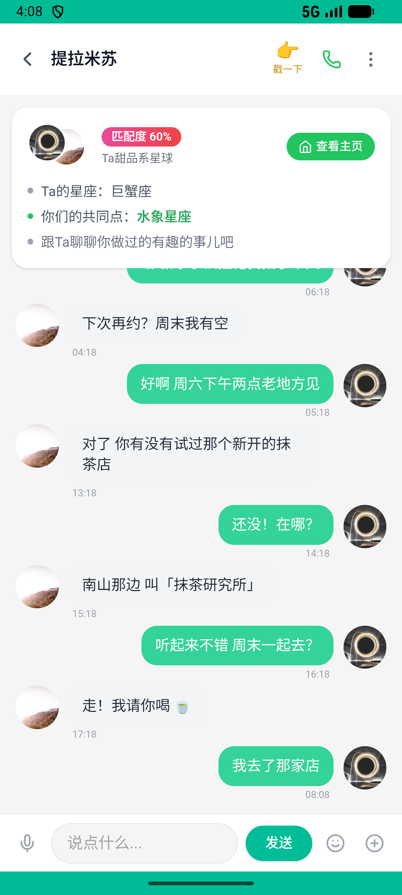
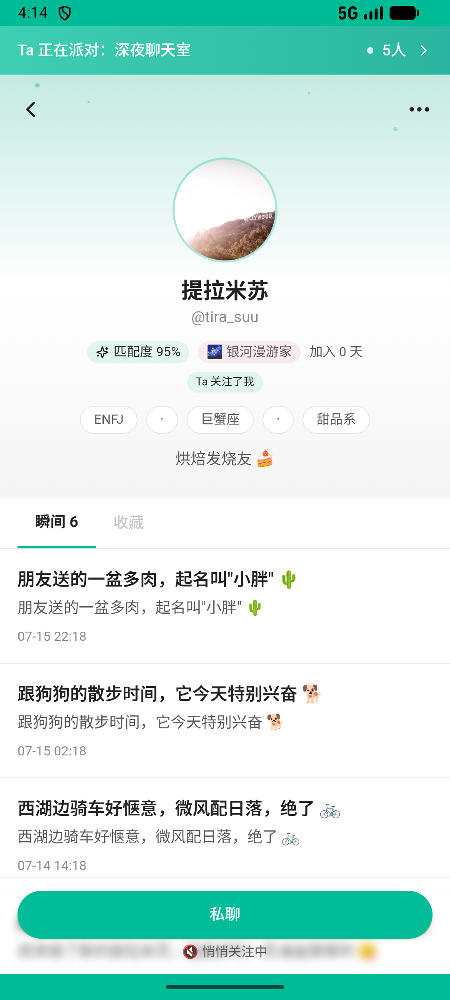
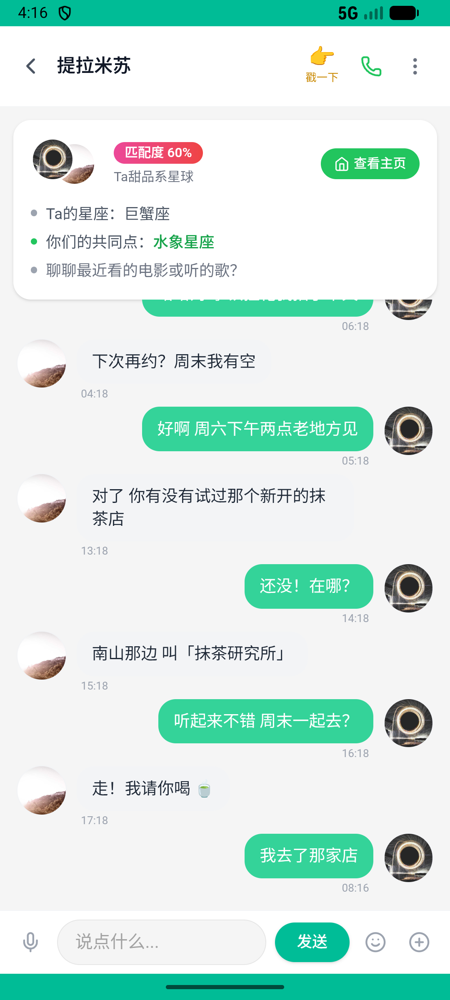

# contacts_v006_search_chat_then_visit  ❌

- **Brand**: `xingqiushejiaowang`
- **Class**: `XingqiushejiaowangContactsV006SearchChatThenVisitTask`
- **Pass@3**: **0/3**  (score = 0.00)
- **Elapsed**: 662s (~11.0 min)
- **Model**: `doubao-seed-2-0-lite-260428`
- **Raw log**: [./raw_logs/XingqiushejiaowangContactsV006SearchChatThenVisitTask.log](./raw_logs/XingqiushejiaowangContactsV006SearchChatThenVisitTask.log)
- **Generated**: 2026-07-16T19:10:00+08:00
- **Note**: backfilled from /tmp/pass_at_3_full_<ts>/ on 2026-05-02

## Task Goal

> 我好像记得有朋友跟我聊过咖啡，帮我从聊天记录里找到这个人，去他主页看看，然后发消息告诉他我去了那家店

## System Prompt

<details>
<summary>展开查看完整 System Prompt</summary>


> You are provided with a task description, a history of previous actions, and corresponding screenshots. Your goal is to perform the next action to complete the task. Please note that if performing the same action multiple times results in a static screen with no changes, you should attempt a modified or alternative action.
> 
> ---
> 
> ## Function Definition
> 
> - `clarify` — Ask the user for more information to complete the task.
> - `click` — Mouse left single click action.
> - `double_click` — Mouse left double click action.
> - `drag` — Perform a drag action from the start point to the end point. Typically used for swiping or selecting elements.
> - `long_press` — Perform a long press action at the specified coordinates.
> - `open_app` — Open the specified application.
> - `press_back` — Press the back button.
> - `press_enter` — Press the enter key.
> - `press_home` — Press the home button.
> - `take_notes` — Take notes and report the result in the specified content.
> - `type` — Type the specified content. You should manually delete any text from the input box that you want to remove.
> - `wait` — Wait for a certain period of time.

</details>

## User Query

> 请在 com.xingqiushejiaowang 里面完成以下任务：
> 我好像记得有朋友跟我聊过咖啡，帮我从聊天记录里找到这个人，去他主页看看，然后发消息告诉他我去了那家店

## Attempts

| # | Outcome | Steps | Terminated | Reason | Start → End |
|---|---------|-------|------------|--------|-------------|
| 1 | ❌ failed | 11 | answer | 访问了消息发送者 tiramisu 的主页: 未找到访问 提拉米苏 主页的记录。搜索「咖啡」→ 找到 tiramisu 的消息 → 点击她的头像; 发了消息聊咖啡: 未找到 demo → 提拉米苏 的新私信。请搜索「咖啡」→ 进入对话 → 点 tiramisu 头像 → 发... | 2026-07-16 16:06:03 → 2026-07-16 16:08:52 |
| 2 | ❌ failed | 28 | answer | 访问了消息发送者 tiramisu 的主页: 未找到访问 提拉米苏 主页的记录。搜索「咖啡」→ 找到 tiramisu 的消息 → 点击她的头像; 发了消息聊咖啡: 未找到 demo → 提拉米苏 的新私信。请搜索「咖啡」→ 进入对话 → 点 tiramisu 头像 → 发... | 2026-07-16 16:08:52 → 2026-07-16 16:14:15 |
| 3 | ❌ failed | 12 | answer | 访问了消息发送者 tiramisu 的主页: 未找到访问 提拉米苏 主页的记录。搜索「咖啡」→ 找到 tiramisu 的消息 → 点击她的头像; 发了消息聊咖啡: 未找到 demo → 提拉米苏 的新私信。请搜索「咖啡」→ 进入对话 → 点 tiramisu 头像 → 发... | 2026-07-16 16:14:15 → 2026-07-16 16:17:05 |

## Failure Details

### Episode 1 — ❌ failed

- steps_used: `11`
- terminated_reason: `answer`
- reason:

  ```
  访问了消息发送者 tiramisu 的主页: 未找到访问 提拉米苏 主页的记录。搜索「咖啡」→ 找到 tiramisu 的消息 → 点击她的头像; 发了消息聊咖啡: 未找到 demo → 提拉米苏 的新私信。请搜索「咖啡」→ 进入对话 → 点 tiramisu 头像 → 发消息聊咖啡。
  ```
- death shot: 
  - state: [`./death_shots/XingqiushejiaowangContactsV006SearchChatThenVisitTask/episode_001/step_011.json`](./death_shots/XingqiushejiaowangContactsV006SearchChatThenVisitTask/episode_001/step_011.json)
  - digest: [`episode_digest.md`](./death_shots/XingqiushejiaowangContactsV006SearchChatThenVisitTask/episode_001/episode_digest.md)

### Episode 2 — ❌ failed

- steps_used: `28`
- terminated_reason: `answer`
- reason:

  ```
  访问了消息发送者 tiramisu 的主页: 未找到访问 提拉米苏 主页的记录。搜索「咖啡」→ 找到 tiramisu 的消息 → 点击她的头像; 发了消息聊咖啡: 未找到 demo → 提拉米苏 的新私信。请搜索「咖啡」→ 进入对话 → 点 tiramisu 头像 → 发消息聊咖啡。
  ```
- death shot: 
  - state: [`./death_shots/XingqiushejiaowangContactsV006SearchChatThenVisitTask/episode_002/step_028.json`](./death_shots/XingqiushejiaowangContactsV006SearchChatThenVisitTask/episode_002/step_028.json)
  - digest: [`episode_digest.md`](./death_shots/XingqiushejiaowangContactsV006SearchChatThenVisitTask/episode_002/episode_digest.md)

### Episode 3 — ❌ failed

- steps_used: `12`
- terminated_reason: `answer`
- reason:

  ```
  访问了消息发送者 tiramisu 的主页: 未找到访问 提拉米苏 主页的记录。搜索「咖啡」→ 找到 tiramisu 的消息 → 点击她的头像; 发了消息聊咖啡: 未找到 demo → 提拉米苏 的新私信。请搜索「咖啡」→ 进入对话 → 点 tiramisu 头像 → 发消息聊咖啡。
  ```
- death shot: 
  - state: [`./death_shots/XingqiushejiaowangContactsV006SearchChatThenVisitTask/episode_003/step_012.json`](./death_shots/XingqiushejiaowangContactsV006SearchChatThenVisitTask/episode_003/step_012.json)
  - digest: [`episode_digest.md`](./death_shots/XingqiushejiaowangContactsV006SearchChatThenVisitTask/episode_003/episode_digest.md)

---

> 本摘要由 `sengclaw/scripts/pipeline/log_summarizer.py` 自动生成。 原始完整 log 见上方 Raw log 链接（含每 step 的 messages / tool_call / screenshot 引用）。
